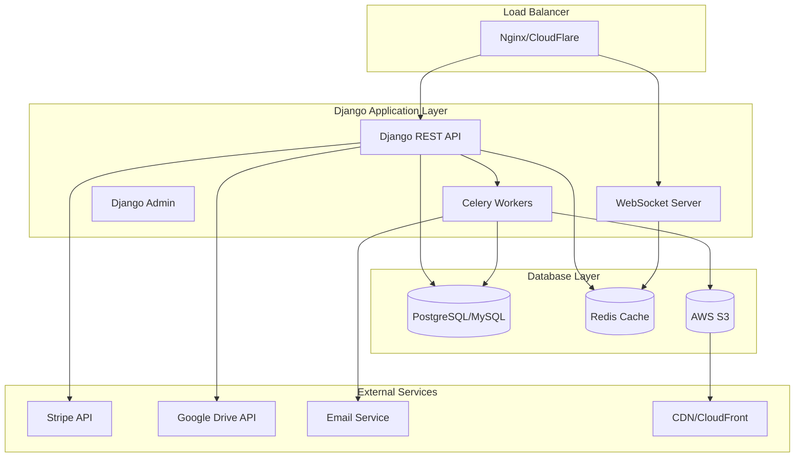
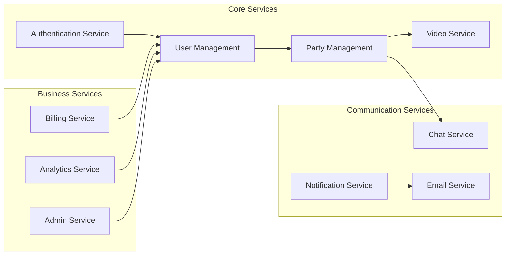

# 🐍 Watch Party Platform - Backend Architecture

    

> **A robust, scalable Django backend powering the Watch Party Platform with real-time streaming, authentication, billing, and comprehensive admin controls.**

---

## 📋 Table of Contents

1. [Overview](#overview)
2. [Tech Stack](#tech-stack)
3. [Architecture Overview](#architecture-overview)
4. [Database Design](#database-design)
5. [API Endpoints](#api-endpoints)
6. [Authentication & Security](#authentication--security)
7. [Real-time Services](#real-time-services)
8. [External Integrations](#external-integrations)
9. [Setup & Development](#setup--development)
10. [Deployment](#deployment)

---

## 🎯 Overview

The Watch Party Backend is a high-performance Django application built with Python 3.11+ that provides comprehensive APIs for video streaming, user management, real-time chat, and subscription billing. It supports flexible database configurations including SSL-enabled connections and AWS RDS integration.

### Key Features
- 🔐 **JWT Authentication** - Secure token-based auth with refresh tokens
- 🎥 **Video Management** - Google Drive & AWS S3 integration
- 💬 **Real-time Chat** - WebSocket support with Redis pub/sub
- 💳 **Stripe Integration** - Complete billing and subscription management
- 🛡️ **Admin APIs** - Comprehensive administrative controls
- 📊 **Analytics** - User behavior tracking and reporting
- 🔒 **Security** - Rate limiting, CORS, and comprehensive validation
- 🏗️ **Scalable Architecture** - Microservices-ready design

> **Compatibility:** Designed to work seamlessly with the [Next.js 15 frontend](https://nextjs.org/docs).

---

## 🛠 Tech Stack

### Backend Core
- **Framework:** Django 5.0 (Django REST Framework)
- **Language:** Python 3.11+
- **ORM:** SQLAlchemy 2.0 + Django ORM (Hybrid approach)
- **Database:** PostgreSQL/MySQL with SSL support
- **Cache:** Redis 7.0+
- **Task Queue:** Celery with Redis broker
- **WebSockets:** Django Channels + Redis

### External Services & APIs
- **Payment:** Stripe API
- **Storage:** AWS S3, Google Drive API
- **Email:** SendGrid/SMTP
- **Monitoring:** Sentry, New Relic
- **CDN:** CloudFlare/AWS CloudFront

### Frontend Integration
- **Real-time Communication:** Socket.IO for chat and video sync
- **State Management:** TanStack Query for data fetching and caching
- **Styling:** Tailwind CSS for utility-first styling

### Development & DevOps
- **API Documentation:** Django REST Swagger
- **Testing:** pytest + Django Test Suite
- **Linting:** Black, isort, flake8
- **Type Checking:** mypy
- **Containerization:** Docker + docker-compose

---

## 🏗 Architecture Overview



### Microservices Architecture



---

## 🗄️ Database Design

### Database Configuration Options

```python
# Database configuration supporting multiple environments
DATABASE_CONFIGS = {
    'local': {
        'ENGINE': 'django.db.backends.postgresql',
        'NAME': 'watchparty_local',
        'USER': 'postgres',
        'PASSWORD': 'password',
        'HOST': 'localhost',
        'PORT': '5432',
    },
    
    'aws_rds': {
        'ENGINE': 'django.db.backends.postgresql',
        'NAME': os.getenv('RDS_DB_NAME'),
        'USER': os.getenv('RDS_USERNAME'),
        'PASSWORD': os.getenv('RDS_PASSWORD'),
        'HOST': os.getenv('RDS_HOSTNAME'),
        'PORT': os.getenv('RDS_PORT', '5432'),
        'OPTIONS': {
            'sslmode': 'require',
            'sslcert': '/path/to/client-cert.pem',
            'sslkey': '/path/to/client-key.pem',
            'sslrootcert': '/path/to/ca-cert.pem',
        }
    },
    
    'ssl_enabled': {
        'ENGINE': 'django.db.backends.mysql',
        'NAME': os.getenv('DB_NAME'),
        'USER': os.getenv('DB_USER'),
        'PASSWORD': os.getenv('DB_PASSWORD'),
        'HOST': os.getenv('DB_HOST'),
        'PORT': os.getenv('DB_PORT', '3306'),
        'OPTIONS': {
            'ssl': {
                'ssl_ca': '/path/to/ca-cert.pem',
                'ssl_cert': '/path/to/client-cert.pem',
                'ssl_key': '/path/to/client-key.pem',
            },
            'charset': 'utf8mb4',
        }
    }
}
```

### Core Database Models

```python
# User Management Models
class User(AbstractUser):
    id = models.UUIDField(primary_key=True, default=uuid.uuid4)
    email = models.EmailField(unique=True)
    first_name = models.CharField(max_length=150)
    last_name = models.CharField(max_length=150)
    avatar = models.ImageField(upload_to='avatars/', null=True, blank=True)
    is_premium = models.BooleanField(default=False)
    subscription_expires = models.DateTimeField(null=True, blank=True)
    created_at = models.DateTimeField(auto_now_add=True)
    updated_at = models.DateTimeField(auto_now=True)

class UserProfile(models.Model):
    user = models.OneToOneField(User, on_delete=models.CASCADE)
    bio = models.TextField(max_length=500, blank=True)
    timezone = models.CharField(max_length=50, default='UTC')
    language = models.CharField(max_length=10, default='en')
    notification_preferences = models.JSONField(default=dict)
    social_links = models.JSONField(default=dict)

# Video Management Models
class Video(models.Model):
    id = models.UUIDField(primary_key=True, default=uuid.uuid4)
    title = models.CharField(max_length=255)
    description = models.TextField(blank=True)
    uploader = models.ForeignKey(User, on_delete=models.CASCADE)
    video_url = models.URLField()  # Google Drive or S3 URL
    thumbnail = models.URLField(blank=True)
    duration = models.DurationField()
    file_size = models.BigIntegerField()  # in bytes
    source_type = models.CharField(max_length=20, choices=[
        ('gdrive', 'Google Drive'),
        ('s3', 'AWS S3'),
        ('youtube', 'YouTube'),
    ])
    visibility = models.CharField(max_length=10, choices=[
        ('public', 'Public'),
        ('private', 'Private'),
        ('friends', 'Friends Only'),
    ], default='private')
    created_at = models.DateTimeField(auto_now_add=True)
    updated_at = models.DateTimeField(auto_now=True)

# Party Management Models
class WatchParty(models.Model):
    id = models.UUIDField(primary_key=True, default=uuid.uuid4)
    title = models.CharField(max_length=255)
    description = models.TextField(blank=True)
    host = models.ForeignKey(User, on_delete=models.CASCADE, related_name='hosted_parties')
    video = models.ForeignKey(Video, on_delete=models.CASCADE)
    max_participants = models.IntegerField(default=10)
    is_active = models.BooleanField(default=True)
    is_public = models.BooleanField(default=False)
    scheduled_start = models.DateTimeField(null=True, blank=True)
    actual_start = models.DateTimeField(null=True, blank=True)
    ended_at = models.DateTimeField(null=True, blank=True)
    room_code = models.CharField(max_length=10, unique=True)
    settings = models.JSONField(default=dict)  # Chat enabled, reactions, etc.
    created_at = models.DateTimeField(auto_now_add=True)

class PartyParticipant(models.Model):
    party = models.ForeignKey(WatchParty, on_delete=models.CASCADE)
    user = models.ForeignKey(User, on_delete=models.CASCADE)
    role = models.CharField(max_length=20, choices=[
        ('host', 'Host'),
        ('moderator', 'Moderator'),
        ('participant', 'Participant'),
    ], default='participant')
    joined_at = models.DateTimeField(auto_now_add=True)
    left_at = models.DateTimeField(null=True, blank=True)
    is_active = models.BooleanField(default=True)

# Chat System Models
class ChatMessage(models.Model):
    id = models.UUIDField(primary_key=True, default=uuid.uuid4)
    party = models.ForeignKey(WatchParty, on_delete=models.CASCADE)
    user = models.ForeignKey(User, on_delete=models.CASCADE)
    content = models.TextField(max_length=1000)
    message_type = models.CharField(max_length=20, choices=[
        ('text', 'Text'),
        ('emoji', 'Emoji Reaction'),
        ('system', 'System Message'),
    ], default='text')
    reply_to = models.ForeignKey('self', on_delete=models.CASCADE, null=True, blank=True)
    is_deleted = models.BooleanField(default=False)
    created_at = models.DateTimeField(auto_now_add=True)

# Billing Models
class Subscription(models.Model):
    id = models.UUIDField(primary_key=True, default=uuid.uuid4)
    user = models.ForeignKey(User, on_delete=models.CASCADE)
    stripe_subscription_id = models.CharField(max_length=255, unique=True)
    status = models.CharField(max_length=20, choices=[
        ('active', 'Active'),
        ('canceled', 'Canceled'),
        ('past_due', 'Past Due'),
        ('unpaid', 'Unpaid'),
    ])
    plan_name = models.CharField(max_length=50)
    amount = models.DecimalField(max_digits=10, decimal_places=2)
    currency = models.CharField(max_length=3, default='USD')
    current_period_start = models.DateTimeField()
    current_period_end = models.DateTimeField()
    created_at = models.DateTimeField(auto_now_add=True)
    updated_at = models.DateTimeField(auto_now=True)

class PaymentHistory(models.Model):
    id = models.UUIDField(primary_key=True, default=uuid.uuid4)
    user = models.ForeignKey(User, on_delete=models.CASCADE)
    stripe_payment_intent_id = models.CharField(max_length=255)
    amount = models.DecimalField(max_digits=10, decimal_places=2)
    currency = models.CharField(max_length=3, default='USD')
    status = models.CharField(max_length=20)
    description = models.CharField(max_length=255)
    created_at = models.DateTimeField(auto_now_add=True)
```

### SQLAlchemy Integration

```python
# SQLAlchemy models for advanced queries and analytics
from sqlalchemy import create_engine, Column, Integer, String, DateTime, Boolean, Text
from sqlalchemy.ext.declarative import declarative_base
from sqlalchemy.dialects.postgresql import UUID
from sqlalchemy.orm import sessionmaker
import uuid

Base = declarative_base()

class AnalyticsEvent(Base):
    __tablename__ = 'analytics_events'
    
    id = Column(UUID(as_uuid=True), primary_key=True, default=uuid.uuid4)
    user_id = Column(UUID(as_uuid=True))
    event_type = Column(String(50))
    event_data = Column(Text)  # JSON string
    session_id = Column(String(100))
    ip_address = Column(String(45))
    user_agent = Column(Text)
    timestamp = Column(DateTime)

class VideoWatchTime(Base):
    __tablename__ = 'video_watch_time'
    
    id = Column(UUID(as_uuid=True), primary_key=True, default=uuid.uuid4)
    user_id = Column(UUID(as_uuid=True))
    video_id = Column(UUID(as_uuid=True))
    party_id = Column(UUID(as_uuid=True))
    watch_duration = Column(Integer)  # in seconds
    total_duration = Column(Integer)  # video length in seconds
    completion_percentage = Column(Integer)
    timestamp = Column(DateTime)

# Database session configuration
class DatabaseManager:
    def __init__(self):
        self.engine = None
        self.Session = None
    
    def setup_connection(self, database_url: str, ssl_config: dict = None):
        connect_args = {}
        if ssl_config:
            connect_args.update(ssl_config)
        
        self.engine = create_engine(
            database_url,
            connect_args=connect_args,
            pool_size=10,
            max_overflow=20,
            pool_timeout=30,
            pool_recycle=3600
        )
        
        self.Session = sessionmaker(bind=self.engine)
        Base.metadata.create_all(self.engine)
    
    def get_session(self):
        return self.Session()
```

---

## 🔗 API Endpoints

### Authentication Endpoints

```python
# Authentication API endpoints
urlpatterns = [
    # User Registration & Login
    path('auth/register/', RegisterView.as_view(), name='register'),
    path('auth/login/', LoginView.as_view(), name='login'),
    path('auth/logout/', LogoutView.as_view(), name='logout'),
    path('auth/refresh/', TokenRefreshView.as_view(), name='token_refresh'),
    
    # Social Authentication
    path('auth/google/', GoogleOAuth2LoginView.as_view(), name='google_login'),
    path('auth/facebook/', FacebookOAuth2LoginView.as_view(), name='facebook_login'),
    
    # Password Management
    path('auth/forgot-password/', ForgotPasswordView.as_view(), name='forgot_password'),
    path('auth/reset-password/', ResetPasswordView.as_view(), name='reset_password'),
    path('auth/change-password/', ChangePasswordView.as_view(), name='change_password'),
    
    # Account Verification
    path('auth/verify-email/', VerifyEmailView.as_view(), name='verify_email'),
    path('auth/resend-verification/', ResendVerificationView.as_view(), name='resend_verification'),
    
    # Two-Factor Authentication
    path('auth/2fa/enable/', Enable2FAView.as_view(), name='enable_2fa'),
    path('auth/2fa/verify/', Verify2FAView.as_view(), name='verify_2fa'),
    path('auth/2fa/disable/', Disable2FAView.as_view(), name='disable_2fa'),
]

# API Response Examples
"""
POST /api/auth/register/
{
    "email": "user@example.com",
    "password": "SecurePass123!",
    "first_name": "John",
    "last_name": "Doe",
    "promo_code": "WELCOME2024"
}

Response: {
    "success": true,
    "message": "Registration successful. Please verify your email.",
    "user": {
        "id": "uuid-here",
        "email": "user@example.com",
        "first_name": "John",
        "last_name": "Doe",
        "is_verified": false
    },
    "verification_sent": true
}

POST /api/auth/login/
{
    "email": "user@example.com",
    "password": "SecurePass123!"
}

Response: {
    "success": true,
    "access_token": "jwt-access-token",
    "refresh_token": "jwt-refresh-token",
    "user": {
        "id": "uuid-here",
        "email": "user@example.com",
        "first_name": "John",
        "last_name": "Doe",
        "is_premium": true,
        "subscription_expires": "2024-12-31T23:59:59Z"
    }
}
"""
```

### User Management Endpoints

```python
# User management API endpoints
urlpatterns = [
    # Profile Management
    path('users/profile/', UserProfileView.as_view(), name='user_profile'),
    path('users/profile/update/', UpdateProfileView.as_view(), name='update_profile'),
    path('users/avatar/upload/', AvatarUploadView.as_view(), name='upload_avatar'),
    
    # Friend System
    path('users/friends/', FriendsListView.as_view(), name='friends_list'),
    path('users/friends/requests/', FriendRequestsView.as_view(), name='friend_requests'),
    path('users/friends/send/', SendFriendRequestView.as_view(), name='send_friend_request'),
    path('users/friends/<uuid:request_id>/accept/', AcceptFriendRequestView.as_view(), name='accept_friend_request'),
    path('users/friends/<uuid:friend_id>/remove/', RemoveFriendView.as_view(), name='remove_friend'),
    
    # User Search & Discovery
    path('users/search/', UserSearchView.as_view(), name='user_search'),
    path('users/<uuid:user_id>/public-profile/', PublicProfileView.as_view(), name='public_profile'),
    
    # Settings & Preferences
    path('users/settings/', UserSettingsView.as_view(), name='user_settings'),
    path('users/notifications/settings/', NotificationSettingsView.as_view(), name='notification_settings'),
    path('users/privacy/settings/', PrivacySettingsView.as_view(), name='privacy_settings'),
    
    # Activity & History
    path('users/activity/', UserActivityView.as_view(), name='user_activity'),
    path('users/watch-history/', WatchHistoryView.as_view(), name='watch_history'),
    path('users/favorites/', FavoritesView.as_view(), name='favorites'),
]
```

### Video Management Endpoints

```python
# Video management API endpoints
urlpatterns = [
    # Video CRUD Operations
    path('videos/', VideoListView.as_view(), name='video_list'),
    path('videos/create/', CreateVideoView.as_view(), name='create_video'),
    path('videos/<uuid:video_id>/', VideoDetailView.as_view(), name='video_detail'),
    path('videos/<uuid:video_id>/update/', UpdateVideoView.as_view(), name='update_video'),
    path('videos/<uuid:video_id>/delete/', DeleteVideoView.as_view(), name='delete_video'),
    
    # Video Upload & Processing
    path('videos/upload/direct/', DirectUploadView.as_view(), name='direct_upload'),
    path('videos/upload/gdrive/', GoogleDriveUploadView.as_view(), name='gdrive_upload'),
    path('videos/upload/s3/', S3UploadView.as_view(), name='s3_upload'),
    path('videos/upload/status/<str:upload_id>/', UploadStatusView.as_view(), name='upload_status'),
    
    # Video Streaming & Access
    path('videos/<uuid:video_id>/stream/', StreamVideoView.as_view(), name='stream_video'),
    path('videos/<uuid:video_id>/thumbnail/', VideoThumbnailView.as_view(), name='video_thumbnail'),
    path('videos/<uuid:video_id>/download/', DownloadVideoView.as_view(), name='download_video'),
    
    # Video Metadata & Analytics
    path('videos/<uuid:video_id>/metadata/', VideoMetadataView.as_view(), name='video_metadata'),
    path('videos/<uuid:video_id>/analytics/', VideoAnalyticsView.as_view(), name='video_analytics'),
    path('videos/<uuid:video_id>/comments/', VideoCommentsView.as_view(), name='video_comments'),
]

# Video API Response Examples
"""
GET /api/videos/
Response: {
    "count": 150,
    "next": "/api/videos/?page=2",
    "previous": null,
    "results": [
        {
            "id": "uuid-here",
            "title": "Amazing Football Match",
            "description": "Championship final game",
            "uploader": {
                "id": "user-uuid",
                "first_name": "John",
                "last_name": "Doe"
            },
            "thumbnail": "https://cdn.example.com/thumbs/video.jpg",
            "duration": "02:30:15",
            "file_size": 2147483648,
            "source_type": "s3",
            "visibility": "public",
            "created_at": "2024-01-15T10:30:00Z",
            "view_count": 1250,
            "like_count": 89
        }
    ]
}

POST /api/videos/upload/s3/
{
    "title": "New Match Recording",
    "description": "Semi-final match",
    "file_name": "match_20240115.mp4",
    "file_size": 1073741824,
    "content_type": "video/mp4"
}

Response: {
    "upload_id": "upload-uuid",
    "upload_url": "https://s3.amazonaws.com/signed-upload-url",
    "fields": {
        "key": "videos/uuid/match_20240115.mp4",
        "AWSAccessKeyId": "...",
        "policy": "...",
        "signature": "..."
    }
}
"""
```

### Watch Party Endpoints

```python
# Watch party API endpoints
urlpatterns = [
    # Party Management
    path('parties/', PartiesListView.as_view(), name='parties_list'),
    path('parties/create/', CreatePartyView.as_view(), name='create_party'),
    path('parties/<uuid:party_id>/', PartyDetailView.as_view(), name='party_detail'),
    path('parties/<uuid:party_id>/update/', UpdatePartyView.as_view(), name='update_party'),
    path('parties/<uuid:party_id>/delete/', DeletePartyView.as_view(), name='delete_party'),
    
    # Party Participation
    path('parties/<uuid:party_id>/join/', JoinPartyView.as_view(), name='join_party'),
    path('parties/<uuid:party_id>/leave/', LeavePartyView.as_view(), name='leave_party'),
    path('parties/<uuid:party_id>/participants/', PartyParticipantsView.as_view(), name='party_participants'),
    path('parties/<uuid:party_id>/kick/<uuid:user_id>/', KickParticipantView.as_view(), name='kick_participant'),
    
    # Party Controls
    path('parties/<uuid:party_id>/start/', StartPartyView.as_view(), name='start_party'),
    path('parties/<uuid:party_id>/pause/', PausePartyView.as_view(), name='pause_party'),
    path('parties/<uuid:party_id>/resume/', ResumePartyView.as_view(), name='resume_party'),
    path('parties/<uuid:party_id>/seek/', SeekPartyView.as_view(), name='seek_party'),
    path('parties/<uuid:party_id>/end/', EndPartyView.as_view(), name='end_party'),
    
    # Party Discovery
    path('parties/public/', PublicPartiesView.as_view(), name='public_parties'),
    path('parties/join-by-code/', JoinByCodeView.as_view(), name='join_by_code'),
    path('parties/search/', SearchPartiesView.as_view(), name='search_parties'),
    
    # Chat & Messaging
    path('parties/<uuid:party_id>/chat/', PartyChatView.as_view(), name='party_chat'),
    path('parties/<uuid:party_id>/chat/history/', ChatHistoryView.as_view(), name='chat_history'),
    path('parties/<uuid:party_id>/reactions/', PartyReactionsView.as_view(), name='party_reactions'),
]
```

### Billing & Subscription Endpoints

```python
# Billing and subscription API endpoints
urlpatterns = [
    # Subscription Management
    path('billing/plans/', SubscriptionPlansView.as_view(), name='subscription_plans'),
    path('billing/subscribe/', CreateSubscriptionView.as_view(), name='create_subscription'),
    path('billing/subscription/', CurrentSubscriptionView.as_view(), name='current_subscription'),
    path('billing/subscription/cancel/', CancelSubscriptionView.as_view(), name='cancel_subscription'),
    path('billing/subscription/resume/', ResumeSubscriptionView.as_view(), name='resume_subscription'),
    path('billing/subscription/update/', UpdateSubscriptionView.as_view(), name='update_subscription'),
    
    # Payment Methods
    path('billing/payment-methods/', PaymentMethodsView.as_view(), name='payment_methods'),
    path('billing/payment-methods/add/', AddPaymentMethodView.as_view(), name='add_payment_method'),
    path('billing/payment-methods/<str:method_id>/delete/', DeletePaymentMethodView.as_view(), name='delete_payment_method'),
    path('billing/payment-methods/<str:method_id>/set-default/', SetDefaultPaymentMethodView.as_view(), name='set_default_payment_method'),
    
    # Billing History
    path('billing/history/', BillingHistoryView.as_view(), name='billing_history'),
    path('billing/invoices/', InvoicesView.as_view(), name='invoices'),
    path('billing/invoices/<str:invoice_id>/download/', DownloadInvoiceView.as_view(), name='download_invoice'),
    
    # Promotions & Discounts
    path('billing/promo-codes/validate/', ValidatePromoCodeView.as_view(), name='validate_promo_code'),
    path('billing/promo-codes/apply/', ApplyPromoCodeView.as_view(), name='apply_promo_code'),
    
    # Webhooks
    path('billing/webhooks/stripe/', StripeWebhookView.as_view(), name='stripe_webhook'),
]

# Stripe Integration Example
"""
POST /api/billing/subscribe/
{
    "plan_id": "price_1234567890",
    "payment_method_id": "pm_1234567890",
    "promo_code": "DISCOUNT20"
}

Response: {
    "success": true,
    "subscription": {
        "id": "sub_1234567890",
        "status": "active",
        "current_period_end": "2024-02-15T10:30:00Z",
        "plan": {
            "id": "price_1234567890",
            "name": "Premium Monthly",
            "amount": 1999,
            "currency": "usd"
        }
    },
    "client_secret": "pi_1234567890_secret_abc123"
}
"""
```

---

## 🔐 Authentication & Security

### JWT Implementation

```python
# JWT Authentication configuration
import jwt
from datetime import datetime, timedelta
from django.conf import settings
from rest_framework.authentication import BaseAuthentication
from rest_framework.exceptions import AuthenticationFailed

class JWTAuthentication(BaseAuthentication):
    def authenticate(self, request):
        token = self.get_token_from_request(request)
        if not token:
            return None
        
        try:
            payload = jwt.decode(
                token,
                settings.JWT_SECRET_KEY,
                algorithms=['HS256']
            )
            user = self.get_user(payload['user_id'])
            return (user, token)
        except (jwt.ExpiredSignatureError, jwt.InvalidTokenError):
            raise AuthenticationFailed('Invalid or expired token')
    
    def get_token_from_request(self, request):
        auth_header = request.META.get('HTTP_AUTHORIZATION')
        if auth_header and auth_header.startswith('Bearer '):
            return auth_header.split(' ')[1]
        return None
    
    def get_user(self, user_id):
        try:
            return User.objects.get(id=user_id, is_active=True)
        except User.DoesNotExist:
            raise AuthenticationFailed('User not found')

# Token generation utilities
class TokenManager:
    @staticmethod
    def generate_access_token(user):
        payload = {
            'user_id': str(user.id),
            'email': user.email,
            'exp': datetime.utcnow() + timedelta(hours=1),
            'iat': datetime.utcnow(),
            'type': 'access'
        }
        return jwt.encode(payload, settings.JWT_SECRET_KEY, algorithm='HS256')
    
    @staticmethod
    def generate_refresh_token(user):
        payload = {
            'user_id': str(user.id),
            'exp': datetime.utcnow() + timedelta(days=7),
            'iat': datetime.utcnow(),
            'type': 'refresh'
        }
        return jwt.encode(payload, settings.JWT_REFRESH_SECRET_KEY, algorithm='HS256')
    
    @staticmethod
    def verify_refresh_token(token):
        try:
            payload = jwt.decode(
                token,
                settings.JWT_REFRESH_SECRET_KEY,
                algorithms=['HS256']
            )
            if payload.get('type') != 'refresh':
                raise jwt.InvalidTokenError('Invalid token type')
            return payload
        except jwt.ExpiredSignatureError:
            raise AuthenticationFailed('Refresh token expired')
        except jwt.InvalidTokenError:
            raise AuthenticationFailed('Invalid refresh token')
```

### Security Middleware

```python
# Security and rate limiting middleware
from django.core.cache import cache
from django.http import JsonResponse
from django.utils.deprecation import MiddlewareMixin
import hashlib
import time

class RateLimitMiddleware(MiddlewareMixin):
    def __init__(self, get_response):
        self.get_response = get_response
        super().__init__(get_response)
    
    def process_request(self, request):
        if self.should_rate_limit(request):
            client_ip = self.get_client_ip(request)
            endpoint = request.path
            
            # Different limits for different endpoints
            rate_limits = {
                '/api/auth/login/': {'requests': 5, 'window': 300},  # 5 per 5 minutes
                '/api/auth/register/': {'requests': 3, 'window': 3600},  # 3 per hour
                '/api/videos/upload/': {'requests': 10, 'window': 3600},  # 10 per hour
                'default': {'requests': 100, 'window': 3600}  # 100 per hour default
            }
            
            limit_config = rate_limits.get(endpoint, rate_limits['default'])
            
            if self.is_rate_limited(client_ip, endpoint, limit_config):
                return JsonResponse({
                    'error': 'Rate limit exceeded',
                    'retry_after': limit_config['window']
                }, status=429)
    
    def get_client_ip(self, request):
        x_forwarded_for = request.META.get('HTTP_X_FORWARDED_FOR')
        if x_forwarded_for:
            return x_forwarded_for.split(',')[0]
        return request.META.get('REMOTE_ADDR')
    
    def is_rate_limited(self, client_ip, endpoint, config):
        cache_key = f"rate_limit_{hashlib.md5(f'{client_ip}_{endpoint}'.encode()).hexdigest()}"
        current_requests = cache.get(cache_key, 0)
        
        if current_requests >= config['requests']:
            return True
        
        cache.set(cache_key, current_requests + 1, config['window'])
        return False
    
    def should_rate_limit(self, request):
        # Skip rate limiting for certain conditions
        return not (
            request.user.is_authenticated and request.user.is_premium or
            request.path.startswith('/api/webhooks/')
        )

class SecurityHeadersMiddleware(MiddlewareMixin):
    def process_response(self, request, response):
        # Add security headers
        response['X-Content-Type-Options'] = 'nosniff'
        response['X-Frame-Options'] = 'DENY'
        response['X-XSS-Protection'] = '1; mode=block'
        response['Strict-Transport-Security'] = 'max-age=31536000; includeSubDomains'
        response['Referrer-Policy'] = 'strict-origin-when-cross-origin'
        response['Content-Security-Policy'] = (
            "default-src 'self'; "
            "script-src 'self' 'unsafe-inline' https://js.stripe.com; "
            "style-src 'self' 'unsafe-inline'; "
            "img-src 'self' data: https:; "
            "font-src 'self' data:; "
            "connect-src 'self' wss: https://api.stripe.com; "
            "frame-src https://js.stripe.com;"
        )
        return response
```

### Permission Classes

```python
# Custom permission classes for different access levels
from rest_framework.permissions import BasePermission

class IsPremiumUser(BasePermission):
    """
    Permission class to check if user has active premium subscription
    """
    def has_permission(self, request, view):
        return (
            request.user and
            request.user.is_authenticated and
            request.user.is_premium and
            request.user.subscription_expires > timezone.now()
        )

class IsPartyHost(BasePermission):
    """
    Permission class to check if user is the host of a party
    """
    def has_object_permission(self, request, view, obj):
        return obj.host == request.user

class IsPartyParticipant(BasePermission):
    """
    Permission class to check if user is a participant in a party
    """
    def has_object_permission(self, request, view, obj):
        return obj.participants.filter(user=request.user, is_active=True).exists()

class IsVideoOwner(BasePermission):
    """
    Permission class to check if user owns the video
    """
    def has_object_permission(self, request, view, obj):
        return obj.uploader == request.user

class IsAdminOrReadOnly(BasePermission):
    """
    Permission class for admin-only write operations
    """
    def has_permission(self, request, view):
        if request.method in ['GET', 'HEAD', 'OPTIONS']:
            return True
        return request.user and request.user.is_staff
```

---

## 📡 Real-time Services

### WebSocket Configuration

```python
# WebSocket configuration with Django Channels
import json
from channels.generic.websocket import AsyncWebsocketConsumer
from channels.db import database_sync_to_async
from django.contrib.auth import get_user_model
import redis

User = get_user_model()

class PartyConsumer(AsyncWebsocketConsumer):
    async def connect(self):
        self.party_id = self.scope['url_route']['kwargs']['party_id']
        self.party_group_name = f'party_{self.party_id}'
        self.user = self.scope['user']
        
        # Join party group
        await self.channel_layer.group_add(
            self.party_group_name,
            self.channel_name
        )
        
        await self.accept()
        
        # Notify others that user joined
        await self.channel_layer.group_send(
            self.party_group_name,
            {
                'type': 'user_joined',
                'user_id': str(self.user.id),
                'username': self.user.get_full_name()
            }
        )

    async def disconnect(self, close_code):
        # Leave party group
        await self.channel_layer.group_discard(
            self.party_group_name,
            self.channel_name
        )
        
        # Notify others that user left
        await self.channel_layer.group_send(
            self.party_group_name,
            {
                'type': 'user_left',
                'user_id': str(self.user.id),
                'username': self.user.get_full_name()
            }
        )

    async def receive(self, text_data):
        text_data_json = json.loads(text_data)
        message_type = text_data_json.get('type')
        
        if message_type == 'chat_message':
            await self.handle_chat_message(text_data_json)
        elif message_type == 'video_control':
            await self.handle_video_control(text_data_json)
        elif message_type == 'reaction':
            await self.handle_reaction(text_data_json)

    async def handle_chat_message(self, data):
        message = data['message']
        
        # Save message to database
        chat_message = await self.save_chat_message(message)
        
        # Send message to party group
        await self.channel_layer.group_send(
            self.party_group_name,
            {
                'type': 'chat_message',
                'message': {
                    'id': str(chat_message.id),
                    'content': chat_message.content,
                    'user': {
                        'id': str(self.user.id),
                        'name': self.user.get_full_name(),
                        'avatar': self.user.avatar.url if self.user.avatar else None
                    },
                    'timestamp': chat_message.created_at.isoformat()
                }
            }
        )

    async def handle_video_control(self, data):
        action = data.get('action')
        timestamp = data.get('timestamp', 0)
        
        # Only hosts and moderators can control video
        if await self.can_control_video():
            await self.channel_layer.group_send(
                self.party_group_name,
                {
                    'type': 'video_control',
                    'action': action,
                    'timestamp': timestamp,
                    'user_id': str(self.user.id)
                }
            )

    async def handle_reaction(self, data):
        emoji = data.get('emoji')
        
        await self.channel_layer.group_send(
            self.party_group_name,
            {
                'type': 'reaction',
                'emoji': emoji,
                'user_id': str(self.user.id),
                'username': self.user.get_full_name()
            }
        )

    # Event handlers
    async def user_joined(self, event):
        await self.send(text_data=json.dumps(event))

    async def user_left(self, event):
        await self.send(text_data=json.dumps(event))

    async def chat_message(self, event):
        await self.send(text_data=json.dumps(event))

    async def video_control(self, event):
        await self.send(text_data=json.dumps(event))

    async def reaction(self, event):
        await self.send(text_data=json.dumps(event))

    @database_sync_to_async
    def save_chat_message(self, message):
        from .models import ChatMessage, WatchParty
        party = WatchParty.objects.get(id=self.party_id)
        return ChatMessage.objects.create(
            party=party,
            user=self.user,
            content=message
        )

    @database_sync_to_async
    def can_control_video(self):
        from .models import PartyParticipant
        try:
            participant = PartyParticipant.objects.get(
                party_id=self.party_id,
                user=self.user,
                is_active=True
            )
            return participant.role in ['host', 'moderator']
        except PartyParticipant.DoesNotExist:
            return False

# Redis Channel Layer Configuration
CHANNEL_LAYERS = {
    'default': {
        'BACKEND': 'channels_redis.core.RedisChannelLayer',
        'CONFIG': {
            "hosts": [('127.0.0.1', 6379)],
        },
    },
}
```

### Celery Task Configuration

```python
# Celery configuration for background tasks
import os
from celery import Celery
from django.conf import settings

# Set default Django settings
os.environ.setdefault('DJANGO_SETTINGS_MODULE', 'watchparty.settings')

app = Celery('watchparty')

# Load settings from Django
app.config_from_object('django.conf:settings', namespace='CELERY')

# Auto-discover tasks
app.autodiscover_tasks()

# Celery Tasks
from celery import shared_task
from django.core.mail import send_mail
from django.template.loader import render_to_string
import requests
import boto3
from datetime import datetime, timedelta

@shared_task
def send_email_notification(user_id, template_name, context, subject):
    """Send email notification to user"""
    try:
        from .models import User
        user = User.objects.get(id=user_id)
        
        html_message = render_to_string(f'emails/{template_name}.html', context)
        text_message = render_to_string(f'emails/{template_name}.txt', context)
        
        send_mail(
            subject=subject,
            message=text_message,
            html_message=html_message,
            from_email=settings.DEFAULT_FROM_EMAIL,
            recipient_list=[user.email],
            fail_silently=False
        )
        return f'Email sent successfully to {user.email}'
    except Exception as e:
        return f'Failed to send email: {str(e)}'

@shared_task
def process_video_upload(video_id):
    """Process uploaded video for thumbnails and metadata"""
    try:
        from .models import Video
        video = Video.objects.get(id=video_id)
        
        # Generate thumbnail
        thumbnail_url = generate_video_thumbnail(video.video_url)
        if thumbnail_url:
            video.thumbnail = thumbnail_url
            video.save()
        
        # Extract metadata
        metadata = extract_video_metadata(video.video_url)
        if metadata:
            video.duration = metadata.get('duration')
            video.file_size = metadata.get('file_size')
            video.save()
        
        return f'Video processing completed for {video.title}'
    except Exception as e:
        return f'Video processing failed: {str(e)}'

@shared_task
def cleanup_expired_parties():
    """Clean up parties that have been inactive for too long"""
    from .models import WatchParty
    cutoff_time = datetime.now() - timedelta(hours=24)
    
    expired_parties = WatchParty.objects.filter(
        is_active=True,
        actual_start__lt=cutoff_time
    )
    
    count = 0
    for party in expired_parties:
        if not party.participants.filter(is_active=True).exists():
            party.is_active = False
            party.ended_at = datetime.now()
            party.save()
            count += 1
    
    return f'Cleaned up {count} expired parties'

@shared_task
def process_analytics_events():
    """Process analytics events and update aggregated data"""
    from sqlalchemy import func
    from .analytics import DatabaseManager, AnalyticsEvent, VideoWatchTime
    
    db_manager = DatabaseManager()
    session = db_manager.get_session()
    
    try:
        # Process watch time aggregations
        daily_stats = session.query(
            VideoWatchTime.video_id,
            func.sum(VideoWatchTime.watch_duration).label('total_watch_time'),
            func.count(VideoWatchTime.id).label('view_count')
        ).group_by(VideoWatchTime.video_id).all()
        
        # Update video statistics
        from .models import Video
        for stat in daily_stats:
            Video.objects.filter(id=stat.video_id).update(
                total_watch_time=stat.total_watch_time,
                view_count=stat.view_count
            )
        
        return f'Processed analytics for {len(daily_stats)} videos'
    finally:
        session.close()

@shared_task
def sync_stripe_subscriptions():
    """Sync subscription statuses with Stripe"""
    import stripe
    from .models import Subscription, User
    
    stripe.api_key = settings.STRIPE_SECRET_KEY
    
    active_subscriptions = Subscription.objects.filter(
        status__in=['active', 'past_due']
    )
    
    updated_count = 0
    for subscription in active_subscriptions:
        try:
            stripe_sub = stripe.Subscription.retrieve(
                subscription.stripe_subscription_id
            )
            
            if stripe_sub.status != subscription.status:
                subscription.status = stripe_sub.status
                subscription.current_period_end = datetime.fromtimestamp(
                    stripe_sub.current_period_end
                )
                subscription.save()
                
                # Update user premium status
                user = subscription.user
                user.is_premium = stripe_sub.status == 'active'
                user.subscription_expires = subscription.current_period_end
                user.save()
                
                updated_count += 1
        except stripe.error.StripeError as e:
            continue
    
    return f'Updated {updated_count} subscriptions'

def generate_video_thumbnail(video_url):
    """Generate thumbnail from video URL"""
    # Implementation depends on video source (S3, Google Drive, etc.)
    # This is a placeholder for the actual thumbnail generation logic
    pass

def extract_video_metadata(video_url):
    """Extract metadata from video file"""
    # Implementation depends on video source and format
    # This is a placeholder for the actual metadata extraction logic
    pass
```

---

## 🔌 External Integrations

### Stripe Integration

```python
# Stripe payment integration
import stripe
from django.conf import settings
from rest_framework.views import APIView
from rest_framework.response import Response
from rest_framework import status
import json

stripe.api_key = settings.STRIPE_SECRET_KEY

class StripeService:
    @staticmethod
    def create_customer(user):
        """Create Stripe customer for user"""
        try:
            customer = stripe.Customer.create(
                email=user.email,
                name=user.get_full_name(),
                metadata={
                    'user_id': str(user.id)
                }
            )
            return customer
        except stripe.error.StripeError as e:
            raise Exception(f'Failed to create customer: {str(e)}')

    @staticmethod
    def create_subscription(customer_id, price_id, payment_method_id=None, promo_code=None):
        """Create subscription for customer"""
        try:
            subscription_data = {
                'customer': customer_id,
                'items': [{'price': price_id}],
                'expand': ['latest_invoice.payment_intent'],
            }
            
            if payment_method_id:
                subscription_data['default_payment_method'] = payment_method_id
            
            if promo_code:
                # Apply promo code
                promotion_code = stripe.PromotionCode.list(
                    code=promo_code,
                    active=True,
                    limit=1
                ).data
                if promotion_code:
                    subscription_data['promotion_code'] = promotion_code[0].id
            
            subscription = stripe.Subscription.create(**subscription_data)
            return subscription
        except stripe.error.StripeError as e:
            raise Exception(f'Failed to create subscription: {str(e)}')

    @staticmethod
    def cancel_subscription(subscription_id):
        """Cancel subscription immediately"""
        try:
            subscription = stripe.Subscription.delete(subscription_id)
            return subscription
        except stripe.error.StripeError as e:
            raise Exception(f'Failed to cancel subscription: {str(e)}')

    @staticmethod
    def create_payment_intent(amount, currency='usd', customer_id=None):
        """Create payment intent for one-time payment"""
        try:
            intent_data = {
                'amount': amount,
                'currency': currency,
                'automatic_payment_methods': {
                    'enabled': True,
                },
            }
            
            if customer_id:
                intent_data['customer'] = customer_id
            
            payment_intent = stripe.PaymentIntent.create(**intent_data)
            return payment_intent
        except stripe.error.StripeError as e:
            raise Exception(f'Failed to create payment intent: {str(e)}')

class StripeWebhookView(APIView):
    """Handle Stripe webhooks"""
    
    def post(self, request):
        payload = request.body
        sig_header = request.META.get('HTTP_STRIPE_SIGNATURE')
        endpoint_secret = settings.STRIPE_WEBHOOK_SECRET

        try:
            event = stripe.Webhook.construct_event(
                payload, sig_header, endpoint_secret
            )
        except ValueError:
            return Response({'error': 'Invalid payload'}, status=400)
        except stripe.error.SignatureVerificationError:
            return Response({'error': 'Invalid signature'}, status=400)

        # Handle the event
        if event['type'] == 'invoice.payment_succeeded':
            self.handle_payment_succeeded(event['data']['object'])
        elif event['type'] == 'invoice.payment_failed':
            self.handle_payment_failed(event['data']['object'])
        elif event['type'] == 'customer.subscription.deleted':
            self.handle_subscription_deleted(event['data']['object'])
        elif event['type'] == 'customer.subscription.updated':
            self.handle_subscription_updated(event['data']['object'])

        return Response({'status': 'success'})

    def handle_payment_succeeded(self, invoice):
        """Handle successful payment"""
        subscription_id = invoice['subscription']
        customer_id = invoice['customer']
        
        try:
            from .models import Subscription, User
            subscription = Subscription.objects.get(
                stripe_subscription_id=subscription_id
            )
            user = subscription.user
            
            # Update subscription status
            subscription.status = 'active'
            subscription.current_period_end = datetime.fromtimestamp(
                invoice['period_end']
            )
            subscription.save()
            
            # Update user premium status
            user.is_premium = True
            user.subscription_expires = subscription.current_period_end
            user.save()
            
            # Send confirmation email
            send_email_notification.delay(
                user.id,
                'payment_success',
                {'user': user, 'amount': invoice['amount_paid'] / 100},
                'Payment Successful'
            )
        except Subscription.DoesNotExist:
            pass

    def handle_payment_failed(self, invoice):
        """Handle failed payment"""
        subscription_id = invoice['subscription']
        
        try:
            from .models import Subscription
            subscription = Subscription.objects.get(
                stripe_subscription_id=subscription_id
            )
            user = subscription.user
            
            # Update subscription status
            subscription.status = 'past_due'
            subscription.save()
            
            # Send payment failed email
            send_email_notification.delay(
                user.id,
                'payment_failed',
                {'user': user, 'amount': invoice['amount_due'] / 100},
                'Payment Failed'
            )
        except Subscription.DoesNotExist:
            pass

    def handle_subscription_deleted(self, subscription):
        """Handle subscription cancellation"""
        try:
            from .models import Subscription
            sub = Subscription.objects.get(
                stripe_subscription_id=subscription['id']
            )
            user = sub.user
            
            # Update subscription status
            sub.status = 'canceled'
            sub.save()
            
            # Update user premium status
            user.is_premium = False
            user.subscription_expires = None
            user.save()
            
        except Subscription.DoesNotExist:
            pass
```

### Google Drive Integration

```python
# Google Drive API integration
from google.oauth2.credentials import Credentials
from google.oauth2 import service_account
from googleapiclient.discovery import build
from googleapiclient.errors import HttpError
import io
from django.conf import settings

class GoogleDriveService:
    def __init__(self, user_credentials=None):
        if user_credentials:
            # Use user's OAuth credentials
            self.credentials = Credentials.from_authorized_user_info(
                user_credentials
            )
        else:
            # Use service account credentials
            self.credentials = service_account.Credentials.from_service_account_file(
                settings.GOOGLE_SERVICE_ACCOUNT_FILE,
                scopes=['https://www.googleapis.com/auth/drive.readonly']
            )
        
        self.service = build('drive', 'v3', credentials=self.credentials)

    def get_file_metadata(self, file_id):
        """Get metadata for a Google Drive file"""
        try:
            file_metadata = self.service.files().get(
                fileId=file_id,
                fields='id,name,size,mimeType,videoMediaMetadata'
            ).execute()
            return file_metadata
        except HttpError as error:
            raise Exception(f'Failed to get file metadata: {error}')

    def get_file_download_link(self, file_id):
        """Get download link for a Google Drive file"""
        try:
            # For video files, we need to use the webContentLink
            file_metadata = self.service.files().get(
                fileId=file_id,
                fields='webContentLink,webViewLink'
            ).execute()
            
            return {
                'download_link': file_metadata.get('webContentLink'),
                'view_link': file_metadata.get('webViewLink')
            }
        except HttpError as error:
            raise Exception(f'Failed to get download link: {error}')

    def check_file_permissions(self, file_id, user_email=None):
        """Check if file is accessible"""
        try:
            permissions = self.service.permissions().list(
                fileId=file_id,
                fields='permissions(id,emailAddress,role)'
            ).execute()
            
            # Check if it's a video file
            mime_type = metadata.get('mimeType', '')
            if not mime_type.startswith('video/'):
                raise Exception('File is not a video')
            
            # Check if file is accessible
            if not drive_service.check_file_permissions(file_id):
                raise Exception('Video is not publicly accessible')
            
            return {
                'file_id': file_id,
                'title': metadata.get('name'),
                'file_size': int(metadata.get('size', 0)),
                'mime_type': mime_type,
                'duration': metadata.get('videoMediaMetadata', {}).get('durationMillis'),
                'download_links': drive_service.get_file_download_link(file_id)
            }
        except Exception as e:
            raise Exception(f'Failed to validate Google Drive video: {str(e)}')
```

### AWS S3 Integration

```python
# AWS S3 integration for video storage
import boto3
from botocore.exceptions import ClientError, NoCredentialsError
from django.conf import settings
import uuid
from datetime import datetime, timedelta
import mimetypes

class S3Service:
    def __init__(self):
        self.s3_client = boto3.client(
            's3',
            aws_access_key_id=settings.AWS_ACCESS_KEY_ID,
            aws_secret_access_key=settings.AWS_SECRET_ACCESS_KEY,
            region_name=settings.AWS_S3_REGION_NAME
        )
        self.bucket_name = settings.AWS_S3_BUCKET_NAME

    def generate_presigned_upload_url(self, file_name, content_type, file_size=None):
        """Generate presigned URL for direct upload to S3"""
        try:
            # Generate unique key
            file_extension = file_name.split('.')[-1] if '.' in file_name else ''
            unique_key = f"videos/{uuid.uuid4()}/{file_name}"
            
            # Prepare conditions
            conditions = [
                {"bucket": self.bucket_name},
                {"key": unique_key},
                {"Content-Type": content_type},
            ]
            
            if file_size:
                conditions.append(["content-length-range", 1, file_size])
            
            # Generate presigned POST
            response = self.s3_client.generate_presigned_post(
                Bucket=self.bucket_name,
                Key=unique_key,
                Fields={"Content-Type": content_type},
                Conditions=conditions,
                ExpiresIn=3600  # 1 hour
            )
            
            return {
                'upload_url': response['url'],
                'fields': response['fields'],
                'key': unique_key,
                'expires_in': 3600
            }
        except ClientError as e:
            raise Exception(f'Failed to generate upload URL: {str(e)}')

    def generate_presigned_download_url(self, key, expires_in=3600):
        """Generate presigned URL for downloading from S3"""
        try:
            response = self.s3_client.generate_presigned_url(
                'get_object',
                Params={'Bucket': self.bucket_name, 'Key': key},
                ExpiresIn=expires_in
            )
            return response
        except ClientError as e:
            raise Exception(f'Failed to generate download URL: {str(e)}')

    def get_file_metadata(self, key):
        """Get metadata for S3 object"""
        try:
            response = self.s3_client.head_object(
                Bucket=self.bucket_name,
                Key=key
            )
            return {
                'content_length': response.get('ContentLength'),
                'content_type': response.get('ContentType'),
                'last_modified': response.get('LastModified'),
                'metadata': response.get('Metadata', {})
            }
        except ClientError as e:
            raise Exception(f'Failed to get file metadata: {str(e)}')

    def delete_file(self, key):
        """Delete file from S3"""
        try:
            self.s3_client.delete_object(
                Bucket=self.bucket_name,
                Key=key
            )
            return True
        except ClientError as e:
            raise Exception(f'Failed to delete file: {str(e)}')

    def copy_file(self, source_key, destination_key):
        """Copy file within S3 bucket"""
        try:
            copy_source = {'Bucket': self.bucket_name, 'Key': source_key}
            self.s3_client.copy_object(
                CopySource=copy_source,
                Bucket=self.bucket_name,
                Key=destination_key
            )
            return True
        except ClientError as e:
            raise Exception(f'Failed to copy file: {str(e)}')

    def list_files(self, prefix='videos/', max_keys=1000):
        """List files in S3 bucket with given prefix"""
        try:
            response = self.s3_client.list_objects_v2(
                Bucket=self.bucket_name,
                Prefix=prefix,
                MaxKeys=max_keys
            )
            
            files = []
            for obj in response.get('Contents', []):
                files.append({
                    'key': obj['Key'],
                    'size': obj['Size'],
                    'last_modified': obj['LastModified'],
                    'etag': obj['ETag']
                })
            
            return files
        except ClientError as e:
            raise Exception(f'Failed to list files: {str(e)}')

class CloudFrontService:
    """CloudFront CDN integration for video delivery"""
    
    def __init__(self):
        self.cloudfront_client = boto3.client(
            'cloudfront',
            aws_access_key_id=settings.AWS_ACCESS_KEY_ID,
            aws_secret_access_key=settings.AWS_SECRET_ACCESS_KEY,
            region_name=settings.AWS_S3_REGION_NAME
        )
        self.distribution_domain = settings.CLOUDFRONT_DOMAIN

    def generate_signed_url(self, key, expires_in=3600):
        """Generate signed CloudFront URL for private content"""
        try:
            from botocore.signers import CloudFrontSigner
            import rsa
            
            # Load private key
            with open(settings.CLOUDFRONT_PRIVATE_KEY_PATH, 'rb') as key_file:
                private_key = rsa.PrivateKey.load_pkcs1(key_file.read())
            
            def rsa_signer(message):
                return rsa.sign(message, private_key, 'SHA-1')
            
            cloudfront_signer = CloudFrontSigner(
                settings.CLOUDFRONT_KEY_PAIR_ID,
                rsa_signer
            )
            
            # Generate signed URL
            url = f"https://{self.distribution_domain}/{key}"
            expires = datetime.utcnow() + timedelta(seconds=expires_in)
            
            signed_url = cloudfront_signer.generate_presigned_url(
                url,
                date_less_than=expires
            )
            
            return signed_url
        except Exception as e:
            raise Exception(f'Failed to generate signed URL: {str(e)}')

    def invalidate_cache(self, paths):
        """Invalidate CloudFront cache for specified paths"""
        try:
            response = self.cloudfront_client.create_invalidation(
                DistributionId=settings.CLOUDFRONT_DISTRIBUTION_ID,
                InvalidationBatch={
                    'Paths': {
                        'Quantity': len(paths),
                        'Items': paths
                    },
                    'CallerReference': str(uuid.uuid4())
                }
            )
            return response['Invalidation']['Id']
        except ClientError as e:
            raise Exception(f'Failed to invalidate cache: {str(e)}')
```

---

## 🚀 Setup & Development

### Prerequisites

```bash
# Required versions
Python >= 3.11
PostgreSQL >= 13.0 or MySQL >= 8.0
Redis >= 7.0
Docker >= 20.10 (optional)
```

### Local Development Setup

```bash
# Clone repository
git clone https://github.com/EL-HOUSS-BRAHIM/v0-watch-party.git
cd watch-party/backend

# Create virtual environment
python -m venv venv
source venv/bin/activate  # On Windows: venv\Scripts\activate

# Install dependencies
pip install -r requirements.txt

# Setup environment variables
cp .env.example .env
# Edit .env with your configuration

# Database setup
python manage.py makemigrations
python manage.py migrate

# Create superuser
python manage.py createsuperuser

# Collect static files
python manage.py collectstatic

# Start development server
python manage.py runserver

# Start Celery worker (separate terminal)
celery -A watchparty worker --loglevel=info

# Start Celery beat (separate terminal)
celery -A watchparty beat --loglevel=info
```

### Environment Configuration

```bash
# Core Django Settings
DEBUG=True
SECRET_KEY=your-super-secret-key-here
ALLOWED_HOSTS=localhost,127.0.0.1,0.0.0.0
DJANGO_SETTINGS_MODULE=watchparty.settings.development

# Database Configuration (PostgreSQL)
DB_ENGINE=django.db.backends.postgresql
DB_NAME=watchparty_dev
DB_USER=postgres
DB_PASSWORD=your_password
DB_HOST=localhost
DB_PORT=5432

# Database Configuration (MySQL with SSL)
DB_ENGINE=django.db.backends.mysql
DB_NAME=watchparty_dev
DB_USER=mysql_user
DB_PASSWORD=your_password
DB_HOST=your_host
DB_PORT=3306
DB_SSL_CA=/path/to/ca-cert.pem
DB_SSL_CERT=/path/to/client-cert.pem
DB_SSL_KEY=/path/to/client-key.pem

# AWS RDS Configuration
RDS_DB_NAME=watchparty_prod
RDS_USERNAME=admin
RDS_PASSWORD=your_rds_password
RDS_HOSTNAME=your-rds-instance.region.rds.amazonaws.com
RDS_PORT=5432
RDS_SSL_MODE=require

# Redis Configuration
REDIS_URL=redis://localhost:6379/0
CACHE_URL=redis://localhost:6379/1
CELERY_BROKER_URL=redis://localhost:6379/2
CELERY_RESULT_BACKEND=redis://localhost:6379/3

# JWT Configuration
JWT_SECRET_KEY=your-jwt-secret-key
JWT_REFRESH_SECRET_KEY=your-jwt-refresh-secret-key
JWT_ACCESS_TOKEN_LIFETIME=3600  # 1 hour
JWT_REFRESH_TOKEN_LIFETIME=604800  # 7 days

# Stripe Configuration
STRIPE_PUBLISHABLE_KEY=pk_test_...
STRIPE_SECRET_KEY=sk_test_...
STRIPE_WEBHOOK_SECRET=whsec_...
STRIPE_PRICE_ID_MONTHLY=price_...
STRIPE_PRICE_ID_YEARLY=price_...

# AWS S3 Configuration
AWS_ACCESS_KEY_ID=your_access_key
AWS_SECRET_ACCESS_KEY=your_secret_key
AWS_S3_REGION_NAME=us-east-1
AWS_S3_BUCKET_NAME=watchparty-videos
AWS_S3_CUSTOM_DOMAIN=your-bucket.s3.amazonaws.com
AWS_S3_FILE_OVERWRITE=False
AWS_DEFAULT_ACL=private

# CloudFront Configuration (optional)
CLOUDFRONT_DOMAIN=d123456789.cloudfront.net
CLOUDFRONT_DISTRIBUTION_ID=E123456789ABCD
CLOUDFRONT_KEY_PAIR_ID=your_key_pair_id
CLOUDFRONT_PRIVATE_KEY_PATH=/path/to/private-key.pem

# Google Drive API Configuration
GOOGLE_DRIVE_CLIENT_ID=your_client_id
GOOGLE_DRIVE_CLIENT_SECRET=your_client_secret
GOOGLE_SERVICE_ACCOUNT_FILE=/path/to/service-account.json

# Email Configuration
EMAIL_BACKEND=django.core.mail.backends.smtp.EmailBackend
EMAIL_HOST=smtp.sendgrid.net
EMAIL_PORT=587
EMAIL_HOST_USER=apikey
EMAIL_HOST_PASSWORD=your_sendgrid_api_key
EMAIL_USE_TLS=True
DEFAULT_FROM_EMAIL=noreply@watchparty.com

# Monitoring & Error Tracking
SENTRY_DSN=your_sentry_dsn
NEW_RELIC_LICENSE_KEY=your_newrelic_key

# Security Settings
CORS_ALLOWED_ORIGINS=http://localhost:3000,http://127.0.0.1:3000
CORS_ALLOW_CREDENTIALS=True
SECURE_SSL_REDIRECT=False  # Set to True in production
SESSION_COOKIE_SECURE=False  # Set to True in production
CSRF_COOKIE_SECURE=False  # Set to True in production
```

### Project Structure

```
backend/
├── manage.py
├── requirements.txt
├── Dockerfile
├── docker-compose.yml
├── watchparty/
│   ├── __init__.py
│   ├── settings/
│   │   ├── __init__.py
│   │   ├── base.py
│   │   ├── development.py
│   │   ├── production.py
│   │   └── testing.py
│   ├── urls.py
│   ├── wsgi.py
│   ├── asgi.py
│   └── celery.py
├── apps/
│   ├── authentication/
│   │   ├── models.py
│   │   ├── views.py
│   │   ├── serializers.py
│   │   ├── urls.py
│   │   └── tests.py
│   ├── users/
│   ├── videos/
│   ├── parties/
│   ├── chat/
│   ├── billing/
│   ├── analytics/
│   └── notifications/
├── utils/
│   ├── permissions.py
│   ├── mixins.py
│   ├── validators.py
│   └── helpers.py
├── static/
├── media/
├── templates/
│   └── emails/
├── tests/
├── docs/
└── deployment/
    ├── nginx.conf
    ├── gunicorn.conf.py
    └── supervisord.conf
```

### Development Scripts

```bash
# Database management
python manage.py makemigrations
python manage.py migrate
python manage.py showmigrations
python manage.py dbshell

# User management
python manage.py createsuperuser
python manage.py changepassword <username>

# Development server
python manage.py runserver 0.0.0.0:8000
python manage.py runserver_plus  # With Werkzeug debugger

# Background tasks
celery -A watchparty worker --loglevel=info
celery -A watchparty beat --loglevel=info
celery -A watchparty flower  # Task monitoring

# Testing
python manage.py test
python manage.py test apps.authentication
pytest
pytest --cov=apps --cov-report=html

# Code quality
black .
isort .
flake8 .
mypy .

# Static files
python manage.py collectstatic
python manage.py findstatic admin/css/base.css

# Cache management
python manage.py clear_cache
```

---

## 🌍 Deployment

### Docker Configuration

```dockerfile
# Dockerfile
FROM python:3.11-slim

# Set environment variables
ENV PYTHONUNBUFFERED=1
ENV PYTHONDONTWRITEBYTECODE=1

# Set work directory
WORKDIR /app

# Install system dependencies
RUN apt-get update \
    && apt-get install -y --no-install-recommends \
        postgresql-client \
        build-essential \
        libpq-dev \
        curl \
    && rm -rf /var/lib/apt/lists/*

# Install Python dependencies
COPY requirements.txt .
RUN pip install --no-cache-dir -r requirements.txt

# Copy project
COPY . .

# Create non-root user
RUN useradd --create-home --shell /bin/bash app \
    && chown -R app:app /app
USER app

# Expose port
EXPOSE 8000

# Run application
CMD ["gunicorn", "--config", "deployment/gunicorn.conf.py", "watchparty.wsgi:application"]
```

```yaml
# docker-compose.yml
version: '3.8'

services:
  db:
    image: postgres:13
    environment:
      POSTGRES_DB: watchparty
      POSTGRES_USER: postgres
      POSTGRES_PASSWORD: password
    volumes:
      - postgres_data:/var/lib/postgresql/data
    ports:
      - "5432:5432"

  redis:
    image: redis:7-alpine
    ports:
      - "6379:6379"

  backend:
    build: .
    environment:
      - DEBUG=False
      - DB_HOST=db
      - REDIS_URL=redis://redis:6379/0
    volumes:
      - ./:/app
      - static_volume:/app/staticfiles
      - media_volume:/app/mediafiles
    ports:
      - "8000:8000"
    depends_on:
      - db
      - redis
    command: >
      sh -c "python manage.py migrate &&
             python manage.py collectstatic --noinput &&
             gunicorn --config deployment/gunicorn.conf.py watchparty.wsgi:application"

  celery:
    build: .
    environment:
      - DEBUG=False
      - DB_HOST=db
      - REDIS_URL=redis://redis:6379/0
    volumes:
      - ./:/app
    depends_on:
      - db
      - redis
      - backend
    command: celery -A watchparty worker --loglevel=info

  celery-beat:
    build: .
    environment:
      - DEBUG=False
      - DB_HOST=db
      - REDIS_URL=redis://redis:6379/0
    volumes:
      - ./:/app
    depends_on:
      - db
      - redis
      - backend
    command: celery -A watchparty beat --loglevel=info

  nginx:
    image: nginx:alpine
    ports:
      - "80:80"
      - "443:443"
    volumes:
      - ./deployment/nginx.conf:/etc/nginx/nginx.conf
      - static_volume:/app/staticfiles
      - media_volume:/app/mediafiles
      - ./ssl:/etc/nginx/ssl
    depends_on:
      - backend

volumes:
  postgres_data:
  static_volume:
  media_volume:
```

### AWS EC2 Deployment

```bash
#!/bin/bash
# deployment/deploy.sh - Deployment script for AWS EC2

# Update system
sudo yum update -y

# Install Docker
sudo yum install -y docker
sudo systemctl start docker
sudo systemctl enable docker
sudo usermod -aG docker ec2-user

# Install docker-compose
sudo curl -L "https://github.com/docker/compose/releases/latest/download/docker-compose-$(uname -s)-$(uname -m)" -o /usr/local/bin/docker-compose
sudo chmod +x /usr/local/bin/docker-compose

# Clone repository
git clone https://github.com/EL-HOUSS-BRAHIM/v0-watch-party.git
cd v0-watch-party/backend

# Setup environment variables
cp .env.example .env
# Edit .env with production values

# Build and start services
docker-compose -f docker-compose.prod.yml up --build -d

# Setup SSL certificates (Let's Encrypt)
sudo yum install -y certbot python3-certbot-nginx
sudo certbot --nginx -d yourdomain.com -d api.yourdomain.com

# Setup log rotation
sudo cp deployment/logrotate.conf /etc/logrotate.d/watchparty

# Setup monitoring
docker-compose -f docker-compose.monitoring.yml up -d

echo "Deployment completed successfully!"
```

### Production Checklist

- [ ] **Environment Configuration**
  - [ ] Debug mode disabled
  - [ ] Secret key secure and unique
  - [ ] Database SSL enabled
  - [ ] Redis password protected
  
- [ ] **Security**
  - [ ] HTTPS enabled with valid SSL certificates
  - [ ] CORS properly configured
  - [ ] Security headers implemented
  - [ ] Rate limiting active
  
- [ ] **Database**
  - [ ] Database migrations applied
  - [ ] Backups configured
  - [ ] Connection pooling enabled
  - [ ] Performance monitoring active
  
- [ ] **Caching & Performance**
  - [ ] Redis cache configured
  - [ ] Static files served by CDN
  - [ ] Database queries optimized
  - [ ] API response caching enabled
  
- [ ] **Monitoring & Logging**
  - [ ] Error tracking (Sentry)
  - [ ] Performance monitoring (New Relic)
  - [ ] Log aggregation configured
  - [ ] Health check endpoints active
  
- [ ] **External Services**
  - [ ] Stripe webhooks configured
  - [ ] AWS S3 bucket permissions set
  - [ ] Email service configured
  - [ ] Google Drive API limits checked
  
- [ ] **Backup & Recovery**
  - [ ] Database backup automation
  - [ ] Media files backup
  - [ ] Disaster recovery plan
  - [ ] Backup restoration tested

### Performance Targets

| Metric | Target | Description |
|--------|--------|-------------|
| API Response Time | < 200ms | Average response time for API calls |
| Database Query Time | < 50ms | Average database query execution time |
| WebSocket Latency | < 100ms | Real-time message delivery latency |
| File Upload Speed | > 10MB/s | Minimum upload speed to S3 |
| Concurrent Users | 10,000+ | Maximum concurrent WebSocket connections |
| API Throughput | 1000 RPS | Requests per second capacity |
| Cache Hit Rate | > 90% | Redis cache effectiveness |
| Error Rate | < 0.1% | Maximum acceptable error rate |

---

## 📚 Additional Resources

### API Documentation
- **Swagger UI:** `/api/docs/`
- **ReDoc:** `/api/redoc/`
- **OpenAPI Schema:** `/api/schema/`

### Development Tools
- [Django Documentation](https://docs.djangoproject.com/)
- [Django REST Framework](https://www.django-rest-framework.org/)
- [SQLAlchemy Documentation](https://docs.sqlalchemy.org/)
- [Celery Documentation](https://docs.celeryproject.org/)
- [Redis Documentation](https://redis.io/docs/)

### External APIs
- [Stripe API Documentation](https://stripe.com/docs/api)
- [Google Drive API](https://developers.google.com/drive/api)
- [AWS S3 API](https://docs.aws.amazon.com/s3/latest/API/)

### Testing & Quality
```bash
# Run test suite
python manage.py test

# Coverage report
coverage run --source='.' manage.py test
coverage html

# API testing with pytest
pytest tests/test_api.py -v

# Load testing
locust -f tests/load_test.py --host=http://localhost:8000
```

### Contributing
Please read our [Contributing Guidelines](../CONTRIBUTING.md) before submitting pull requests.

### License
This project is licensed under the MIT License - see the [LICENSE](../LICENSE) file for details.

---

**Built with ❤️ by the Watch Party Team**

*Last updated: July 20, 2025*