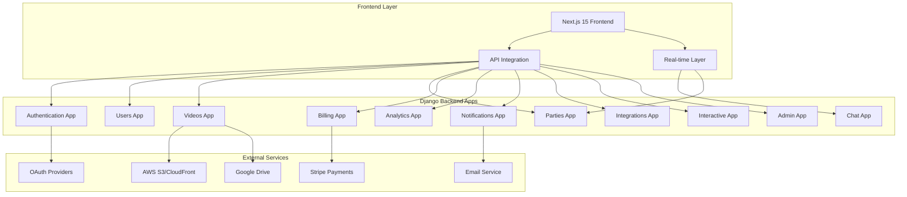
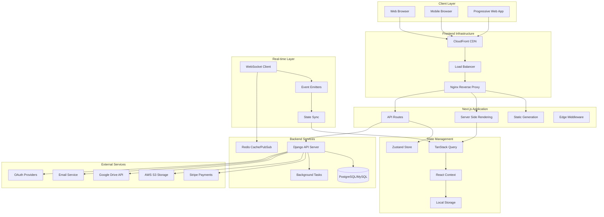
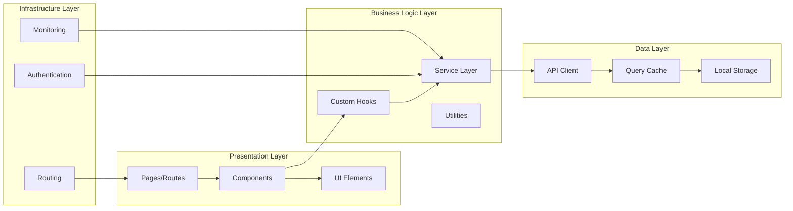
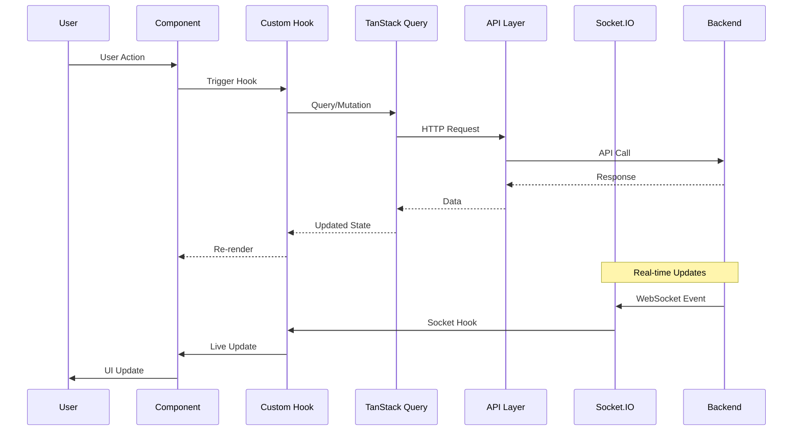
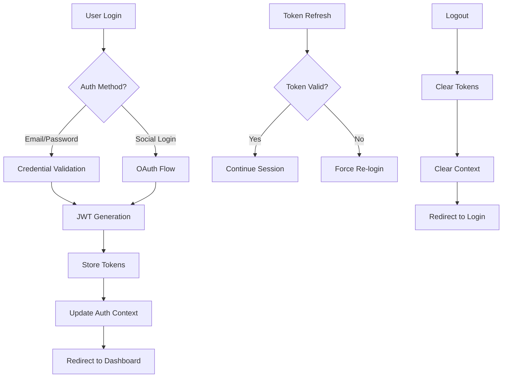
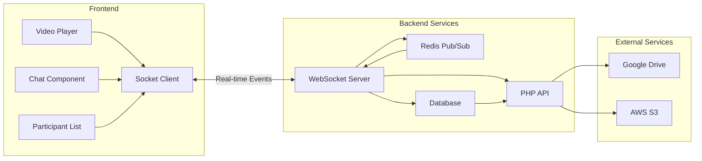

# 🎬 Watch Party Platform - Next.js Frontend Architecture

    

> **A comprehensive, scalable Next.js frontend for the Watch Party Platform - supporting real-time streaming, chat, analytics, billing, integrations, and future extensibility.**

---

## 📋 Table of Contents

1. [Overview](#overview)
2. [Tech Stack](#tech-stack)
3. [Backend Integration](#backend-integration)
4. [Architecture Overview](#architecture-overview)
5. [Scalable Component System](#scalable-component-system)
6. [Page Structure & Routes](#page-structure--routes)
7. [Real-time Integration](#real-time-integration)
8. [State Management](#state-management)
9. [Design System](#design-system)
10. [API Integration Layer](#api-integration-layer)
11. [Future-Proof Architecture](#future-proof-architecture)
12. [Setup & Development](#setup--development)
13. [Deployment](#deployment)

---

## 🎯 Overview

The Watch Party Platform Frontend is a cutting-edge Next.js 15 application designed to seamlessly integrate with a comprehensive Django backend. Built with scalability and extensibility in mind, this frontend supports all current backend functionality while providing a robust foundation for future feature additions.

### Core Platform Features
- 🎥 **Advanced Video Streaming** - Multi-source support (Google Drive, S3, YouTube) with CDN optimization
- 💬 **Real-time Communication** - WebSocket-powered chat, reactions, and live synchronization
- 👥 **Comprehensive User Management** - Profiles, friends, social features, and role-based access
- 💳 **Complete Billing System** - Stripe integration with subscriptions, invoices, and promo codes
- 🛡️ **Admin Dashboard** - Full system administration, analytics, and content moderation
- 📊 **Advanced Analytics** - User behavior tracking, video analytics, and business intelligence
- 🔗 **External Integrations** - OAuth providers, cloud storage, payment systems
- 📱 **Mobile-Optimized** - Responsive design with mobile-first approach
- ⚡ **High Performance** - Optimized for 10,000+ concurrent users
- 🧩 **Modular Architecture** - Plugin-ready system for easy feature additions

### Backend Integration Highlights
- **11 Django Apps** - Authentication, Users, Videos, Parties, Chat, Billing, Analytics, Notifications, Integrations, Interactive, Admin
- **Real-time WebSockets** - Chat, video sync, reactions, and live updates
- **Comprehensive APIs** - 150+ endpoints covering all platform functionality
- **Advanced Security** - JWT authentication, rate limiting, CORS, security headers
- **Multi-database Support** - PostgreSQL, MySQL with SSL, AWS RDS
- **Cloud Integration** - AWS S3, Google Drive, CloudFront CDN
- **Payment Processing** - Full Stripe integration with webhooks
- **Background Tasks** - Celery for email, video processing, analytics

---

## 🛠 Tech Stack

### Frontend Core
- **Framework:** Next.js 15 (App Router) - Latest features with React 19
- **Language:** TypeScript 5 - Strict mode with advanced type safety
- **Styling:** Tailwind CSS 3.4 - Utility-first with custom design system
- **UI Library:** Radix UI - Accessible, headless components
- **State Management:** TanStack Query v5 + Zustand - Server state + client state
- **Forms:** React Hook Form + Zod - Type-safe validation
- **Icons:** Lucide React - Consistent iconography
- **Charts & Visualization:** Recharts - Data visualization
- **Animation:** Framer Motion - Smooth, performant animations

### Real-time & Communication
- **WebSockets:** Socket.IO Client - Real-time bidirectional communication
- **HTTP Client:** Axios with Interceptors - Robust API communication
- **Error Handling:** React Error Boundary - Graceful error recovery
- **Notifications:** Sonner - Toast notifications with queue management

### Backend Integration
- **API Layer:** RESTful APIs with OpenAPI/Swagger integration
- **Authentication:** JWT with refresh tokens and auto-refresh
- **File Upload:** Direct S3 uploads with presigned URLs
- **Payment:** Stripe Elements with 3D Secure support
- **Social Auth:** OAuth 2.0 (Google, Facebook, GitHub)
- **WebRTC:** Video calling and screen sharing capabilities

### Development & Quality
- **Package Manager:** pnpm - Fast, efficient dependency management
- **Type Checking:** TypeScript strict mode with path mapping
- **Linting:** ESLint + Prettier - Code quality and formatting
- **Testing:** Jest + React Testing Library + Playwright
- **Performance:** Next.js built-in optimizations + custom monitoring
- **SEO:** Next.js metadata API with dynamic generation
- **Accessibility:** WCAG 2.1 AA compliance with testing

### Future-Ready Features
- **Micro-frontends:** Module federation support for scalable architecture
- **PWA:** Progressive Web App capabilities with offline support
- **Internationalization:** i18n ready with dynamic locale loading
- **A/B Testing:** Feature flag system for experimentation
- **Plugin System:** Extensible architecture for third-party integrations

---

## 🔗 Backend Integration

### Django Backend Architecture
The frontend integrates with a sophisticated Django backend featuring 11 specialized apps:



### Backend App Integration Map

| **Django App** | **Frontend Pages/Components** | **Key Features** |
|----------------|--------------------------------|------------------|
| **Authentication** | `/login`, `/register`, `/reset-password` | JWT auth, 2FA, social login, password reset |
| **Users** | `/dashboard/profile`, `/dashboard/friends` | Profile management, friend system, preferences |
| **Videos** | `/dashboard/videos`, `/watch/[id]` | Upload, streaming, metadata, thumbnails |
| **Parties** | `/dashboard/parties`, `/watch/[roomId]` | Room creation, management, controls |
| **Chat** | `ChatComponent`, `MessageSystem` | Real-time messaging, reactions, moderation |
| **Billing** | `/dashboard/billing`, `/pricing` | Subscriptions, payments, invoices, promo codes |
| **Analytics** | `/admin/analytics`, `DashboardMetrics` | User behavior, video stats, business intelligence |
| **Notifications** | `NotificationCenter`, `ToastSystem` | Real-time alerts, email notifications, preferences |
| **Integrations** | `/dashboard/settings/accounts` | OAuth connections, external service management |
| **Interactive** | `PollSystem`, `QuizComponents` | Live polls, quizzes, interactive features |
| **Admin** | `/admin/*` | System administration, user management, moderation |

### API Integration Layer

```typescript
// Comprehensive API client configuration
interface APIConfig {
  baseURL: string;
  timeout: number;
  withCredentials: boolean;
  headers: {
    'Content-Type': string;
    'Accept': string;
    'X-Requested-With': string;
  };
}

// Backend API endpoints mapped to frontend needs
const API_ENDPOINTS = {
  // Authentication App
  auth: {
    login: '/api/auth/login/',
    register: '/api/auth/register/',
    refresh: '/api/auth/refresh/',
    logout: '/api/auth/logout/',
    socialAuth: '/api/auth/{provider}/',
    forgotPassword: '/api/auth/forgot-password/',
    resetPassword: '/api/auth/reset-password/',
    verify2FA: '/api/auth/2fa/verify/',
  },
  
  // Users App
  users: {
    profile: '/api/users/profile/',
    updateProfile: '/api/users/profile/update/',
    friends: '/api/users/friends/',
    search: '/api/users/search/',
    activity: '/api/users/activity/',
    settings: '/api/users/settings/',
  },
  
  // Videos App
  videos: {
    list: '/api/videos/',
    upload: '/api/videos/upload/{type}/',
    stream: '/api/videos/{id}/stream/',
    metadata: '/api/videos/{id}/metadata/',
    analytics: '/api/videos/{id}/analytics/',
  },
  
  // Parties App
  parties: {
    list: '/api/parties/',
    create: '/api/parties/create/',
    join: '/api/parties/{id}/join/',
    controls: '/api/parties/{id}/{action}/',
    participants: '/api/parties/{id}/participants/',
  },
  
  // Chat App
  chat: {
    history: '/api/parties/{id}/chat/history/',
    reactions: '/api/parties/{id}/reactions/',
  },
  
  // Billing App
  billing: {
    plans: '/api/billing/plans/',
    subscribe: '/api/billing/subscribe/',
    history: '/api/billing/history/',
    methods: '/api/billing/payment-methods/',
    promoCode: '/api/billing/promo-codes/validate/',
  },
  
  // Analytics App
  analytics: {
    dashboard: '/api/analytics/dashboard/',
    videos: '/api/analytics/videos/',
    users: '/api/analytics/users/',
    revenue: '/api/analytics/revenue/',
  },
  
  // Notifications App
  notifications: {
    list: '/api/notifications/',
    markRead: '/api/notifications/{id}/read/',
    settings: '/api/notifications/settings/',
  },
  
  // Integrations App
  integrations: {
    list: '/api/integrations/',
    connect: '/api/integrations/{service}/connect/',
    disconnect: '/api/integrations/{service}/disconnect/',
  },
  
  // Interactive App
  interactive: {
    polls: '/api/interactive/polls/',
    quizzes: '/api/interactive/quizzes/',
    responses: '/api/interactive/{type}/{id}/responses/',
  },
  
  // Admin App (role-restricted)
  admin: {
    dashboard: '/api/admin/dashboard/',
    users: '/api/admin/users/',
    content: '/api/admin/content/',
    system: '/api/admin/system/',
    reports: '/api/admin/reports/',
  }
};
```

### Real-time Integration

```typescript
// WebSocket event mapping from Django backend
interface WebSocketEvents {
  // Chat App Events
  'chat:message': ChatMessage;
  'chat:reaction': ReactionEvent;
  'chat:typing': TypingEvent;
  
  // Party App Events
  'party:join': UserJoinEvent;
  'party:leave': UserLeaveEvent;
  'party:control': VideoControlEvent;
  'party:sync': SyncEvent;
  
  // Interactive App Events
  'interactive:poll_start': PollStartEvent;
  'interactive:poll_vote': PollVoteEvent;
  'interactive:quiz_question': QuizQuestionEvent;
  
  // Notification Events
  'notification:new': NotificationEvent;
  'notification:update': NotificationUpdateEvent;
  
  // System Events
  'system:maintenance': MaintenanceEvent;
  'system:announcement': AnnouncementEvent;
}

// Real-time connection management
class WebSocketManager {
  private connections: Map<string, Socket> = new Map();
  
  connect(namespace: string, token: string) {
    const socket = io(`/api/ws/${namespace}/`, {
      auth: { token },
      transports: ['websocket', 'polling']
    });
    
    this.connections.set(namespace, socket);
    return socket;
  }
  
  disconnect(namespace: string) {
    const socket = this.connections.get(namespace);
    socket?.disconnect();
    this.connections.delete(namespace);
  }
}
```

---

## 🏗 Architecture Overview

### High-Level System Architecture



### Frontend Architecture Layers



### Modular Component Architecture

```typescript
// Component hierarchy and dependency flow
interface ComponentArchitecture {
  // Layout Components (Global)
  layout: {
    AppLayout: 'Main application wrapper';
    PublicLayout: 'Marketing and public pages';
    DashboardLayout: 'Authenticated user interface';
    AdminLayout: 'Administrative interface';
    MobileLayout: 'Mobile-optimized layouts';
  };
  
  // Feature Components (Domain-specific)
  features: {
    Authentication: 'Login, register, password reset';
    UserManagement: 'Profiles, friends, settings';
    VideoStreaming: 'Upload, playback, controls';
    WatchParties: 'Room creation, participation';
    ChatSystem: 'Messaging, reactions, moderation';
    BillingSystem: 'Subscriptions, payments, invoices';
    Analytics: 'Dashboards, reports, metrics';
    Notifications: 'Real-time alerts, preferences';
    Integrations: 'External service connections';
    Interactive: 'Polls, quizzes, live activities';
    AdminTools: 'System management, moderation';
  };
  
  // UI Components (Reusable)
  ui: {
    Primitives: 'Buttons, inputs, modals from Radix UI';
    Composite: 'Data tables, forms, navigation';
    Specialized: 'Video players, chat bubbles, charts';
    Layout: 'Grids, containers, responsive wrappers';
  };
  
  // Provider Components (Context)
  providers: {
    AuthProvider: 'Authentication state and methods';
    ThemeProvider: 'Dark/light mode, color schemes';
    QueryProvider: 'TanStack Query configuration';
    SocketProvider: 'WebSocket connections and events';
    NotificationProvider: 'Toast and alert management';
  };
}
```

---

## 🧩 Scalable Component System

### Component Organization Strategy

```typescript
// Comprehensive component classification system
interface ComponentSystemArchitecture {
  // Atomic Components (Design System Foundation)
  atoms: {
    Button: 'variants: primary, secondary, ghost, destructive, premium';
    Input: 'types: text, email, password, search, file, with validation states';
    Avatar: 'sizes: xs, sm, md, lg, xl with fallbacks and online indicators';
    Badge: 'variants: default, success, warning, error, premium, live';
    Icon: 'Lucide React icons with consistent sizing and theming';
    Spinner: 'Loading states with different sizes and colors';
    Skeleton: 'Loading placeholders matching content structure';
  };
  
  // Molecular Components (Combined Atoms)
  molecules: {
    FormField: 'Input + Label + Error + Help text combinations';
    SearchBox: 'Input + Search icon + Clear button + Suggestions';
    UserCard: 'Avatar + Name + Status + Action buttons';
    MediaCard: 'Thumbnail + Title + Description + Metadata';
    NotificationItem: 'Icon + Message + Timestamp + Actions';
    PricingCard: 'Plan details + Features + CTA button';
    StatCard: 'Metric + Value + Trend + Sparkline chart';
  };
  
  // Organism Components (Complex UI Blocks)
  organisms: {
    Navigation: 'Multi-level menu with role-based visibility';
    VideoPlayer: 'Custom controls + Quality selector + Fullscreen';
    ChatInterface: 'Message list + Input + Emoji picker + Moderation';
    DataTable: 'Sorting + Filtering + Pagination + Bulk actions';
    Dashboard: 'Widget grid + Customizable layout + Real-time updates';
    PaymentForm: 'Stripe Elements + Validation + Processing states';
    AnalyticsChart: 'Recharts integration + Filters + Export options';
  };
  
  // Template Components (Page Layouts)
  templates: {
    PublicPageTemplate: 'Header + Hero + Content + Footer';
    DashboardTemplate: 'Sidebar + Header + Main + Breadcrumbs';
    AuthTemplate: 'Centered form + Branding + Background';
    AdminTemplate: 'Admin nav + Content area + Quick actions';
    MobileTemplate: 'Bottom tab nav + Content + Optimized spacing';
  };
  
  // Page Components (Complete Views)
  pages: {
    LandingPage: 'Marketing content + Feature showcase + CTA sections';
    DashboardPage: 'User overview + Quick actions + Recent activity';
    WatchPartyPage: 'Video player + Chat + Participants + Controls';
    AdminDashboard: 'System metrics + User management + Content moderation';
    BillingPage: 'Subscription status + Payment methods + Billing history';
  };
}
```

### Advanced Component Patterns

```typescript
// Compound Component Pattern for complex UI
export const VideoPlayer = {
  Root: VideoPlayerRoot,
  Screen: VideoScreen,
  Controls: VideoControls,
  Timeline: VideoTimeline,
  VolumeControl: VolumeControl,
  QualitySelector: QualitySelector,
  FullscreenButton: FullscreenButton,
  SettingsMenu: SettingsMenu,
};

// Usage: Flexible and composable
<VideoPlayer.Root>
  <VideoPlayer.Screen />
  <VideoPlayer.Controls>
    <VideoPlayer.Timeline />
    <VideoPlayer.VolumeControl />
    <VideoPlayer.QualitySelector />
    <VideoPlayer.FullscreenButton />
  </VideoPlayer.Controls>
  <VideoPlayer.SettingsMenu />
</VideoPlayer.Root>

// Render Props Pattern for data sharing
interface DataProviderProps<T> {
  children: (data: T, loading: boolean, error: Error | null) => React.ReactNode;
  query: QueryFunction<T>;
}

function DataProvider<T>({ children, query }: DataProviderProps<T>) {
  const { data, isLoading, error } = useQuery(query);
  return children(data, isLoading, error);
}

// HOC Pattern for feature enhancement
function withAuthentication<P extends object>(
  Component: React.ComponentType<P>
) {
  return function AuthenticatedComponent(props: P) {
    const { user, isAuthenticated } = useAuth();
    
    if (!isAuthenticated) {
      return <LoginPrompt />;
    }
    
    return <Component {...props} user={user} />;
  };
}

// Custom Hook Pattern for logic reuse
function useVideoPlayer(videoId: string) {
  const [playing, setPlaying] = useState(false);
  const [currentTime, setCurrentTime] = useState(0);
  const [duration, setDuration] = useState(0);
  const [volume, setVolume] = useState(1);
  const [quality, setQuality] = useState('auto');
  
  const { data: videoData } = useQuery(['video', videoId], () =>
    api.videos.getById(videoId)
  );
  
  const { socket } = useSocket(`/party/${videoId}`);
  
  useEffect(() => {
    socket?.on('video:control', handleRemoteControl);
    return () => socket?.off('video:control', handleRemoteControl);
  }, [socket]);
  
  return {
    // State
    playing,
    currentTime,
    duration,
    volume,
    quality,
    videoData,
    
    // Actions
    play: () => setPlaying(true),
    pause: () => setPlaying(false),
    seek: setCurrentTime,
    setVolume,
    setQuality,
    
    // Remote sync
    syncState: () => socket?.emit('video:sync', { currentTime, playing }),
  };
}
```

### Component Extension System

```typescript
// Plugin-based component extension
interface ComponentPlugin {
  name: string;
  version: string;
  dependencies?: string[];
  component: React.ComponentType<any>;
  config?: Record<string, any>;
}

class ComponentRegistry {
  private plugins = new Map<string, ComponentPlugin>();
  
  register(plugin: ComponentPlugin) {
    // Validate dependencies
    if (plugin.dependencies) {
      const missingDeps = plugin.dependencies.filter(
        dep => !this.plugins.has(dep)
      );
      if (missingDeps.length > 0) {
        throw new Error(`Missing dependencies: ${missingDeps.join(', ')}`);
      }
    }
    
    this.plugins.set(plugin.name, plugin);
  }
  
  get(name: string): ComponentPlugin | undefined {
    return this.plugins.get(name);
  }
  
  list(): ComponentPlugin[] {
    return Array.from(this.plugins.values());
  }
}

// Feature flag system for gradual rollouts
function useFeatureFlag(flagName: string) {
  const { user } = useAuth();
  const { data: flags } = useQuery(['feature-flags', user?.id], () =>
    api.admin.getFeatureFlags(user?.id)
  );
  
  return flags?.[flagName] ?? false;
}

// Conditional rendering with feature flags
function ConditionalComponent({ feature, children, fallback = null }) {
  const isEnabled = useFeatureFlag(feature);
  return isEnabled ? children : fallback;
}

// Usage
<ConditionalComponent 
  feature="new-video-player"
  fallback={<LegacyVideoPlayer />}
>
  <NewVideoPlayer />
</ConditionalComponent>
```

---

## 🌐 Page Structure & Routes

### Complete Route Architecture

```typescript
// Comprehensive routing structure supporting all backend functionality
interface RouteStructure {
  // Public Routes (Marketing & Authentication)
  public: {
    '/': 'Landing page with dynamic content and live metrics';
    '/about': 'Company information and team profiles';
    '/contact': 'Multi-department contact forms with routing';
    '/features': 'Feature showcase with interactive demos';
    '/pricing': 'Dynamic pricing with A/B testing support';
    '/blog': 'SEO-optimized blog with categories and search';
    '/blog/[slug]': 'Individual blog posts with comments';
    '/help': 'Knowledge base with search and categorization';
    '/terms': 'Legal documents with version tracking';
    '/privacy': 'Privacy policy with regional variations';
    '/login': 'Multi-method authentication (email, social, 2FA)';
    '/register': 'Registration with email verification';
    '/forgot-password': 'Password reset with rate limiting';
    '/reset-password/[token]': 'Token-based password reset';
    '/verify-email/[token]': 'Email verification handling';
    '/social-auth/callback/[provider]': 'OAuth callback handling';
  };
  
  // Protected User Routes (Dashboard & Features)
  protected: {
    // Main Dashboard
    '/dashboard': 'User overview with activity feed and quick actions';
    
    // Video Management (Videos App Integration)
    '/dashboard/videos': 'Personal video library with filtering and search';
    '/dashboard/videos/upload': 'Multi-source upload (S3, Google Drive, direct)';
    '/dashboard/videos/[id]': 'Video details with analytics and sharing';
    '/dashboard/videos/[id]/edit': 'Video metadata editing and privacy settings';
    
    // Watch Party Management (Parties App Integration)
    '/dashboard/parties': 'Created and joined parties with status tracking';
    '/dashboard/parties/create': 'Party creation with advanced scheduling';
    '/dashboard/parties/[id]': 'Party management and moderation tools';
    '/watch/[roomId]': 'Main watch party interface with video sync';
    '/join/[code]': 'Quick join by room code with validation';
    
    // Social Features (Users App Integration)
    '/dashboard/friends': 'Friend management with activity feeds';
    '/dashboard/friends/requests': 'Friend request management';
    '/dashboard/social': 'Social activity and recommendations';
    '/dashboard/profile': 'Profile management with privacy controls';
    '/dashboard/profile/public': 'Public profile preview';
    
    // Billing & Subscriptions (Billing App Integration)
    '/dashboard/billing': 'Subscription management and payment methods';
    '/dashboard/billing/history': 'Payment history and invoice downloads';
    '/dashboard/billing/upgrade': 'Plan upgrade with feature comparison';
    '/dashboard/billing/cancel': 'Cancellation flow with retention offers';
    
    // Notifications (Notifications App Integration)
    '/dashboard/notifications': 'Notification center with filtering';
    '/dashboard/notifications/settings': 'Notification preferences by type';
    
    // Integrations (Integrations App Integration)
    '/dashboard/integrations': 'Connected services and OAuth management';
    '/dashboard/integrations/[service]': 'Individual service configuration';
    
    // Interactive Features (Interactive App Integration)
    '/dashboard/polls': 'Created polls with results and analytics';
    '/dashboard/quizzes': 'Quiz management and performance tracking';
    '/dashboard/interactive/create': 'Interactive content creation tools';
    
    // User Settings & Preferences
    '/dashboard/settings': 'General account settings';
    '/dashboard/settings/security': 'Security settings, 2FA, sessions';
    '/dashboard/settings/privacy': 'Privacy controls and data management';
    '/dashboard/settings/appearance': 'Theme and display preferences';
    '/dashboard/settings/api': 'API key management for developers';
    
    // Analytics & Insights (User-level)
    '/dashboard/analytics': 'Personal usage analytics and insights';
    '/dashboard/analytics/videos': 'Video performance metrics';
    '/dashboard/analytics/engagement': 'Social engagement statistics';
  };
  
  // Administrative Routes (Admin App Integration)
  admin: {
    // Main Admin Dashboard
    '/admin': 'System overview with real-time metrics and alerts';
    
    // User Management
    '/admin/users': 'User administration with advanced filtering';
    '/admin/users/[id]': 'Individual user management and history';
    '/admin/users/bulk': 'Bulk user operations and imports';
    '/admin/users/roles': 'Role and permission management';
    
    // Content Management
    '/admin/videos': 'Video content moderation and analytics';
    '/admin/videos/flagged': 'Flagged content review queue';
    '/admin/videos/analytics': 'Platform-wide video analytics';
    '/admin/parties': 'Live party monitoring and intervention';
    '/admin/chat': 'Chat moderation and message review';
    
    // System Administration
    '/admin/system': 'System health, services, and configurations';
    '/admin/system/logs': 'System logs with filtering and search';
    '/admin/system/performance': 'Performance metrics and optimization';
    '/admin/system/security': 'Security monitoring and threat detection';
    
    // Business Analytics (Analytics App Integration)
    '/admin/analytics': 'Business intelligence dashboard';
    '/admin/analytics/revenue': 'Revenue analytics and forecasting';
    '/admin/analytics/engagement': 'User engagement and retention metrics';
    '/admin/analytics/content': 'Content performance and trends';
    
    // Billing Management
    '/admin/billing': 'Subscription and payment management';
    '/admin/billing/plans': 'Pricing plan configuration';
    '/admin/billing/coupons': 'Promotional code management';
    '/admin/billing/disputes': 'Payment dispute resolution';
    
    // Communication Management
    '/admin/notifications': 'System-wide notification management';
    '/admin/notifications/templates': 'Email and notification templates';
    '/admin/notifications/campaigns': 'Marketing campaign management';
    
    // Integration Management
    '/admin/integrations': 'External service configuration';
    '/admin/integrations/oauth': 'OAuth provider management';
    '/admin/integrations/webhooks': 'Webhook configuration and monitoring';
    
    // Interactive Content Management
    '/admin/interactive': 'Platform-wide interactive content';
    '/admin/interactive/polls': 'Poll management and moderation';
    '/admin/interactive/quizzes': 'Quiz content and performance tracking';
    
    // Reports & Exports
    '/admin/reports': 'Report generation and scheduling';
    '/admin/reports/custom': 'Custom report builder';
    '/admin/reports/exports': 'Data export management';
  };
  
  // API Routes (Internal)
  api: {
    '/api/auth/[...nextauth]': 'NextAuth.js authentication endpoints';
    '/api/upload/signature': 'Upload signature generation for S3';
    '/api/webhooks/stripe': 'Stripe webhook handling';
    '/api/webhooks/[provider]': 'External service webhook endpoints';
    '/api/health': 'Application health check';
    '/api/cron/[task]': 'Scheduled task endpoints';
  };
  
  // Mobile-Optimized Routes
  mobile: {
    '/mobile': 'Mobile app download and QR codes';
    '/mobile/watch/[roomId]': 'Mobile-optimized watch interface';
    '/mobile/dashboard': 'Mobile dashboard with touch-friendly UI';
  };
  
  // Error & Special Pages
  special: {
    '/404': 'Custom 404 page with search and navigation';
    '/500': 'Error page with incident reporting';
    '/maintenance': 'Maintenance mode page with status updates';
    '/offline': 'Offline mode page for PWA';
  };
}
```

### Dynamic Route Configuration

```typescript
// Advanced routing with middleware and guards
interface RouteConfig {
  path: string;
  component: React.ComponentType;
  middleware?: Middleware[];
  guards?: RouteGuard[];
  metadata?: PageMetadata;
  features?: string[]; // Feature flags required
  roles?: UserRole[]; // Required user roles
  premium?: boolean; // Requires premium subscription
}

// Route middleware system
const routeMiddleware = {
  auth: (req, res, next) => {
    // JWT token validation
    // Redirect to login if not authenticated
  },
  
  premium: (req, res, next) => {
    // Check premium subscription status
    // Show upgrade prompt if required
  },
  
  admin: (req, res, next) => {
    // Verify admin role
    // Redirect to dashboard if unauthorized
  },
  
  rateLimit: (req, res, next) => {
    // Rate limiting based on user tier
    // Show rate limit error if exceeded
  },
  
  featureFlag: (feature: string) => (req, res, next) => {
    // Check if feature is enabled for user
    // Show 404 if feature not available
  },
  
  analytics: (req, res, next) => {
    // Track page views and user behavior
    // Send analytics events to backend
  }
};

// Route-based code splitting configuration
const routeSplitting = {
  '/admin/*': () => import('../components/admin/AdminBundle'),
  '/dashboard/analytics/*': () => import('../components/analytics/AnalyticsBundle'),
  '/dashboard/billing/*': () => import('../components/billing/BillingBundle'),
  '/watch/*': () => import('../components/watch-party/WatchPartyBundle'),
  '/dashboard/videos/*': () => import('../components/videos/VideoBundle'),
};

// SEO and metadata configuration per route
const routeMetadata = {
  '/': {
    title: 'Watch Party Platform - Stream Together',
    description: 'Watch videos with friends in real-time. Upload, share, and enjoy synchronized streaming with live chat.',
    keywords: 'watch party, video streaming, live chat, synchronized viewing',
    ogImage: '/og-images/landing.png',
    canonical: 'https://watchparty.com',
  },
  
  '/dashboard': {
    title: 'Dashboard - Watch Party Platform',
    description: 'Manage your videos, parties, and social connections.',
    robots: 'noindex, nofollow', // Private pages
  },
  
  '/admin/*': {
    title: 'Admin Panel - Watch Party Platform',
    description: 'Administrative interface for platform management.',
    robots: 'noindex, nofollow',
  }
};
```

### Mobile-First Route Optimization

```typescript
// Mobile-specific routing and optimization
interface MobileRouteConfig {
  // Touch-optimized navigation
  bottomTabRoutes: {
    '/dashboard': { icon: 'Home', label: 'Dashboard' };
    '/dashboard/videos': { icon: 'Play', label: 'Videos' };
    '/dashboard/parties': { icon: 'Users', label: 'Parties' };
    '/dashboard/friends': { icon: 'Heart', label: 'Friends' };
    '/dashboard/settings': { icon: 'Settings', label: 'Settings' };
  };
  
  // Swipe gesture support
  swipeRoutes: {
    '/dashboard': {
      swipeLeft: '/dashboard/videos',
      swipeRight: '/dashboard/friends',
    };
  };
  
  // Progressive Web App routes
  pwaRoutes: {
    '/watch/[roomId]': {
      standalone: true,
      orientation: 'landscape',
      fullscreen: true,
    };
  };
  
  // Offline-capable routes
  offlineRoutes: [
    '/dashboard',
    '/dashboard/videos',
    '/dashboard/settings',
  ];
}
```

---

## ⚡ Real-time Integration

### WebSocket Architecture

```typescript
// Comprehensive WebSocket integration with Django Channels
interface WebSocketArchitecture {
  // Connection Management
  connections: {
    global: '/api/ws/global/'; // System-wide notifications
    party: '/api/ws/party/{partyId}/'; // Party-specific events
    chat: '/api/ws/chat/{partyId}/'; // Chat messages and reactions
    admin: '/api/ws/admin/'; // Admin-only real-time updates
    analytics: '/api/ws/analytics/'; // Real-time metrics (admin)
    user: '/api/ws/user/{userId}/'; // User-specific notifications
  };
  
  // Event Categories
  events: {
    // Chat App Events
    'chat:message': 'New chat message received';
    'chat:reaction': 'Emoji reaction added to message';
    'chat:typing': 'User typing indicator';
    'chat:delete': 'Message deleted by user/moderator';
    'chat:moderate': 'Moderation action taken';
    
    // Party App Events
    'party:join': 'User joined the party';
    'party:leave': 'User left the party';
    'party:control': 'Video playback control (play/pause/seek)';
    'party:sync': 'Video synchronization event';
    'party:update': 'Party settings updated';
    'party:end': 'Party ended by host';
    
    // Interactive App Events
    'interactive:poll_start': 'New poll started in party';
    'interactive:poll_vote': 'Vote cast on active poll';
    'interactive:poll_end': 'Poll ended with results';
    'interactive:quiz_question': 'New quiz question presented';
    'interactive:quiz_answer': 'Quiz answer submitted';
    
    // User App Events
    'user:friend_request': 'New friend request received';
    'user:friend_accept': 'Friend request accepted';
    'user:status_change': 'User online/offline status change';
    'user:profile_update': 'Profile information updated';
    
    // Notification App Events
    'notification:new': 'New notification received';
    'notification:read': 'Notification marked as read';
    'notification:clear': 'All notifications cleared';
    
    // Billing App Events
    'billing:payment_success': 'Payment processed successfully';
    'billing:payment_failed': 'Payment processing failed';
    'billing:subscription_change': 'Subscription status changed';
    
    // System Events
    'system:maintenance': 'System maintenance announcement';
    'system:announcement': 'General system announcement';
    'system:feature_toggle': 'Feature flag updated';
    'system:emergency': 'Emergency alert broadcast';
  };
}

// WebSocket Client Implementation
class WebSocketManager {
  private connections = new Map<string, Socket>();
  private reconnectAttempts = new Map<string, number>();
  private maxReconnectAttempts = 5;
  private reconnectDelay = 1000;
  
  connect(namespace: string, options: SocketOptions = {}) {
    if (this.connections.has(namespace)) {
      return this.connections.get(namespace)!;
    }
    
    const socket = io(`${process.env.NEXT_PUBLIC_WS_URL}${namespace}`, {
      auth: {
        token: this.getAuthToken(),
      },
      transports: ['websocket', 'polling'],
      timeout: 20000,
      ...options,
    });
    
    this.setupSocketHandlers(socket, namespace);
    this.connections.set(namespace, socket);
    
    return socket;
  }
  
  private setupSocketHandlers(socket: Socket, namespace: string) {
    socket.on('connect', () => {
      console.log(`Connected to ${namespace}`);
      this.reconnectAttempts.set(namespace, 0);
    });
    
    socket.on('disconnect', (reason) => {
      console.log(`Disconnected from ${namespace}:`, reason);
      if (reason === 'io server disconnect') {
        // Server initiated disconnect - don't reconnect
        return;
      }
      this.handleReconnection(socket, namespace);
    });
    
    socket.on('connect_error', (error) => {
      console.error(`Connection error for ${namespace}:`, error);
      this.handleReconnection(socket, namespace);
    });
  }
  
  private handleReconnection(socket: Socket, namespace: string) {
    const attempts = this.reconnectAttempts.get(namespace) || 0;
    
    if (attempts < this.maxReconnectAttempts) {
      setTimeout(() => {
        this.reconnectAttempts.set(namespace, attempts + 1);
        socket.connect();
      }, this.reconnectDelay * Math.pow(2, attempts)); // Exponential backoff
    }
  }
  
  disconnect(namespace: string) {
    const socket = this.connections.get(namespace);
    if (socket) {
      socket.disconnect();
      this.connections.delete(namespace);
      this.reconnectAttempts.delete(namespace);
    }
  }
  
  emit(namespace: string, event: string, data: any) {
    const socket = this.connections.get(namespace);
    if (socket?.connected) {
      socket.emit(event, data);
    }
  }
  
  private getAuthToken(): string {
    // Get JWT token from storage or auth context
    return localStorage.getItem('access_token') || '';
  }
}

// React Hooks for WebSocket Integration
function useSocket(namespace: string, options?: SocketOptions) {
  const [socket, setSocket] = useState<Socket | null>(null);
  const [connected, setConnected] = useState(false);
  const wsManager = useRef(new WebSocketManager());
  
  useEffect(() => {
    const socketInstance = wsManager.current.connect(namespace, options);
    
    socketInstance.on('connect', () => setConnected(true));
    socketInstance.on('disconnect', () => setConnected(false));
    
    setSocket(socketInstance);
    
    return () => {
      wsManager.current.disconnect(namespace);
    };
  }, [namespace]);
  
  return { socket, connected };
}

function usePartyEvents(partyId: string) {
  const { socket } = useSocket(`/party/${partyId}`);
  const [participants, setParticipants] = useState<User[]>([]);
  const [videoState, setVideoState] = useState({
    playing: false,
    currentTime: 0,
    timestamp: Date.now(),
  });
  
  useEffect(() => {
    if (!socket) return;
    
    const handleUserJoin = (data: { user: User }) => {
      setParticipants(prev => [...prev, data.user]);
    };
    
    const handleUserLeave = (data: { userId: string }) => {
      setParticipants(prev => prev.filter(p => p.id !== data.userId));
    };
    
    const handleVideoControl = (data: VideoControlEvent) => {
      setVideoState({
        playing: data.action === 'play',
        currentTime: data.timestamp,
        timestamp: Date.now(),
      });
    };
    
    socket.on('party:join', handleUserJoin);
    socket.on('party:leave', handleUserLeave);
    socket.on('party:control', handleVideoControl);
    
    return () => {
      socket.off('party:join', handleUserJoin);
      socket.off('party:leave', handleUserLeave);
      socket.off('party:control', handleVideoControl);
    };
  }, [socket]);
  
  const emitVideoControl = (action: string, timestamp: number) => {
    socket?.emit('video:control', { action, timestamp });
  };
  
  return {
    participants,
    videoState,
    emitVideoControl,
    connected: socket?.connected || false,
  };
}

function useChatMessages(partyId: string) {
  const { socket } = useSocket(`/chat/${partyId}`);
  const [messages, setMessages] = useState<ChatMessage[]>([]);
  const [typing, setTyping] = useState<string[]>([]);
  
  useEffect(() => {
    if (!socket) return;
    
    const handleMessage = (message: ChatMessage) => {
      setMessages(prev => [...prev, message]);
    };
    
    const handleTyping = (data: { userId: string, username: string }) => {
      setTyping(prev => [...prev.filter(id => id !== data.userId), data.userId]);
      
      // Remove typing indicator after 3 seconds
      setTimeout(() => {
        setTyping(prev => prev.filter(id => id !== data.userId));
      }, 3000);
    };
    
    socket.on('chat:message', handleMessage);
    socket.on('chat:typing', handleTyping);
    
    return () => {
      socket.off('chat:message', handleMessage);
      socket.off('chat:typing', handleTyping);
    };
  }, [socket]);
  
  const sendMessage = (content: string) => {
    socket?.emit('chat:message', { content });
  };
  
  const sendTyping = () => {
    socket?.emit('chat:typing', {});
  };
  
  return {
    messages,
    typing,
    sendMessage,
    sendTyping,
    connected: socket?.connected || false,
  };
}
```

### Real-time State Synchronization

```typescript
// Video synchronization with conflict resolution
class VideoSyncManager {
  private syncTolerance = 1000; // 1 second tolerance
  private lastSyncTime = 0;
  private syncDebounce = 500; // Debounce sync events
  
  constructor(
    private socket: Socket,
    private videoElement: HTMLVideoElement,
    private isHost: boolean
  ) {
    this.setupEventHandlers();
  }
  
  private setupEventHandlers() {
    // Local video events
    this.videoElement.addEventListener('play', this.handleLocalPlay);
    this.videoElement.addEventListener('pause', this.handleLocalPause);
    this.videoElement.addEventListener('seeked', this.handleLocalSeek);
    
    // Remote events
    this.socket.on('video:sync', this.handleRemoteSync);
    this.socket.on('video:control', this.handleRemoteControl);
  }
  
  private handleLocalPlay = () => {
    if (this.isHost && this.shouldSync()) {
      this.emitSync('play', this.videoElement.currentTime);
    }
  };
  
  private handleLocalPause = () => {
    if (this.isHost && this.shouldSync()) {
      this.emitSync('pause', this.videoElement.currentTime);
    }
  };
  
  private handleLocalSeek = () => {
    if (this.isHost && this.shouldSync()) {
      this.emitSync('seek', this.videoElement.currentTime);
    }
  };
  
  private handleRemoteSync = (data: SyncEvent) => {
    if (data.timestamp <= this.lastSyncTime) return;
    
    const timeDiff = Math.abs(this.videoElement.currentTime - data.currentTime);
    
    if (timeDiff > this.syncTolerance / 1000) {
      this.videoElement.currentTime = data.currentTime;
    }
    
    if (data.playing !== !this.videoElement.paused) {
      if (data.playing) {
        this.videoElement.play();
      } else {
        this.videoElement.pause();
      }
    }
    
    this.lastSyncTime = data.timestamp;
  };
  
  private handleRemoteControl = (data: VideoControlEvent) => {
    switch (data.action) {
      case 'play':
        this.videoElement.currentTime = data.timestamp;
        this.videoElement.play();
        break;
      case 'pause':
        this.videoElement.pause();
        break;
      case 'seek':
        this.videoElement.currentTime = data.timestamp;
        break;
    }
  };
  
  private emitSync(action: string, currentTime: number) {
    const now = Date.now();
    if (now - this.lastSyncTime < this.syncDebounce) return;
    
    this.socket.emit('video:control', {
      action,
      timestamp: currentTime,
      serverTime: now,
    });
    
    this.lastSyncTime = now;
  }
  
  private shouldSync(): boolean {
    // Only sync if user has control permissions
    return this.isHost && this.socket.connected;
  }
}

// Real-time analytics tracking
function useRealTimeAnalytics() {
  const { socket } = useSocket('/analytics');
  const [metrics, setMetrics] = useState<AnalyticsMetrics>({});
  
  useEffect(() => {
    if (!socket) return;
    
    const handleMetricsUpdate = (data: AnalyticsMetrics) => {
      setMetrics(prev => ({ ...prev, ...data }));
    };
    
    socket.on('analytics:update', handleMetricsUpdate);
    
    return () => {
      socket.off('analytics:update', handleMetricsUpdate);
    };
  }, [socket]);
  
  const trackEvent = (event: string, data: any) => {
    socket?.emit('analytics:track', { event, data, timestamp: Date.now() });
  };
  
  return { metrics, trackEvent };
}
```

---

## 🗃️ State Management

### Multi-Layer State Architecture

```typescript
// Comprehensive state management strategy
interface StateArchitecture {
  // Server State (TanStack Query)
  serverState: {
    user: 'User profile and authentication data';
    videos: 'Video library and metadata';
    parties: 'Watch party information and participants';
    friends: 'Friend connections and social data';
    billing: 'Subscription and payment information';
    notifications: 'User notifications and preferences';
    analytics: 'User and admin analytics data';
    integrations: 'Connected services and OAuth data';
    interactive: 'Polls, quizzes, and interactive content';
    admin: 'Administrative data and system metrics';
  };
  
  // Client State (Zustand)
  clientState: {
    ui: 'UI state, modals, sidebars, themes';
    preferences: 'User preferences and settings';
    temporaryData: 'Form data, draft content, temporary selections';
    navigation: 'Routing state and navigation history';
    errors: 'Error states and error recovery';
    offline: 'Offline state and sync queue';
  };
  
  // Real-time State (WebSocket)
  realTimeState: {
    chat: 'Live chat messages and typing indicators';
    presence: 'User online/offline status and activity';
    videoSync: 'Video playback synchronization';
    liveMetrics: 'Real-time analytics and system metrics';
    notifications: 'Live notification updates';
  };
  
  // Local State (Component-specific)
  localState: {
    forms: 'Form inputs and validation states';
    animations: 'Animation states and transitions';
    interactions: 'User interaction states (hover, focus)';
    componentSpecific: 'Component-specific temporary state';
  };
}

// TanStack Query Configuration
export const queryClient = new QueryClient({
  defaultOptions: {
    queries: {
      staleTime: 5 * 60 * 1000, // 5 minutes
      gcTime: 10 * 60 * 1000, // 10 minutes
      retry: (failureCount, error) => {
        if (error.status === 401) return false; // Don't retry auth errors
        return failureCount < 3;
      },
      refetchOnWindowFocus: false,
      refetchOnReconnect: true,
    },
    mutations: {
      retry: false,
      onError: (error) => {
        // Global error handling
        if (error.status === 401) {
          // Redirect to login
        }
        toast.error(error.message);
      },
    },
  },
});

// Query Keys Factory
export const queryKeys = {
  // Authentication
  auth: {
    user: () => ['auth', 'user'] as const,
    permissions: (userId: string) => ['auth', 'permissions', userId] as const,
  },
  
  // Users
  users: {
    all: () => ['users'] as const,
    profile: (userId: string) => ['users', 'profile', userId] as const,
    friends: (userId: string) => ['users', 'friends', userId] as const,
    search: (query: string) => ['users', 'search', query] as const,
    activity: (userId: string, filters?: any) => 
      ['users', 'activity', userId, filters] as const,
  },
  
  // Videos
  videos: {
    all: () => ['videos'] as const,
    list: (filters?: VideoFilters) => ['videos', 'list', filters] as const,
    detail: (videoId: string) => ['videos', 'detail', videoId] as const,
    analytics: (videoId: string) => ['videos', 'analytics', videoId] as const,
    upload: (uploadId: string) => ['videos', 'upload', uploadId] as const,
  },
  
  // Parties
  parties: {
    all: () => ['parties'] as const,
    list: (userId: string) => ['parties', 'list', userId] as const,
    detail: (partyId: string) => ['parties', 'detail', partyId] as const,
    participants: (partyId: string) => ['parties', 'participants', partyId] as const,
    public: (filters?: PartyFilters) => ['parties', 'public', filters] as const,
  },
  
  // Billing
  billing: {
    subscription: (userId: string) => ['billing', 'subscription', userId] as const,
    history: (userId: string) => ['billing', 'history', userId] as const,
    methods: (userId: string) => ['billing', 'methods', userId] as const,
    plans: () => ['billing', 'plans'] as const,
  },
  
  // Analytics
  analytics: {
    dashboard: (timeRange?: string) => ['analytics', 'dashboard', timeRange] as const,
    videos: (filters?: AnalyticsFilters) => ['analytics', 'videos', filters] as const,
    users: (filters?: AnalyticsFilters) => ['analytics', 'users', filters] as const,
    revenue: (timeRange?: string) => ['analytics', 'revenue', timeRange] as const,
  },
  
  // Admin
  admin: {
    users: (filters?: AdminFilters) => ['admin', 'users', filters] as const,
    system: () => ['admin', 'system'] as const,
    reports: (type: string) => ['admin', 'reports', type] as const,
  },
};

// Zustand Store for Client State
interface AppStore {
  // UI State
  ui: {
    sidebarOpen: boolean;
    theme: 'light' | 'dark' | 'system';
    mobileMenuOpen: boolean;
    modalStack: string[];
    loading: Record<string, boolean>;
  };
  
  // User Preferences
  preferences: {
    videoQuality: 'auto' | '720p' | '1080p' | '4k';
    autoplay: boolean;
    notifications: NotificationSettings;
    privacy: PrivacySettings;
  };
  
  // Temporary Data
  temp: {
    drafts: Record<string, any>;
    selections: Record<string, any>;
    formData: Record<string, any>;
  };
  
  // Error State
  errors: {
    global: string | null;
    field: Record<string, string>;
  };
  
  // Actions
  actions: {
    ui: UIActions;
    preferences: PreferenceActions;
    temp: TempActions;
    errors: ErrorActions;
  };
}

export const useAppStore = create<AppStore>((set, get) => ({
  ui: {
    sidebarOpen: true,
    theme: 'dark',
    mobileMenuOpen: false,
    modalStack: [],
    loading: {},
  },
  
  preferences: {
    videoQuality: 'auto',
    autoplay: true,
    notifications: {
      email: true,
      push: true,
      chat: true,
      parties: true,
    },
    privacy: {
      profileVisibility: 'friends',
      activityVisibility: 'friends',
      searchable: true,
    },
  },
  
  temp: {
    drafts: {},
    selections: {},
    formData: {},
  },
  
  errors: {
    global: null,
    field: {},
  },
  
  actions: {
    ui: {
      toggleSidebar: () => 
        set(state => ({ 
          ui: { ...state.ui, sidebarOpen: !state.ui.sidebarOpen }
        })),
      
      setTheme: (theme) =>
        set(state => ({
          ui: { ...state.ui, theme }
        })),
      
      pushModal: (modalId) =>
        set(state => ({
          ui: { 
            ...state.ui, 
            modalStack: [...state.ui.modalStack, modalId]
          }
        })),
      
      popModal: () =>
        set(state => ({
          ui: {
            ...state.ui,
            modalStack: state.ui.modalStack.slice(0, -1)
          }
        })),
      
      setLoading: (key, loading) =>
        set(state => ({
          ui: {
            ...state.ui,
            loading: { ...state.ui.loading, [key]: loading }
          }
        })),
    },
    
    preferences: {
      updateVideoQuality: (quality) =>
        set(state => ({
          preferences: { ...state.preferences, videoQuality: quality }
        })),
      
      updateNotifications: (notifications) =>
        set(state => ({
          preferences: { 
            ...state.preferences, 
            notifications: { ...state.preferences.notifications, ...notifications }
          }
        })),
      
      updatePrivacy: (privacy) =>
        set(state => ({
          preferences: {
            ...state.preferences,
            privacy: { ...state.preferences.privacy, ...privacy }
          }
        })),
    },
    
    temp: {
      saveDraft: (key, data) =>
        set(state => ({
          temp: {
            ...state.temp,
            drafts: { ...state.temp.drafts, [key]: data }
          }
        })),
      
      removeDraft: (key) =>
        set(state => ({
          temp: {
            ...state.temp,
            drafts: Object.fromEntries(
              Object.entries(state.temp.drafts).filter(([k]) => k !== key)
            )
          }
        })),
      
      setSelection: (key, selection) =>
        set(state => ({
          temp: {
            ...state.temp,
            selections: { ...state.temp.selections, [key]: selection }
          }
        })),
    },
    
    errors: {
      setGlobalError: (error) =>
        set(state => ({
          errors: { ...state.errors, global: error }
        })),
      
      clearGlobalError: () =>
        set(state => ({
          errors: { ...state.errors, global: null }
        })),
      
      setFieldError: (field, error) =>
        set(state => ({
          errors: {
            ...state.errors,
            field: { ...state.errors.field, [field]: error }
          }
        })),
      
      clearFieldError: (field) =>
        set(state => ({
          errors: {
            ...state.errors,
            field: Object.fromEntries(
              Object.entries(state.errors.field).filter(([k]) => k !== field)
            )
          }
        })),
    },
  },
}));

// Real-time State Management
interface RealTimeStore {
  connections: Map<string, Socket>;
  presence: Record<string, UserPresence>;
  chat: Record<string, ChatMessage[]>;
  videoSync: Record<string, VideoSyncState>;
  notifications: NotificationEvent[];
  
  actions: {
    addConnection: (namespace: string, socket: Socket) => void;
    removeConnection: (namespace: string) => void;
    updatePresence: (userId: string, presence: UserPresence) => void;
    addChatMessage: (partyId: string, message: ChatMessage) => void;
    updateVideoSync: (partyId: string, state: VideoSyncState) => void;
    addNotification: (notification: NotificationEvent) => void;
  };
}

export const useRealTimeStore = create<RealTimeStore>((set, get) => ({
  connections: new Map(),
  presence: {},
  chat: {},
  videoSync: {},
  notifications: [],
  
  actions: {
    addConnection: (namespace, socket) =>
      set(state => ({
        connections: new Map(state.connections).set(namespace, socket)
      })),
    
    removeConnection: (namespace) =>
      set(state => {
        const connections = new Map(state.connections);
        connections.delete(namespace);
        return { connections };
      }),
    
    updatePresence: (userId, presence) =>
      set(state => ({
        presence: { ...state.presence, [userId]: presence }
      })),
    
    addChatMessage: (partyId, message) =>
      set(state => ({
        chat: {
          ...state.chat,
          [partyId]: [...(state.chat[partyId] || []), message]
        }
      })),
    
    updateVideoSync: (partyId, syncState) =>
      set(state => ({
        videoSync: { ...state.videoSync, [partyId]: syncState }
      })),
    
    addNotification: (notification) =>
      set(state => ({
        notifications: [notification, ...state.notifications.slice(0, 99)] // Keep last 100
      })),
  },
}));

// Optimistic Updates Pattern
export function useOptimisticMutation<TData, TVariables>(
  mutation: UseMutationOptions<TData, Error, TVariables>,
  queryKey: QueryKey,
  optimisticUpdate: (oldData: any, variables: TVariables) => any
) {
  const queryClient = useQueryClient();
  
  return useMutation({
    ...mutation,
    onMutate: async (variables) => {
      // Cancel outgoing refetches
      await queryClient.cancelQueries({ queryKey });
      
      // Snapshot previous value
      const previousData = queryClient.getQueryData(queryKey);
      
      // Optimistically update
      queryClient.setQueryData(queryKey, (old: any) =>
        optimisticUpdate(old, variables)
      );
      
      return { previousData };
    },
    
    onError: (err, variables, context) => {
      // Rollback on error
      if (context?.previousData) {
        queryClient.setQueryData(queryKey, context.previousData);
      }
      mutation.onError?.(err, variables, context);
    },
    
    onSettled: () => {
      // Refetch after mutation
      queryClient.invalidateQueries({ queryKey });
    },
  });
}
```

---

## 🎨 Design System - "Neo Stadium Glow"

### Design Philosophy & Brand Guidelines

```typescript
// Comprehensive design system supporting scalability and accessibility
interface DesignSystemPhilosophy {
  core: {
    purpose: 'Create immersive, accessible, and professional streaming experience';
    personality: 'Modern, energetic, trustworthy, innovative';
    principles: [
      'Accessibility First - WCAG 2.1 AA compliance',
      'Mobile First - Progressive enhancement',
      'Dark Mode Native - Optimized for extended viewing',
      'Performance Focused - Minimal cognitive load',
      'Scalable Architecture - Design tokens and component variants'
    ];
  };
  
  brandValues: {
    trust: 'Professional appearance builds user confidence';
    energy: 'Vibrant colors create excitement for shared experiences';
    clarity: 'Clear typography and spacing enhance usability';
    innovation: 'Modern aesthetics reflect cutting-edge technology';
  };
}
```

### Advanced Color System

```typescript
// Comprehensive color palette with semantic meaning and accessibility
const colorSystem = {
  // Base Dark Theme (Primary)
  foundation: {
    black: '#000000',           // Pure black for text on light backgrounds
    darkest: '#0A0A0B',        // Deepest background (modals, overlays)
    darker: '#0E0E10',         // Main app background
    dark: '#1A1A1D',           // Cards, panels, elevated surfaces
    medium: '#2E2E32',         // Borders, dividers, input backgrounds
    light: '#404045',          // Hover states, secondary elements
    lighter: '#5A5A5F',        // Disabled states, subtle text
    lightest: '#888888',       // Tertiary text, placeholders
    white: '#FFFFFF',          // Primary text, icons
  },
  
  // Semantic Colors (Brand & Functional)
  semantic: {
    // Primary Brand (Stadium Blue)
    primary: {
      50: '#EBF8FF',
      100: '#D6F1FF',
      200: '#B8E9FF',
      300: '#85D8FF',
      400: '#3ABEF9',     // Main brand color
      500: '#28A8E0',
      600: '#1A8BC7',
      700: '#0F6BA3',
      800: '#0A4D7A',
      900: '#063551',
      950: '#041E2E',
    },
    
    // Success (Stadium Green)
    success: {
      50: '#F0FDF4',
      100: '#DCFCE7',
      200: '#BBF7D0',
      300: '#9FF87A',     // Main success color
      400: '#4ADE80',
      500: '#22C55E',
      600: '#16A34A',
      700: '#15803D',
      800: '#166534',
      900: '#14532D',
    },
    
    // Warning (Stadium Gold)
    warning: {
      50: '#FFFBEB',
      100: '#FEF3C7',
      200: '#FDE68A',
      300: '#FFC857',     // Main warning color
      400: '#F59E0B',
      500: '#D97706',
      600: '#B45309',
      700: '#92400E',
      800: '#78350F',
      900: '#451A03',
    },
    
    // Error (Stadium Red)
    error: {
      50: '#FEF2F2',
      100: '#FEE2E2',
      200: '#FECACA',
      300: '#FCA5A5',
      400: '#FF3B3B',     // Main error color
      500: '#EF4444',
      600: '#DC2626',
      700: '#B91C1C',
      800: '#991B1B',
      900: '#7F1D1D',
    },
    
    // Special Colors
    highlight: '#14FFEC',     // Neon cyan for special highlights
    premium: '#FFD700',       // Gold for premium features
    live: '#FF4444',          // Live indicators
    offline: '#666666',       // Offline status
    
    // Interactive Colors
    link: '#60A5FA',          // Links and interactive elements
    linkHover: '#93C5FD',     // Link hover states
    selection: '#3B82F640',   // Text selection background
    focus: '#3ABEF9',         // Focus rings and states
  },
  
  // Gradient Definitions
  gradients: {
    primary: 'linear-gradient(135deg, #3ABEF9 0%, #7C5FFF 100%)',
    success: 'linear-gradient(135deg, #9FF87A 0%, #14FFEC 100%)',
    premium: 'linear-gradient(135deg, #FFD700 0%, #FFC857 100%)',
    error: 'linear-gradient(135deg, #FF3B3B 0%, #FF69B4 100%)',
    subtle: 'linear-gradient(135deg, #1A1A1D 0%, #2E2E32 100%)',
    glow: 'radial-gradient(circle, #3ABEF940 0%, transparent 70%)',
  },
  
  // Shadow System
  shadows: {
    xs: '0 1px 2px 0 rgba(0, 0, 0, 0.05)',
    sm: '0 1px 3px 0 rgba(0, 0, 0, 0.1), 0 1px 2px 0 rgba(0, 0, 0, 0.06)',
    md: '0 4px 6px -1px rgba(0, 0, 0, 0.1), 0 2px 4px -1px rgba(0, 0, 0, 0.06)',
    lg: '0 10px 15px -3px rgba(0, 0, 0, 0.1), 0 4px 6px -2px rgba(0, 0, 0, 0.05)',
    xl: '0 20px 25px -5px rgba(0, 0, 0, 0.1), 0 10px 10px -5px rgba(0, 0, 0, 0.04)',
    '2xl': '0 25px 50px -12px rgba(0, 0, 0, 0.25)',
    inner: 'inset 0 2px 4px 0 rgba(0, 0, 0, 0.06)',
    
    // Glow Effects
    glowSm: '0 0 10px rgba(58, 190, 249, 0.3)',
    glowMd: '0 0 20px rgba(58, 190, 249, 0.4)',
    glowLg: '0 0 30px rgba(58, 190, 249, 0.5)',
    glowXl: '0 0 40px rgba(58, 190, 249, 0.6)',
    
    // Colored Shadows
    primaryGlow: '0 0 20px rgba(58, 190, 249, 0.3)',
    successGlow: '0 0 20px rgba(159, 248, 122, 0.3)',
    warningGlow: '0 0 20px rgba(255, 200, 87, 0.3)',
    errorGlow: '0 0 20px rgba(255, 59, 59, 0.3)',
    premiumGlow: '0 0 20px rgba(255, 215, 0, 0.4)',
  },
};

// Typography System
const typographySystem = {
  fontFamilies: {
    sans: ['Inter', 'system-ui', 'sans-serif'],
    mono: ['JetBrains Mono', 'Consolas', 'Monaco', 'monospace'],
    display: ['Poppins', 'Inter', 'system-ui', 'sans-serif'],
  },
  
  fontSizes: {
    // Scale: 1.125 (Major Second)
    '2xs': ['0.625rem', { lineHeight: '0.75rem' }],     // 10px
    xs: ['0.75rem', { lineHeight: '1rem' }],            // 12px
    sm: ['0.875rem', { lineHeight: '1.25rem' }],        // 14px
    base: ['1rem', { lineHeight: '1.5rem' }],           // 16px
    lg: ['1.125rem', { lineHeight: '1.75rem' }],        // 18px
    xl: ['1.25rem', { lineHeight: '1.75rem' }],         // 20px
    '2xl': ['1.5rem', { lineHeight: '2rem' }],          // 24px
    '3xl': ['1.875rem', { lineHeight: '2.25rem' }],     // 30px
    '4xl': ['2.25rem', { lineHeight: '2.5rem' }],       // 36px
    '5xl': ['3rem', { lineHeight: '3.25rem' }],         // 48px
    '6xl': ['3.75rem', { lineHeight: '4rem' }],         // 60px
    '7xl': ['4.5rem', { lineHeight: '4.75rem' }],       // 72px
    '8xl': ['6rem', { lineHeight: '6.25rem' }],         // 96px
    '9xl': ['8rem', { lineHeight: '8.25rem' }],         // 128px
  },
  
  fontWeights: {
    thin: '100',
    extralight: '200',
    light: '300',
    normal: '400',
    medium: '500',
    semibold: '600',
    bold: '700',
    extrabold: '800',
    black: '900',
  },
  
  letterSpacing: {
    tighter: '-0.05em',
    tight: '-0.025em',
    normal: '0em',
    wide: '0.025em',
    wider: '0.05em',
    widest: '0.1em',
  },
  
  lineHeight: {
    none: '1',
    tight: '1.25',
    snug: '1.375',
    normal: '1.5',
    relaxed: '1.625',
    loose: '2',
  },
};

// Spacing and Layout System
const spacingSystem = {
  // Base spacing unit: 0.25rem (4px)
  spacing: {
    px: '1px',
    0: '0px',
    0.5: '0.125rem',    // 2px
    1: '0.25rem',       // 4px
    1.5: '0.375rem',    // 6px
    2: '0.5rem',        // 8px
    2.5: '0.625rem',    // 10px
    3: '0.75rem',       // 12px
    3.5: '0.875rem',    // 14px
    4: '1rem',          // 16px
    5: '1.25rem',       // 20px
    6: '1.5rem',        // 24px
    7: '1.75rem',       // 28px
    8: '2rem',          // 32px
    9: '2.25rem',       // 36px
    10: '2.5rem',       // 40px
    11: '2.75rem',      // 44px
    12: '3rem',         // 48px
    14: '3.5rem',       // 56px
    16: '4rem',         // 64px
    20: '5rem',         // 80px
    24: '6rem',         // 96px
    28: '7rem',         // 112px
    32: '8rem',         // 128px
    36: '9rem',         // 144px
    40: '10rem',        // 160px
    44: '11rem',        // 176px
    48: '12rem',        // 192px
    52: '13rem',        // 208px
    56: '14rem',        // 224px
    60: '15rem',        // 240px
    64: '16rem',        // 256px
    72: '18rem',        // 288px
    80: '20rem',        // 320px
    96: '24rem',        // 384px
  },
  
  // Container sizes
  containers: {
    xs: '20rem',        // 320px
    sm: '24rem',        // 384px
    md: '28rem',        // 448px
    lg: '32rem',        // 512px
    xl: '36rem',        // 576px
    '2xl': '42rem',     // 672px
    '3xl': '48rem',     // 768px
    '4xl': '56rem',     // 896px
    '5xl': '64rem',     // 1024px
    '6xl': '72rem',     // 1152px
    '7xl': '80rem',     // 1280px
    full: '100%',
    min: 'min-content',
    max: 'max-content',
  },
  
  // Border radius
  borderRadius: {
    none: '0px',
    sm: '0.125rem',     // 2px
    default: '0.25rem', // 4px
    md: '0.375rem',     // 6px
    lg: '0.5rem',       // 8px
    xl: '0.75rem',      // 12px
    '2xl': '1rem',      // 16px
    '3xl': '1.5rem',    // 24px
    full: '9999px',
  },
  
  // Z-index scale
  zIndex: {
    auto: 'auto',
    0: '0',
    10: '10',
    20: '20',
    30: '30',
    40: '40',
    50: '50',
    
    // Semantic z-index
    dropdown: '1000',
    sticky: '1020',
    fixed: '1030',
    modalBackdrop: '1040',
    modal: '1050',
    popover: '1060',
    tooltip: '1070',
    toast: '1080',
  },
};

// Animation System
const animationSystem = {
  // Timing functions
  timingFunctions: {
    linear: 'linear',
    easeIn: 'cubic-bezier(0.4, 0, 1, 1)',
    easeOut: 'cubic-bezier(0, 0, 0.2, 1)',
    easeInOut: 'cubic-bezier(0.4, 0, 0.2, 1)',
    
    // Custom curves
    bounce: 'cubic-bezier(0.68, -0.55, 0.265, 1.55)',
    elastic: 'cubic-bezier(0.175, 0.885, 0.32, 1.275)',
    spring: 'cubic-bezier(0.175, 0.885, 0.32, 1.275)',
  },
  
  // Duration scale
  durations: {
    75: '75ms',
    100: '100ms',
    150: '150ms',
    200: '200ms',
    300: '300ms',
    500: '500ms',
    700: '700ms',
    1000: '1000ms',
  },
  
  // Common animations
  keyframes: {
    // Loading animations
    spin: {
      '0%': { transform: 'rotate(0deg)' },
      '100%': { transform: 'rotate(360deg)' },
    },
    
    ping: {
      '75%, 100%': {
        transform: 'scale(2)',
        opacity: '0',
      },
    },
    
    pulse: {
      '50%': { opacity: '0.5' },
    },
    
    // Interactive animations
    bounce: {
      '0%, 100%': {
        transform: 'translateY(-25%)',
        animationTimingFunction: 'cubic-bezier(0.8, 0, 1, 1)',
      },
      '50%': {
        transform: 'none',
        animationTimingFunction: 'cubic-bezier(0, 0, 0.2, 1)',
      },
    },
    
    // Custom glow effect
    glow: {
      '0%': {
        boxShadow: '0 0 5px rgba(58, 190, 249, 0.3)',
      },
      '50%': {
        boxShadow: '0 0 20px rgba(58, 190, 249, 0.6)',
      },
      '100%': {
        boxShadow: '0 0 5px rgba(58, 190, 249, 0.3)',
      },
    },
    
    // Slide animations
    slideInFromRight: {
      '0%': { transform: 'translateX(100%)' },
      '100%': { transform: 'translateX(0%)' },
    },
    
    slideInFromLeft: {
      '0%': { transform: 'translateX(-100%)' },
      '100%': { transform: 'translateX(0%)' },
    },
    
    slideInFromTop: {
      '0%': { transform: 'translateY(-100%)' },
      '100%': { transform: 'translateY(0%)' },
    },
    
    slideInFromBottom: {
      '0%': { transform: 'translateY(100%)' },
      '100%': { transform: 'translateY(0%)' },
    },
    
    // Fade animations
    fadeIn: {
      '0%': { opacity: '0' },
      '100%': { opacity: '1' },
    },
    
    fadeOut: {
      '0%': { opacity: '1' },
      '100%': { opacity: '0' },
    },
    
    // Scale animations
    scaleIn: {
      '0%': { transform: 'scale(0.9)', opacity: '0' },
      '100%': { transform: 'scale(1)', opacity: '1' },
    },
    
    scaleOut: {
      '0%': { transform: 'scale(1)', opacity: '1' },
      '100%': { transform: 'scale(0.9)', opacity: '0' },
    },
  },
};
```

### Component Variant System

```typescript
// Comprehensive component variant system using CVA (Class Variance Authority)
import { cva, type VariantProps } from 'class-variance-authority';

// Button component variants
export const buttonVariants = cva(
  // Base styles
  'inline-flex items-center justify-center rounded-md text-sm font-medium transition-colors focus-visible:outline-none focus-visible:ring-2 focus-visible:ring-ring focus-visible:ring-offset-2 disabled:opacity-50 disabled:pointer-events-none ring-offset-background',
  {
    variants: {
      variant: {
        default: 'bg-primary text-primary-foreground hover:bg-primary/90',
        destructive: 'bg-destructive text-destructive-foreground hover:bg-destructive/90',
        outline: 'border border-input hover:bg-accent hover:text-accent-foreground',
        secondary: 'bg-secondary text-secondary-foreground hover:bg-secondary/80',
        ghost: 'hover:bg-accent hover:text-accent-foreground',
        link: 'underline-offset-4 hover:underline text-primary',
        premium: 'bg-gradient-to-r from-yellow-400 to-yellow-600 text-black hover:from-yellow-500 hover:to-yellow-700 shadow-premium',
        live: 'bg-red-500 text-white hover:bg-red-600 animate-pulse',
        glow: 'bg-primary text-primary-foreground hover:bg-primary/90 shadow-glowMd hover:shadow-glowLg transition-shadow',
      },
      size: {
        default: 'h-10 py-2 px-4',
        sm: 'h-9 px-3 rounded-md',
        lg: 'h-11 px-8 rounded-md',
        xl: 'h-12 px-10 rounded-lg text-base',
        icon: 'h-10 w-10',
        'icon-sm': 'h-8 w-8',
        'icon-lg': 'h-12 w-12',
      },
      fullWidth: {
        true: 'w-full',
        false: 'w-auto',
      },
    },
    defaultVariants: {
      variant: 'default',
      size: 'default',
      fullWidth: false,
    },
  }
);

// Badge component variants
export const badgeVariants = cva(
  'inline-flex items-center rounded-full border px-2.5 py-0.5 text-xs font-semibold transition-colors focus:outline-none focus:ring-2 focus:ring-ring focus:ring-offset-2',
  {
    variants: {
      variant: {
        default: 'bg-primary hover:bg-primary/80 border-transparent text-primary-foreground',
        secondary: 'bg-secondary hover:bg-secondary/80 border-transparent text-secondary-foreground',
        destructive: 'bg-destructive hover:bg-destructive/80 border-transparent text-destructive-foreground',
        outline: 'text-foreground',
        success: 'bg-green-500 hover:bg-green-600 border-transparent text-white',
        warning: 'bg-yellow-500 hover:bg-yellow-600 border-transparent text-black',
        premium: 'bg-gradient-to-r from-yellow-400 to-yellow-600 text-black border-transparent',
        live: 'bg-red-500 text-white border-transparent animate-pulse',
        online: 'bg-green-400 text-green-900 border-transparent',
        offline: 'bg-gray-400 text-gray-900 border-transparent',
      },
      size: {
        default: 'px-2.5 py-0.5 text-xs',
        sm: 'px-2 py-0.5 text-2xs',
        lg: 'px-3 py-1 text-sm',
      },
    },
    defaultVariants: {
      variant: 'default',
      size: 'default',
    },
  }
);

// Card component variants
export const cardVariants = cva(
  'rounded-lg border bg-card text-card-foreground shadow-sm',
  {
    variants: {
      variant: {
        default: 'border-border',
        elevated: 'shadow-md hover:shadow-lg transition-shadow',
        interactive: 'border-border hover:border-primary/50 transition-colors cursor-pointer',
        glow: 'border-primary/20 shadow-primaryGlow',
        premium: 'border-yellow-400/30 bg-gradient-to-br from-yellow-400/5 to-yellow-600/5',
        error: 'border-red-400/30 bg-red-400/5',
        success: 'border-green-400/30 bg-green-400/5',
        warning: 'border-yellow-400/30 bg-yellow-400/5',
      },
      padding: {
        none: 'p-0',
        sm: 'p-4',
        default: 'p-6',
        lg: 'p-8',
      },
    },
    defaultVariants: {
      variant: 'default',
      padding: 'default',
    },
  }
);

// Usage examples with TypeScript
export type ButtonProps = React.ButtonHTMLAttributes<HTMLButtonElement> &
  VariantProps<typeof buttonVariants>;

export type BadgeProps = React.HTMLAttributes<HTMLDivElement> &
  VariantProps<typeof badgeVariants>;

export type CardProps = React.HTMLAttributes<HTMLDivElement> &
  VariantProps<typeof cardVariants>;
```

### Accessibility Standards

```typescript
// Comprehensive accessibility implementation
interface AccessibilityStandards {
  colorContrast: {
    // WCAG 2.1 AA compliance ratios
    normal: '4.5:1 minimum';
    large: '3:1 minimum for text ≥18pt or ≥14pt bold';
    enhanced: '7:1 for AAA compliance';
    uiComponents: '3:1 for interactive elements';
    
    // Implemented ratios
    primaryOnDark: '21:1';    // White (#FFFFFF) on dark (#0E0E10)
    secondaryOnDark: '8.2:1'; // Light gray (#B3B3B3) on dark
    accentOnDark: '12.3:1';   // Primary blue (#3ABEF9) on dark
    errorOnDark: '9.1:1';     // Error red (#FF3B3B) on dark
  };
  
  focusManagement: {
    visibleIndicators: 'All interactive elements have visible focus rings';
    logicalTabOrder: 'Tab order follows visual and logical flow';
    skipLinks: 'Skip to main content and navigation shortcuts';
    focusTrapping: 'Modal dialogs trap focus appropriately';
    focusRestoration: 'Focus returns to trigger element when modal closes';
  };
  
  keyboardNavigation: {
    tabSupport: 'All interactive elements accessible via keyboard';
    arrowKeys: 'Arrow key navigation in menus, lists, and carousels';
    enterSpace: 'Enter/Space activate buttons and controls';
    escape: 'Escape key closes modals, menus, and overlays';
    shortcuts: 'Keyboard shortcuts for power users (/, Ctrl+K, etc.)';
  };
  
  screenReaderSupport: {
    semanticHTML: 'Proper use of headings, landmarks, and structure';
    ariaLabels: 'Descriptive labels for all controls and regions';
    ariaDescriptions: 'Additional context where needed';
    liveRegions: 'Dynamic content updates announced';
    roleAttributes: 'Custom components have appropriate ARIA roles';
    stateManagement: 'Expanded/collapsed, checked/unchecked states';
  };
  
  reducedMotion: {
    respectPreference: 'prefers-reduced-motion media query support';
    alternativeAnimations: 'Static alternatives for motion-sensitive users';
    essentialMotion: 'Only essential animations remain active';
  };
  
  inclusiveDesign: {
    colorIndependence: 'Information not conveyed by color alone';
    textAlternatives: 'Alt text for images, transcripts for videos';
    clearLanguage: 'Simple, clear language and instructions';
    errorPrevention: 'Clear validation and error recovery';
    timeouts: 'Generous timeouts with extension options';
  };
}

// Accessibility utilities and hooks
export function useAccessibleFocus() {
  const [focusVisible, setFocusVisible] = useState(false);
  
  useEffect(() => {
    const handleKeyDown = (e: KeyboardEvent) => {
      if (e.key === 'Tab') {
        setFocusVisible(true);
      }
    };
    
    const handleMouseDown = () => {
      setFocusVisible(false);
    };
    
    document.addEventListener('keydown', handleKeyDown);
    document.addEventListener('mousedown', handleMouseDown);
    
    return () => {
      document.removeEventListener('keydown', handleKeyDown);
      document.removeEventListener('mousedown', handleMouseDown);
    };
  }, []);
  
  return focusVisible;
}

export function useReducedMotion() {
  const [prefersReducedMotion, setPrefersReducedMotion] = useState(false);
  
  useEffect(() => {
    const mediaQuery = window.matchMedia('(prefers-reduced-motion: reduce)');
    setPrefersReducedMotion(mediaQuery.matches);
    
    const handleChange = (e: MediaQueryListEvent) => {
      setPrefersReducedMotion(e.matches);
    };
    
    mediaQuery.addEventListener('change', handleChange);
    return () => mediaQuery.removeEventListener('change', handleChange);
  }, []);
  
  return prefersReducedMotion;
}

// Screen reader announcements
export function useAnnouncements() {
  const announce = useCallback((message: string, priority: 'polite' | 'assertive' = 'polite') => {
    const announcement = document.createElement('div');
    announcement.setAttribute('aria-live', priority);
    announcement.setAttribute('aria-atomic', 'true');
    announcement.className = 'sr-only';
    announcement.textContent = message;
    
    document.body.appendChild(announcement);
    
    setTimeout(() => {
      document.body.removeChild(announcement);
    }, 1000);
  }, []);
  
  return announce;
}
```

---

## 🔌 API Integration Layer

### Comprehensive API Client Architecture

```typescript
// Type-safe API client with full backend integration
interface APIClientArchitecture {
  // Core HTTP Client Configuration
  client: {
    baseURL: string;
    timeout: number;
    retryAttempts: number;
    retryDelay: number;
    interceptors: {
      request: RequestInterceptor[];
      response: ResponseInterceptor[];
      error: ErrorInterceptor[];
    };
  };
  
  // Authentication Integration
  auth: {
    tokenStorage: 'localStorage | sessionStorage | httpOnly cookies';
    refreshStrategy: 'automatic refresh before expiry';
    fallbackBehavior: 'redirect to login on 401';
    socialProviders: ['google', 'facebook', 'github', 'discord'];
  };
  
  // Backend App Integration
  endpoints: {
    authentication: AuthenticationAPI;
    users: UsersAPI;
    videos: VideosAPI;
    parties: PartiesAPI;
    chat: ChatAPI;
    billing: BillingAPI;
    analytics: AnalyticsAPI;
    notifications: NotificationsAPI;
    integrations: IntegrationsAPI;
    interactive: InteractiveAPI;
    admin: AdminAPI;
  };
}

// Main API Client Implementation
class APIClient {
  private client: AxiosInstance;
  private authStore: AuthStore;
  
  constructor(config: APIConfig) {
    this.client = axios.create({
      baseURL: config.baseURL,
      timeout: config.timeout || 30000,
      withCredentials: true,
      headers: {
        'Content-Type': 'application/json',
        'Accept': 'application/json',
        'X-Requested-With': 'XMLHttpRequest',
      },
    });
    
    this.setupInterceptors();
  }
  
  private setupInterceptors() {
    // Request interceptor for auth token
    this.client.interceptors.request.use(
      (config) => {
        const token = this.authStore.getAccessToken();
        if (token) {
          config.headers.Authorization = `Bearer ${token}`;
        }
        return config;
      },
      (error) => Promise.reject(error)
    );
    
    // Response interceptor for token refresh
    this.client.interceptors.response.use(
      (response) => response,
      async (error) => {
        const originalRequest = error.config;
        
        if (error.response?.status === 401 && !originalRequest._retry) {
          originalRequest._retry = true;
          
          try {
            await this.authStore.refreshToken();
            const newToken = this.authStore.getAccessToken();
            originalRequest.headers.Authorization = `Bearer ${newToken}`;
            return this.client(originalRequest);
          } catch (refreshError) {
            this.authStore.logout();
            return Promise.reject(refreshError);
          }
        }
        
        return Promise.reject(error);
      }
    );
  }
  
  // Generic CRUD operations
  async get<T>(url: string, config?: AxiosRequestConfig): Promise<T> {
    const response = await this.client.get<T>(url, config);
    return response.data;
  }
  
  async post<T>(url: string, data?: any, config?: AxiosRequestConfig): Promise<T> {
    const response = await this.client.post<T>(url, data, config);
    return response.data;
  }
  
  async put<T>(url: string, data?: any, config?: AxiosRequestConfig): Promise<T> {
    const response = await this.client.put<T>(url, data, config);
    return response.data;
  }
  
  async patch<T>(url: string, data?: any, config?: AxiosRequestConfig): Promise<T> {
    const response = await this.client.patch<T>(url, data, config);
    return response.data;
  }
  
  async delete<T>(url: string, config?: AxiosRequestConfig): Promise<T> {
    const response = await this.client.delete<T>(url, config);
    return response.data;
  }
}

// Authentication API Integration
export class AuthenticationAPI {
  constructor(private client: APIClient) {}
  
  async login(credentials: LoginCredentials): Promise<AuthResponse> {
    return this.client.post('/api/auth/login/', credentials);
  }
  
  async register(userData: RegisterData): Promise<AuthResponse> {
    return this.client.post('/api/auth/register/', userData);
  }
  
  async refreshToken(refreshToken: string): Promise<TokenResponse> {
    return this.client.post('/api/auth/refresh/', { refresh_token: refreshToken });
  }
  
  async logout(): Promise<void> {
    return this.client.post('/api/auth/logout/');
  }
  
  async forgotPassword(email: string): Promise<MessageResponse> {
    return this.client.post('/api/auth/forgot-password/', { email });
  }
  
  async resetPassword(token: string, password: string): Promise<MessageResponse> {
    return this.client.post('/api/auth/reset-password/', { token, password });
  }
  
  async verifyEmail(token: string): Promise<MessageResponse> {
    return this.client.post('/api/auth/verify-email/', { token });
  }
  
  async enable2FA(): Promise<TwoFactorResponse> {
    return this.client.post('/api/auth/2fa/enable/');
  }
  
  async verify2FA(code: string): Promise<AuthResponse> {
    return this.client.post('/api/auth/2fa/verify/', { code });
  }
  
  async socialAuth(provider: string, code: string): Promise<AuthResponse> {
    return this.client.post(`/api/auth/${provider}/`, { code });
  }
}

// Users API Integration
export class UsersAPI {
  constructor(private client: APIClient) {}
  
  async getProfile(): Promise<UserProfile> {
    return this.client.get('/api/users/profile/');
  }
  
  async updateProfile(data: Partial<UserProfile>): Promise<UserProfile> {
    return this.client.patch('/api/users/profile/update/', data);
  }
  
  async uploadAvatar(file: File): Promise<AvatarResponse> {
    const formData = new FormData();
    formData.append('avatar', file);
    return this.client.post('/api/users/avatar/upload/', formData, {
      headers: { 'Content-Type': 'multipart/form-data' },
    });
  }
  
  async getFriends(): Promise<Friend[]> {
    return this.client.get('/api/users/friends/');
  }
  
  async getFriendRequests(): Promise<FriendRequest[]> {
    return this.client.get('/api/users/friends/requests/');
  }
  
  async sendFriendRequest(userId: string): Promise<MessageResponse> {
    return this.client.post('/api/users/friends/send/', { user_id: userId });
  }
  
  async acceptFriendRequest(requestId: string): Promise<MessageResponse> {
    return this.client.post(`/api/users/friends/${requestId}/accept/`);
  }
  
  async searchUsers(query: string, filters?: UserSearchFilters): Promise<UserSearchResult> {
    return this.client.get('/api/users/search/', { params: { q: query, ...filters } });
  }
  
  async getUserActivity(filters?: ActivityFilters): Promise<UserActivity[]> {
    return this.client.get('/api/users/activity/', { params: filters });
  }
  
  async getSettings(): Promise<UserSettings> {
    return this.client.get('/api/users/settings/');
  }
  
  async updateSettings(settings: Partial<UserSettings>): Promise<UserSettings> {
    return this.client.patch('/api/users/settings/', settings);
  }
}

// Videos API Integration
export class VideosAPI {
  constructor(private client: APIClient) {}
  
  async getVideos(filters?: VideoFilters): Promise<PaginatedResponse<Video>> {
    return this.client.get('/api/videos/', { params: filters });
  }
  
  async getVideo(videoId: string): Promise<Video> {
    return this.client.get(`/api/videos/${videoId}/`);
  }
  
  async createVideo(data: CreateVideoData): Promise<Video> {
    return this.client.post('/api/videos/create/', data);
  }
  
  async updateVideo(videoId: string, data: Partial<Video>): Promise<Video> {
    return this.client.patch(`/api/videos/${videoId}/update/`, data);
  }
  
  async deleteVideo(videoId: string): Promise<void> {
    return this.client.delete(`/api/videos/${videoId}/delete/`);
  }
  
  async getUploadUrl(uploadType: 'direct' | 'gdrive' | 's3', metadata: UploadMetadata): Promise<UploadUrlResponse> {
    return this.client.post(`/api/videos/upload/${uploadType}/`, metadata);
  }
  
  async getUploadStatus(uploadId: string): Promise<UploadStatus> {
    return this.client.get(`/api/videos/upload/status/${uploadId}/`);
  }
  
  async getStreamUrl(videoId: string): Promise<StreamUrlResponse> {
    return this.client.get(`/api/videos/${videoId}/stream/`);
  }
  
  async getVideoAnalytics(videoId: string, timeRange?: string): Promise<VideoAnalytics> {
    return this.client.get(`/api/videos/${videoId}/analytics/`, { 
      params: { time_range: timeRange } 
    });
  }
  
  async validateGoogleDriveVideo(fileId: string): Promise<VideoValidationResponse> {
    return this.client.post('/api/videos/validate/gdrive/', { file_id: fileId });
  }
}

// Parties API Integration  
export class PartiesAPI {
  constructor(private client: APIClient) {}
  
  async getParties(filters?: PartyFilters): Promise<PaginatedResponse<WatchParty>> {
    return this.client.get('/api/parties/', { params: filters });
  }
  
  async getParty(partyId: string): Promise<WatchParty> {
    return this.client.get(`/api/parties/${partyId}/`);
  }
  
  async createParty(data: CreatePartyData): Promise<WatchParty> {
    return this.client.post('/api/parties/create/', data);
  }
  
  async updateParty(partyId: string, data: Partial<WatchParty>): Promise<WatchParty> {
    return this.client.patch(`/api/parties/${partyId}/update/`, data);
  }
  
  async deleteParty(partyId: string): Promise<void> {
    return this.client.delete(`/api/parties/${partyId}/delete/`);
  }
  
  async joinParty(partyId: string): Promise<PartyJoinResponse> {
    return this.client.post(`/api/parties/${partyId}/join/`);
  }
  
  async leaveParty(partyId: string): Promise<void> {
    return this.client.post(`/api/parties/${partyId}/leave/`);
  }
  
  async getParticipants(partyId: string): Promise<PartyParticipant[]> {
    return this.client.get(`/api/parties/${partyId}/participants/`);
  }
  
  async kickParticipant(partyId: string, userId: string): Promise<void> {
    return this.client.post(`/api/parties/${partyId}/kick/${userId}/`);
  }
  
  async controlVideo(partyId: string, action: VideoControlAction): Promise<void> {
    return this.client.post(`/api/parties/${partyId}/${action.type}/`, action.data);
  }
  
  async getPublicParties(filters?: PublicPartyFilters): Promise<PaginatedResponse<WatchParty>> {
    return this.client.get('/api/parties/public/', { params: filters });
  }
  
  async joinByCode(code: string): Promise<PartyJoinResponse> {
    return this.client.post('/api/parties/join-by-code/', { code });
  }
}

// Billing API Integration
export class BillingAPI {
  constructor(private client: APIClient) {}
  
  async getPlans(): Promise<SubscriptionPlan[]> {
    return this.client.get('/api/billing/plans/');
  }
  
  async getCurrentSubscription(): Promise<Subscription | null> {
    return this.client.get('/api/billing/subscription/');
  }
  
  async createSubscription(data: CreateSubscriptionData): Promise<SubscriptionResponse> {
    return this.client.post('/api/billing/subscribe/', data);
  }
  
  async cancelSubscription(): Promise<MessageResponse> {
    return this.client.post('/api/billing/subscription/cancel/');
  }
  
  async resumeSubscription(): Promise<MessageResponse> {
    return this.client.post('/api/billing/subscription/resume/');
  }
  
  async updateSubscription(planId: string): Promise<SubscriptionResponse> {
    return this.client.post('/api/billing/subscription/update/', { plan_id: planId });
  }
  
  async getPaymentMethods(): Promise<PaymentMethod[]> {
    return this.client.get('/api/billing/payment-methods/');
  }
  
  async addPaymentMethod(paymentMethodId: string): Promise<PaymentMethod> {
    return this.client.post('/api/billing/payment-methods/add/', { 
      payment_method_id: paymentMethodId 
    });
  }
  
  async deletePaymentMethod(methodId: string): Promise<void> {
    return this.client.delete(`/api/billing/payment-methods/${methodId}/delete/`);
  }
  
  async getBillingHistory(): Promise<PaginatedResponse<BillingHistory>> {
    return this.client.get('/api/billing/history/');
  }
  
  async validatePromoCode(code: string): Promise<PromoCodeValidation> {
    return this.client.post('/api/billing/promo-codes/validate/', { code });
  }
  
  async applyPromoCode(code: string): Promise<MessageResponse> {
    return this.client.post('/api/billing/promo-codes/apply/', { code });
  }
}

// Analytics API Integration
export class AnalyticsAPI {
  constructor(private client: APIClient) {}
  
  async getDashboardMetrics(timeRange?: string): Promise<DashboardMetrics> {
    return this.client.get('/api/analytics/dashboard/', { 
      params: { time_range: timeRange } 
    });
  }
  
  async getVideoAnalytics(filters?: AnalyticsFilters): Promise<VideoAnalytics[]> {
    return this.client.get('/api/analytics/videos/', { params: filters });
  }
  
  async getUserAnalytics(filters?: AnalyticsFilters): Promise<UserAnalytics[]> {
    return this.client.get('/api/analytics/users/', { params: filters });
  }
  
  async getRevenueAnalytics(timeRange?: string): Promise<RevenueAnalytics> {
    return this.client.get('/api/analytics/revenue/', { 
      params: { time_range: timeRange } 
    });
  }
  
  async trackEvent(event: AnalyticsEvent): Promise<void> {
    return this.client.post('/api/analytics/track/', event);
  }
}

// Type-safe API hook implementation
export function useAPI() {
  const client = useMemo(() => new APIClient({
    baseURL: process.env.NEXT_PUBLIC_API_URL!,
    timeout: 30000,
  }), []);
  
  return useMemo(() => ({
    auth: new AuthenticationAPI(client),
    users: new UsersAPI(client),
    videos: new VideosAPI(client),
    parties: new PartiesAPI(client),
    billing: new BillingAPI(client),
    analytics: new AnalyticsAPI(client),
    // ... other APIs
  }), [client]);
}

// API Error Handling
export class APIError extends Error {
  constructor(
    public status: number,
    public code: string,
    message: string,
    public details?: any
  ) {
    super(message);
    this.name = 'APIError';
  }
  
  static fromResponse(error: AxiosError): APIError {
    const response = error.response;
    const data = response?.data as any;
    
    return new APIError(
      response?.status || 500,
      data?.code || 'UNKNOWN_ERROR',
      data?.message || error.message,
      data?.details
    );
  }
}

// API Response Types
interface PaginatedResponse<T> {
  count: number;
  next: string | null;
  previous: string | null;
  results: T[];
}

interface MessageResponse {
  message: string;
  success: boolean;
}

interface AuthResponse {
  access_token: string;
  refresh_token: string;
  user: UserProfile;
  expires_in: number;
}

interface UploadUrlResponse {
  upload_url: string;
  upload_id: string;
  fields?: Record<string, string>;
  expires_in: number;
}

interface StreamUrlResponse {
  stream_url: string;
  cdn_url?: string;
  expires_in: number;
  quality_options?: QualityOption[];
}

interface VideoValidationResponse {
  valid: boolean;
  metadata?: VideoMetadata;
  error?: string;
}
```

---

## 🚀 Future-Proof Architecture

### Extensibility Framework

```typescript
// Plugin-based architecture for future feature additions
interface ExtensibilityFramework {
  // Plugin System
  plugins: {
    registration: 'Dynamic plugin registration and discovery';
    lifecycle: 'Plugin initialization, activation, deactivation';
    dependencies: 'Dependency resolution and version management';
    sandboxing: 'Isolated execution environments for third-party code';
    api: 'Standardized plugin API for consistent integration';
  };
  
  // Feature Flag System
  featureFlags: {
    gradualRollout: 'Progressive feature deployment';
    abTesting: 'A/B testing framework with statistical analysis';
    userSegmentation: 'Feature access based on user segments';
    fallbackHandling: 'Graceful degradation when features disabled';
    realTimeToggling: 'Dynamic feature enabling/disabling';
  };
  
  // Micro-frontend Support
  microfrontends: {
    moduleRegistration: 'Dynamic module loading and registration';
    stateIsolation: 'Isolated state management per module';
    eventBus: 'Inter-module communication system';
    sharedDependencies: 'Optimized dependency sharing';
    routing: 'Nested routing for micro-applications';
  };
  
  // API Versioning
  apiVersioning: {
    semanticVersioning: 'Consistent API version management';
    backwardCompatibility: 'Maintaining compatibility across versions';
    deprecationStrategy: 'Planned deprecation with migration paths';
    clientAdaptation: 'Automatic client adaptation to API changes';
  };
}

// Plugin Architecture Implementation
interface PluginInterface {
  name: string;
  version: string;
  description: string;
  author: string;
  dependencies: PluginDependency[];
  permissions: Permission[];
  
  // Plugin lifecycle methods
  initialize?(context: PluginContext): Promise<void>;
  activate?(context: PluginContext): Promise<void>;
  deactivate?(context: PluginContext): Promise<void>;
  dispose?(): Promise<void>;
  
  // Feature contributions
  components?: ComponentContribution[];
  routes?: RouteContribution[];
  hooks?: HookContribution[];
  services?: ServiceContribution[];
  apis?: APIContribution[];
}

class PluginManager {
  private plugins = new Map<string, PluginInterface>();
  private activePlugins = new Set<string>();
  private pluginContext: PluginContext;
  
  constructor() {
    this.pluginContext = {
      api: this.createPluginAPI(),
      eventBus: new EventBus(),
      logger: new Logger(),
      storage: new PluginStorage(),
    };
  }
  
  async registerPlugin(plugin: PluginInterface): Promise<void> {
    // Validate plugin
    this.validatePlugin(plugin);
    
    // Check dependencies
    await this.resolveDependencies(plugin);
    
    // Register plugin
    this.plugins.set(plugin.name, plugin);
    
    // Initialize if auto-activate
    if (plugin.autoActivate) {
      await this.activatePlugin(plugin.name);
    }
  }
  
  async activatePlugin(pluginName: string): Promise<void> {
    const plugin = this.plugins.get(pluginName);
    if (!plugin) throw new Error(`Plugin ${pluginName} not found`);
    
    // Check permissions
    await this.checkPermissions(plugin);
    
    // Initialize if needed
    if (plugin.initialize && !plugin.initialized) {
      await plugin.initialize(this.pluginContext);
      plugin.initialized = true;
    }
    
    // Activate
    if (plugin.activate) {
      await plugin.activate(this.pluginContext);
    }
    
    // Register contributions
    this.registerContributions(plugin);
    
    this.activePlugins.add(pluginName);
  }
  
  async deactivatePlugin(pluginName: string): Promise<void> {
    const plugin = this.plugins.get(pluginName);
    if (!plugin) return;
    
    // Deactivate
    if (plugin.deactivate) {
      await plugin.deactivate(this.pluginContext);
    }
    
    // Unregister contributions
    this.unregisterContributions(plugin);
    
    this.activePlugins.delete(pluginName);
  }
  
  private validatePlugin(plugin: PluginInterface): void {
    if (!plugin.name || !plugin.version) {
      throw new Error('Plugin must have name and version');
    }
    
    if (this.plugins.has(plugin.name)) {
      throw new Error(`Plugin ${plugin.name} already registered`);
    }
  }
  
  private async resolveDependencies(plugin: PluginInterface): Promise<void> {
    for (const dep of plugin.dependencies || []) {
      const depPlugin = this.plugins.get(dep.name);
      
      if (!depPlugin) {
        throw new Error(`Dependency ${dep.name} not found`);
      }
      
      if (!this.isVersionCompatible(depPlugin.version, dep.version)) {
        throw new Error(`Incompatible version for ${dep.name}`);
      }
    }
  }
  
  private createPluginAPI(): PluginAPI {
    return {
      // Component registration
      registerComponent: (component: ComponentContribution) => {
        this.componentRegistry.register(component);
      },
      
      // Route registration
      registerRoute: (route: RouteContribution) => {
        this.routeRegistry.register(route);
      },
      
      // Service registration
      registerService: (service: ServiceContribution) => {
        this.serviceRegistry.register(service);
      },
      
      // Event system
      on: (event: string, handler: Function) => {
        this.pluginContext.eventBus.on(event, handler);
      },
      
      emit: (event: string, data: any) => {
        this.pluginContext.eventBus.emit(event, data);
      },
      
      // Storage access
      storage: this.pluginContext.storage,
      
      // Core API access
      api: this.coreAPI,
    };
  }
}

// Feature Flag System
class FeatureFlagManager {
  private flags = new Map<string, FeatureFlag>();
  private userSegments = new Map<string, UserSegment>();
  
  constructor(private apiClient: APIClient) {
    this.loadFlags();
    this.setupRealTimeUpdates();
  }
  
  async isEnabled(flagName: string, user?: User, context?: any): Promise<boolean> {
    const flag = this.flags.get(flagName);
    if (!flag) return false;
    
    if (!flag.enabled) return false;
    
    // Check user segments
    if (flag.segments.length > 0 && user) {
      const userInSegment = flag.segments.some(segmentId => 
        this.isUserInSegment(user, segmentId)
      );
      if (!userInSegment) return false;
    }
    
    // Check percentage rollout
    if (flag.percentage < 100) {
      const hash = this.hashUser(user?.id || 'anonymous', flagName);
      return hash < flag.percentage;
    }
    
    // Check conditions
    if (flag.conditions.length > 0) {
      return this.evaluateConditions(flag.conditions, user, context);
    }
    
    return true;
  }
  
  async getVariant(flagName: string, user?: User): Promise<string> {
    const flag = this.flags.get(flagName);
    if (!flag || !await this.isEnabled(flagName, user)) {
      return 'control';
    }
    
    if (flag.variants.length === 0) return 'treatment';
    
    const hash = this.hashUser(user?.id || 'anonymous', flagName);
    let cumulative = 0;
    
    for (const variant of flag.variants) {
      cumulative += variant.percentage;
      if (hash < cumulative) {
        return variant.name;
      }
    }
    
    return 'control';
  }
  
  private async loadFlags(): Promise<void> {
    try {
      const flags = await this.apiClient.get<FeatureFlag[]>('/api/admin/feature-flags/');
      flags.forEach(flag => this.flags.set(flag.name, flag));
    } catch (error) {
      console.error('Failed to load feature flags:', error);
    }
  }
  
  private setupRealTimeUpdates(): void {
    // WebSocket connection for real-time flag updates
    const socket = io('/api/ws/feature-flags/');
    
    socket.on('flag:updated', (flag: FeatureFlag) => {
      this.flags.set(flag.name, flag);
    });
    
    socket.on('flag:deleted', (flagName: string) => {
      this.flags.delete(flagName);
    });
  }
  
  private hashUser(userId: string, flagName: string): number {
    // Simple hash function for consistent user bucketing
    const str = `${userId}:${flagName}`;
    let hash = 0;
    for (let i = 0; i < str.length; i++) {
      const char = str.charCodeAt(i);
      hash = ((hash << 5) - hash) + char;
      hash = hash & hash; // Convert to 32-bit integer
    }
    return Math.abs(hash) % 100;
  }
}

// Micro-frontend Support
class MicrofrontendManager {
  private modules = new Map<string, MicrofrontendModule>();
  private sharedDependencies = new Map<string, any>();
  
  async loadModule(moduleConfig: MicrofrontendConfig): Promise<void> {
    // Load module script
    const module = await this.loadScript(moduleConfig.url);
    
    // Initialize module with shared dependencies
    const moduleInstance = await module.initialize({
      shared: this.sharedDependencies,
      eventBus: this.eventBus,
      router: this.router,
    });
    
    this.modules.set(moduleConfig.name, moduleInstance);
    
    // Register module routes
    if (moduleInstance.routes) {
      this.registerModuleRoutes(moduleConfig.name, moduleInstance.routes);
    }
  }
  
  async unloadModule(moduleName: string): Promise<void> {
    const module = this.modules.get(moduleName);
    if (!module) return;
    
    // Cleanup module
    if (module.dispose) {
      await module.dispose();
    }
    
    // Unregister routes
    this.unregisterModuleRoutes(moduleName);
    
    this.modules.delete(moduleName);
  }
  
  private async loadScript(url: string): Promise<any> {
    return new Promise((resolve, reject) => {
      const script = document.createElement('script');
      script.src = url;
      script.onload = () => {
        const module = (window as any).__WEBPACK_FEDERATION_MODULES__[url];
        resolve(module);
      };
      script.onerror = reject;
      document.head.appendChild(script);
    });
  }
}

// Progressive Enhancement Strategy
interface ProgressiveEnhancement {
  // Core functionality always available
  coreFeatures: {
    authentication: 'Basic login/logout without social auth';
    videoPlayback: 'HTML5 video player with basic controls';
    chat: 'Simple text messaging without real-time features';
    navigation: 'Basic routing and page navigation';
  };
  
  // Enhanced features with graceful degradation
  enhancedFeatures: {
    realTimeChat: 'WebSocket-based live messaging with polling fallback';
    videoSync: 'Synchronized playback with manual sync fallback';
    notifications: 'Real-time notifications with periodic polling fallback';
    analytics: 'Advanced analytics with basic tracking fallback';
    socialFeatures: 'Advanced social features with basic profile fallback';
  };
  
  // Premium features with clear upgrade paths
  premiumFeatures: {
    advancedVideoPlayer: 'Custom video player with quality selection';
    collaborativeFeatures: 'Advanced collaboration tools';
    customizations: 'Theme customization and advanced preferences';
    integrations: 'Third-party service integrations';
    prioritySupport: 'Premium customer support features';
  };
}

// Internationalization Framework
class I18nManager {
  private translations = new Map<string, Map<string, string>>();
  private currentLocale = 'en';
  private fallbackLocale = 'en';
  
  async loadLocale(locale: string): Promise<void> {
    if (this.translations.has(locale)) return;
    
    try {
      // Dynamic import of translation files
      const translations = await import(`../locales/${locale}.json`);
      this.translations.set(locale, new Map(Object.entries(translations.default)));
    } catch (error) {
      console.warn(`Failed to load translations for ${locale}:`, error);
    }
  }
  
  t(key: string, params?: Record<string, any>): string {
    const translations = this.translations.get(this.currentLocale) || 
                        this.translations.get(this.fallbackLocale);
    
    if (!translations) return key;
    
    let translation = translations.get(key) || key;
    
    // Parameter substitution
    if (params) {
      Object.entries(params).forEach(([param, value]) => {
        translation = translation.replace(`{{${param}}}`, String(value));
      });
    }
    
    return translation;
  }
  
  async setLocale(locale: string): Promise<void> {
    await this.loadLocale(locale);
    this.currentLocale = locale;
    
    // Update document language
    document.documentElement.lang = locale;
    
    // Emit locale change event
    this.eventBus.emit('locale:changed', locale);
  }
  
  getAvailableLocales(): string[] {
    return Array.from(this.translations.keys());
  }
}

// Performance Monitoring Framework
class PerformanceMonitor {
  private metrics = new Map<string, PerformanceMetric>();
  private observers = new Map<string, PerformanceObserver>();
  
  startMeasure(name: string): void {
    performance.mark(`${name}:start`);
  }
  
  endMeasure(name: string): number {
    performance.mark(`${name}:end`);
    performance.measure(name, `${name}:start`, `${name}:end`);
    
    const measure = performance.getEntriesByName(name, 'measure')[0];
    const duration = measure.duration;
    
    this.recordMetric(name, duration);
    return duration;
  }
  
  measureAsync<T>(name: string, fn: () => Promise<T>): Promise<T> {
    this.startMeasure(name);
    return fn().finally(() => this.endMeasure(name));
  }
  
  observeWebVitals(): void {
    // Core Web Vitals monitoring
    this.observeMetric('largest-contentful-paint', (entries) => {
      const lcp = entries[entries.length - 1];
      this.recordWebVital('LCP', lcp.startTime);
    });
    
    this.observeMetric('first-input', (entries) => {
      const fid = entries[0];
      this.recordWebVital('FID', fid.processingStart - fid.startTime);
    });
    
    this.observeMetric('layout-shift', (entries) => {
      const cls = entries.reduce((sum, entry) => sum + entry.value, 0);
      this.recordWebVital('CLS', cls);
    });
  }
  
  private observeMetric(type: string, callback: (entries: any[]) => void): void {
    const observer = new PerformanceObserver((list) => {
      callback(list.getEntries());
    });
    
    observer.observe({ type, buffered: true });
    this.observers.set(type, observer);
  }
  
  private recordMetric(name: string, value: number): void {
    const existing = this.metrics.get(name);
    
    if (existing) {
      existing.count++;
      existing.total += value;
      existing.average = existing.total / existing.count;
      existing.min = Math.min(existing.min, value);
      existing.max = Math.max(existing.max, value);
    } else {
      this.metrics.set(name, {
        name,
        count: 1,
        total: value,
        average: value,
        min: value,
        max: value,
      });
    }
  }
  
  private recordWebVital(name: string, value: number): void {
    // Send to analytics
    this.analyticsClient.track('web_vital', {
      metric: name,
      value,
      url: window.location.pathname,
      timestamp: Date.now(),
    });
  }
  
  getMetrics(): PerformanceMetric[] {
    return Array.from(this.metrics.values());
  }
}

// Type Definitions for Future Architecture
interface FeatureFlag {
  name: string;
  enabled: boolean;
  percentage: number;
  segments: string[];
  variants: FeatureVariant[];
  conditions: FeatureCondition[];
  description: string;
  createdAt: Date;
  updatedAt: Date;
}

interface FeatureVariant {
  name: string;
  percentage: number;
  payload?: any;
}

interface MicrofrontendConfig {
  name: string;
  url: string;
  scope: string;
  module: string;
  routes?: string[];
  permissions?: string[];
}

interface PerformanceMetric {
  name: string;
  count: number;
  total: number;
  average: number;
  min: number;
  max: number;
}

interface PluginContext {
  api: PluginAPI;
  eventBus: EventBus;
  logger: Logger;
  storage: PluginStorage;
}

interface ComponentContribution {
  name: string;
  component: React.ComponentType;
  props?: any;
  slot?: string;
}

interface RouteContribution {
  path: string;
  component: React.ComponentType;
  exact?: boolean;
  guards?: RouteGuard[];
}
```

---
  // Base Dark Theme
  background: {
    primary: '#0E0E10',    // Main app background
    secondary: '#1A1A1D',  // Cards, modals, elevated surfaces
    tertiary: '#2E2E32',   // Borders, dividers, subtle elements
  },
  
  // Text Hierarchy
  text: {
    primary: '#FFFFFF',    // Main content, headings
    secondary: '#B3B3B3',  // Descriptions, metadata
    tertiary: '#888888',   // Placeholder, disabled states
    inverse: '#0E0E10',    // Text on light backgrounds
  },
  
  // Accent Colors (Semantic)
  accent: {
    primary: '#3ABEF9',    // Primary actions, links, focus states
    success: '#9FF87A',    // Success states, online indicators
    warning: '#FFC857',    // Warnings, attention needed
    error: '#FF3B3B',      // Errors, destructive actions
    highlight: '#14FFEC',  // Special highlights, active states
    premium: '#FFD700',    // Premium features, paid content
  },
  
  // Supporting Colors
  support: {
    violet: '#7C5FFF',     // Secondary accents, tooltips
    pink: '#FF69B4',       // Reactions, emotive elements
    gradient: 'linear-gradient(135deg, #3ABEF9, #7C5FFF)', // Buttons, banners
  }
};

// Usage Examples in Components
const buttonStyles = {
  primary: 'bg-accent-primary hover:bg-accent-primary/90 text-white',
  secondary: 'bg-background-secondary hover:bg-background-tertiary text-text-primary',
  premium: 'bg-accent-premium hover:bg-accent-premium/90 text-text-inverse',
  destructive: 'bg-accent-error hover:bg-accent-error/90 text-white',
};

const statusStyles = {
  online: 'bg-accent-success text-accent-success/20',
  offline: 'bg-text-tertiary text-text-secondary',
  premium: 'bg-accent-premium text-accent-premium/20',
  warning: 'bg-accent-warning text-accent-warning/20',
};
```

### Extended Tailwind Configuration

```javascript
// tailwind.config.ts
export default {
  darkMode: 'class',
  content: [
    './pages/**/*.{js,ts,jsx,tsx,mdx}',
    './components/**/*.{js,ts,jsx,tsx,mdx}',
    './app/**/*.{js,ts,jsx,tsx,mdx}',
  ],
  theme: {
    extend: {
      colors: {
        // Custom color palette
        background: {
          primary: '#0E0E10',
          secondary: '#1A1A1D',
          tertiary: '#2E2E32',
        },
        surface: {
          DEFAULT: '#1A1A1D',
          elevated: '#242427',
          overlay: 'rgba(14, 14, 16, 0.95)',
        },
        text: {
          primary: '#FFFFFF',
          secondary: '#B3B3B3',
          tertiary: '#888888',
          inverse: '#0E0E10',
        },
        accent: {
          primary: '#3ABEF9',
          secondary: '#28A8E0',
          success: '#9FF87A',
          warning: '#FFC857',
          error: '#FF3B3B',
          highlight: '#14FFEC',
          premium: '#FFD700',
          violet: '#7C5FFF',
          pink: '#FF69B4',
        },
        border: {
          DEFAULT: '#2E2E32',
          focus: '#3ABEF9',
          success: '#9FF87A',
          error: '#FF3B3B',
        },
      },
      fontFamily: {
        sans: ['Inter', 'system-ui', 'sans-serif'],
        mono: ['JetBrains Mono', 'Menlo', 'monospace'],
      },
      fontSize: {
        '2xs': ['0.625rem', { lineHeight: '0.875rem' }],
        '3xl': ['1.875rem', { lineHeight: '2.25rem' }],
        '4xl': ['2.25rem', { lineHeight: '2.5rem' }],
        '5xl': ['3rem', { lineHeight: '3.5rem' }],
      },
      spacing: {
        '18': '4.5rem',
        '88': '22rem',
        '128': '32rem',
      },
      animation: {
        'glow': 'glow 2s ease-in-out infinite alternate',
        'pulse-slow': 'pulse 3s cubic-bezier(0.4, 0, 0.6, 1) infinite',
        'bounce-gentle': 'bounce 3s ease-in-out infinite',
        'fade-in': 'fadeIn 0.5s ease-in-out',
        'slide-up': 'slideUp 0.3s ease-out',
        'slide-down': 'slideDown 0.3s ease-out',
      },
      keyframes: {
        glow: {
          '0%': { 
            boxShadow: '0 0 5px #3ABEF9, 0 0 10px #3ABEF9, 0 0 15px #3ABEF9',
          },
          '100%': { 
            boxShadow: '0 0 10px #3ABEF9, 0 0 20px #3ABEF9, 0 0 30px #3ABEF9',
          },
        },
        fadeIn: {
          '0%': { opacity: '0' },
          '100%': { opacity: '1' },
        },
        slideUp: {
          '0%': { transform: 'translateY(10px)', opacity: '0' },
          '100%': { transform: 'translateY(0)', opacity: '1' },
        },
        slideDown: {
          '0%': { transform: 'translateY(-10px)', opacity: '0' },
          '100%': { transform: 'translateY(0)', opacity: '1' },
        },
      },
      backgroundImage: {
        'gradient-radial': 'radial-gradient(var(--tw-gradient-stops))',
        'gradient-conic': 'conic-gradient(from 180deg at 50% 50%, var(--tw-gradient-stops))',
        'gradient-primary': 'linear-gradient(135deg, #3ABEF9, #7C5FFF)',
        'gradient-success': 'linear-gradient(135deg, #9FF87A, #14FFEC)',
        'gradient-premium': 'linear-gradient(135deg, #FFD700, #FFC857)',
      },
      boxShadow: {
        'glow-sm': '0 0 10px rgba(58, 190, 249, 0.5)',
        'glow-md': '0 0 20px rgba(58, 190, 249, 0.5)',
        'glow-lg': '0 0 30px rgba(58, 190, 249, 0.5)',
        'premium': '0 0 20px rgba(255, 215, 0, 0.3)',
        'success': '0 0 15px rgba(159, 248, 122, 0.3)',
        'error': '0 0 15px rgba(255, 59, 59, 0.3)',
      },
      backdropBlur: {
        xs: '2px',
      },
    },
  },
  plugins: [
    require('tailwindcss-animate'),
    require('@tailwindcss/typography'),
    require('@tailwindcss/forms'),
    require('@tailwindcss/aspect-ratio'),
  ],
};
```

### Accessibility Standards

```typescript
// Accessibility compliance checklist
const accessibilityFeatures = {
  colorContrast: {
    // WCAG AA compliant ratios
    primaryText: '21:1', // White on dark background
    secondaryText: '7.5:1', // Light gray on dark background
    accentColors: 'Minimum 4.5:1 against backgrounds',
  },
  
  focusManagement: {
    focusRings: 'Visible focus indicators with glow effect',
    tabOrder: 'Logical keyboard navigation',
    skipLinks: 'Skip to main content functionality',
    trapFocus: 'Modal and dropdown focus trapping',
  },
  
  semanticHTML: {
    landmarks: 'Proper use of nav, main, aside, footer',
    headings: 'Hierarchical heading structure (h1-h6)',
    lists: 'Proper ul/ol for navigation and content',
    buttons: 'Button vs link semantic distinction',
  },
  
  screenReaderSupport: {
    ariaLabels: 'Descriptive labels for all interactive elements',
    ariaDescriptions: 'Context for complex UI components',
    liveRegions: 'Announcements for dynamic content updates',
    roleAttributes: 'Proper ARIA roles for custom components',
  },
  
  keyboardNavigation: {
    tabSupport: 'All interactive elements keyboard accessible',
    shortcuts: 'Keyboard shortcuts for power users',
    escapeHandling: 'ESC key closes modals/dropdowns',
    arrowNavigation: 'Arrow key navigation in lists/menus',
  },
};
```

---

## 🔄 Data Flow Architecture

### State Management Flow



### Authentication Flow



### Real-time Communication Flow



---

## ⚡ Dynamic Content Requirements

### Real-time Data Synchronization

| **Component** | **Data Source** | **Update Frequency** | **Fallback Strategy** |
|---------------|-----------------|---------------------|----------------------|
| Video Player | WebSocket + CDN | Real-time (< 100ms) | Local state + retry logic |
| Chat Messages | Socket.IO | Instant | Message queuing + resend |
| Participant List | WebSocket | Real-time | Cached participant data |
| Notification Bell | Server-Sent Events | Every 30s | Polling fallback |
| System Status | Health Check API | Every 60s | Static status page |
| Live Metrics | WebSocket | Every 5s | Historical data |

### Dynamic Content Loading Strategies

```typescript
// Content loading patterns
const dynamicContent = {
  // Immediate Load (Critical Path)
  critical: [
    'User authentication state',
    'Current subscription status', 
    'Active party information',
    'Chat message history (last 50)',
  ],
  
  // Lazy Load (Below Fold)
  deferred: [
    'User profile details',
    'Billing history',
    'Friend activity feed',
    'Video thumbnails',
    'Admin analytics data',
  ],
  
  // On-Demand (User Triggered)
  onDemand: [
    'Video upload interface',
    'Advanced settings panels',
    'Historical reports',
    'System logs',
    'Detailed user profiles',
  ],
  
  // Background Sync (Invisible to User)
  background: [
    'Cache warming',
    'Offline data sync',
    'Performance metrics',
    'Usage analytics',
    'A/B test assignments',
  ],
};

// Data refresh strategies
const refreshStrategies = {
  realTime: ['chat', 'videoSync', 'participants'],
  periodic: ['notifications', 'systemHealth', 'metrics'],
  manual: ['settings', 'profile', 'billing'],
  onFocus: ['dashboard', 'parties', 'friends'],
  onMount: ['initialData', 'userPreferences', 'permissions'],
};
```

### Input Validation & Form States

```typescript
// Form input requirements by page
const formInputs = {
  // Authentication Forms
  login: {
    email: 'Email validation + rate limiting',
    password: 'Minimum security requirements',
    rememberMe: 'Persistent session option',
    twoFactorCode: 'OTP validation (conditional)',
  },
  
  register: {
    email: 'Uniqueness check + verification',
    password: 'Strength meter + confirmation',
    firstName: 'Required, character limits',
    lastName: 'Required, character limits',
    termsAccepted: 'Mandatory legal agreement',
    promoCode: 'Optional discount application',
  },
  
  // Party Creation
  createParty: {
    title: 'Required, 3-100 characters',
    description: 'Optional, max 500 characters',
    videoSource: 'URL validation (GDrive/S3)',
    privacy: 'Public/Private/Friends-only',
    maxParticipants: 'Number, 2-50 range',
    scheduledStart: 'Future date/time picker',
    allowChat: 'Boolean toggle',
    allowReactions: 'Boolean toggle',
    moderators: 'User selection from friends',
  },
  
  // Video Upload
  videoUpload: {
    file: 'Format validation, size limits',
    title: 'Required, SEO friendly',
    description: 'Optional, rich text editor',
    thumbnail: 'Image upload, auto-generate option',
    tags: 'Multi-select, auto-suggestions',
    visibility: 'Private/Friends/Public',
    allowDownload: 'Boolean permission',
    ageRestriction: 'Content rating selection',
  },
  
  // Payment Forms
  billing: {
    cardNumber: 'Stripe validation',
    expiryDate: 'MM/YY format validation',
    cvv: 'Security code validation',
    billingAddress: 'Address completion',
    savePaymentMethod: 'Future use option',
    promoCode: 'Discount code validation',
  },
  
  // Admin Forms
  userModeration: {
    reason: 'Required for actions',
    duration: 'Time-based penalties',
    notifyUser: 'Communication option',
    publicLog: 'Transparency setting',
  },
};
```

### Performance Optimization Strategies

```typescript
// Performance optimization techniques
const optimizations = {
  // Code Splitting
  routing: 'Automatic page-level splitting',
  components: 'Dynamic imports for heavy components',
  libraries: 'Vendor chunk optimization',
  
  // Data Fetching
  prefetching: 'Next.js Link prefetching',
  caching: 'TanStack Query with stale-while-revalidate',
  pagination: 'Virtual scrolling for large lists',
  
  // Asset Optimization
  images: 'Next.js Image component with WebP',
  fonts: 'Font preloading and subsetting',
  icons: 'Tree-shaking with Lucide React',
  
  // Runtime Performance  
  memoization: 'React.memo for expensive components',
  virtualization: 'React Window for long lists',
  debouncing: 'Search input optimization',
  
  // Network Optimization
  compression: 'Gzip/Brotli compression',
  cdn: 'Global asset distribution', 
  serviceWorker: 'Offline functionality',
};
```

---

## 🛠 Setup & Development

### Prerequisites & Environment

```bash
# Required software versions
Node.js >= 18.0.0 (LTS recommended)
pnpm >= 8.0.0 (for optimal performance)
Python >= 3.11 (for backend integration)
Docker >= 20.10 (for containerized development)
Git >= 2.30 (for version control)

# Recommended development tools
VS Code with extensions:
  - ES7+ React/Redux/React-Native snippets
  - Tailwind CSS IntelliSense
  - TypeScript Importer
  - Prettier - Code formatter
  - ESLint
  - GitLens
  - Thunder Client (API testing)
```

### Project Setup

```bash
# Clone the repository
git clone https://github.com/EL-HOUSS-BRAHIM/v0-watch-party.git
cd watch-party

# Install frontend dependencies
cd watch-party
pnpm install

# Install backend dependencies
cd ../backend
python -m venv venv
source venv/bin/activate  # On Windows: venv\Scripts\activate
pip install -r requirements.txt

# Setup environment variables
cp .env.example .env.local
# Edit .env.local with your configuration
```

### Environment Configuration

```bash
# Frontend Environment Variables (.env.local)
# ===========================================

# API Configuration
NEXT_PUBLIC_API_URL=http://localhost:8000
NEXT_PUBLIC_WEBSOCKET_URL=ws://localhost:8080
NEXT_PUBLIC_CDN_URL=https://your-cdn.cloudfront.net

# Authentication & Security
NEXTAUTH_SECRET=your-super-secret-nextauth-key
NEXTAUTH_URL=http://localhost:3000
JWT_SECRET=your-jwt-secret-key

# External Services
NEXT_PUBLIC_STRIPE_PUBLISHABLE_KEY=pk_test_...
NEXT_PUBLIC_GOOGLE_CLIENT_ID=your-google-oauth-client-id
NEXT_PUBLIC_GOOGLE_DRIVE_API_KEY=your-google-drive-api-key

# Analytics & Monitoring
NEXT_PUBLIC_SENTRY_DSN=your-sentry-dsn
NEXT_PUBLIC_GA_TRACKING_ID=GA-XXXXXXXXX
NEXT_PUBLIC_HOTJAR_ID=your-hotjar-id

# Feature Flags
NEXT_PUBLIC_FEATURE_FLAGS_URL=http://localhost:8000/api/feature-flags/
NEXT_PUBLIC_ENABLE_DEV_TOOLS=true

# Performance & Optimization
NEXT_PUBLIC_BUNDLE_ANALYZER=false
NEXT_PUBLIC_ENABLE_SW=true
NEXT_PUBLIC_ENABLE_PWA=true

# Development Settings
NEXT_PUBLIC_DEBUG_MODE=true
NEXT_PUBLIC_LOG_LEVEL=debug
NEXT_PUBLIC_MOCK_API=false
```

### Development Workflow

```bash
# Start development environment
pnpm dev:full          # Start both frontend and backend
pnpm dev               # Frontend only
pnpm dev:backend       # Backend only
pnpm dev:docker        # Full stack with Docker

# Development utilities
pnpm type-check        # TypeScript type checking
pnpm lint              # ESLint code linting
pnpm lint:fix          # Auto-fix linting issues
pnpm format            # Prettier code formatting
pnpm analyze           # Bundle analysis
pnpm test              # Run test suite
pnpm test:watch        # Run tests in watch mode
pnpm test:e2e          # End-to-end tests
pnpm test:coverage     # Test coverage report

# Database operations
pnpm db:migrate        # Run database migrations
pnpm db:seed           # Seed development data
pnpm db:reset          # Reset and reseed database
pnpm db:studio         # Open database studio

# Code generation
pnpm generate:types    # Generate TypeScript types from backend
pnpm generate:api      # Generate API client from OpenAPI spec
pnpm generate:icons    # Optimize and generate icon components
pnpm generate:sitemap  # Generate sitemap for SEO

# Build and deployment
pnpm build             # Production build
pnpm build:analyze     # Build with bundle analysis
pnpm start             # Start production server
pnpm export            # Export static site
pnpm deploy:staging    # Deploy to staging
pnpm deploy:prod       # Deploy to production
```

### Advanced Development Features

```typescript
// Development-only features and utilities
interface DevelopmentFeatures {
  // Hot Module Replacement
  hmr: {
    enabled: true;
    preserveLocalState: true;
    refreshBoundaries: ['pages', 'components'];
  };
  
  // Development Tools
  devTools: {
    reactDevTools: 'Browser extension integration';
    tanStackQueryDevTools: 'Query cache inspection';
    storybook: 'Component development environment';
    bundleAnalyzer: 'Bundle size analysis';
    performanceProfiler: 'Runtime performance analysis';
  };
  
  // Mock Data & APIs
  mocking: {
    msw: 'Mock Service Worker for API mocking';
    fixtures: 'Static test data for development';
    scenarios: 'Predefined user scenarios';
  };
  
  // Testing Environment
  testing: {
    unitTests: 'Jest + React Testing Library';
    integrationTests: 'API integration testing';
    e2eTests: 'Playwright end-to-end testing';
    visualTests: 'Chromatic visual regression testing';
  };
  
  // Code Quality
  quality: {
    typeScript: 'Strict mode with advanced type checking';
    eslint: 'Comprehensive linting rules';
    prettier: 'Consistent code formatting';
    husky: 'Git hooks for quality gates';
    commitizen: 'Conventional commit messages';
  };
}

// Development configuration
const developmentConfig = {
  // Fast Refresh configuration
  experimental: {
    esmExternals: true,
    serverComponents: true,
    serverActions: true,
  },
  
  // TypeScript configuration
  typescript: {
    ignoreBuildErrors: false,
    tsconfigPath: './tsconfig.dev.json',
  },
  
  // Development server
  devServer: {
    port: 3000,
    hostname: 'localhost',
    allowedHosts: ['localhost', '.local'],
  },
  
  // Source maps for debugging
  productionBrowserSourceMaps: true,
  
  // Bundle analyzer
  bundleAnalyzer: {
    enabled: process.env.ANALYZE === 'true',
    openAnalyzer: true,
  },
};
```

### Project Structure Guidelines

```
watch-party/
├── app/                          # Next.js 15 App Router
│   ├── (auth)/                   # Auth layout group
│   │   ├── login/
│   │   ├── register/
│   │   └── layout.tsx
│   ├── (dashboard)/              # Dashboard layout group
│   │   ├── dashboard/
│   │   ├── watch/
│   │   └── layout.tsx
│   ├── (public)/                 # Public layout group
│   │   ├── about/
│   │   ├── pricing/
│   │   └── layout.tsx
│   ├── admin/                    # Admin section
│   ├── api/                      # API routes
│   │   ├── auth/
│   │   ├── webhooks/
│   │   └── health/
│   ├── globals.css
│   ├── layout.tsx                # Root layout
│   └── page.tsx                  # Home page
├── components/                   # React components
│   ├── ui/                       # Base UI components (shadcn/ui)
│   │   ├── button.tsx
│   │   ├── input.tsx
│   │   ├── modal.tsx
│   │   └── index.ts
│   ├── auth/                     # Authentication components
│   │   ├── login-form.tsx
│   │   ├── register-form.tsx
│   │   └── social-auth.tsx
│   ├── video/                    # Video-related components
│   │   ├── video-player.tsx
│   │   ├── video-controls.tsx
│   │   └── video-uploader.tsx
│   ├── chat/                     # Chat system components
│   │   ├── chat-interface.tsx
│   │   ├── message-bubble.tsx
│   │   └── emoji-picker.tsx
│   ├── dashboard/                # Dashboard components
│   ├── admin/                    # Admin panel components
│   ├── billing/                  # Billing components
│   ├── analytics/                # Analytics components
│   └── layout/                   # Layout components
├── contexts/                     # React contexts
│   ├── auth-context.tsx
│   ├── socket-context.tsx
│   ├── theme-context.tsx
│   └── feature-flag-context.tsx
├── hooks/                        # Custom React hooks
│   ├── use-auth.ts
│   ├── use-socket.ts
│   ├── use-api.ts
│   ├── use-feature-flag.ts
│   └── use-analytics.ts
├── lib/                          # Utility libraries
│   ├── api/                      # API client and types
│   │   ├── client.ts
│   │   ├── auth.ts
│   │   ├── videos.ts
│   │   └── types.ts
│   ├── utils/                    # Utility functions
│   │   ├── cn.ts                 # Class name utility
│   │   ├── format.ts             # Formatting utilities
│   │   ├── validation.ts         # Validation schemas
│   │   └── constants.ts          # App constants
│   ├── stores/                   # State management
│   │   ├── auth-store.ts
│   │   ├── ui-store.ts
│   │   └── realtime-store.ts
│   ├── services/                 # Service layer
│   │   ├── analytics.ts
│   │   ├── feature-flags.ts
│   │   └── websocket.ts
│   └── plugins/                  # Plugin system
├── types/                        # TypeScript type definitions
│   ├── auth.ts
│   ├── api.ts
│   ├── ui.ts
│   └── global.d.ts
├── public/                       # Static assets
│   ├── images/
│   ├── icons/
│   ├── manifest.json             # PWA manifest
│   └── sw.js                     # Service worker
├── styles/                       # Global styles
│   ├── globals.css               # Global CSS
│   ├── components.css            # Component-specific styles
│   └── themes/                   # Theme definitions
├── locales/                      # Internationalization
│   ├── en.json
│   ├── es.json
│   └── fr.json
├── tests/                        # Test files
│   ├── __mocks__/                # Jest mocks
│   ├── fixtures/                 # Test data
│   ├── e2e/                      # Playwright tests
│   └── utils/                    # Test utilities
├── docs/                         # Documentation
│   ├── api/                      # API documentation
│   ├── components/               # Component documentation
│   └── deployment/               # Deployment guides
├── .github/                      # GitHub workflows
│   ├── workflows/
│   └── ISSUE_TEMPLATE/
├── config/                       # Configuration files
│   ├── eslint.config.js
│   ├── tailwind.config.ts
│   ├── next.config.mjs
│   └── jest.config.js
└── package.json
```

### Testing Strategy

```typescript
// Comprehensive testing approach
interface TestingStrategy {
  // Unit Testing
  unit: {
    framework: 'Jest + React Testing Library';
    coverage: 'Minimum 80% code coverage';
    focus: 'Component logic, utility functions, business logic';
    mocking: 'Mock external dependencies and APIs';
  };
  
  // Integration Testing
  integration: {
    approach: 'Test component interactions and data flow';
    apiTesting: 'Test API integration with mock server';
    stateManagement: 'Test state management and side effects';
  };
  
  // End-to-End Testing
  e2e: {
    framework: 'Playwright for cross-browser testing';
    scenarios: 'Critical user journeys and workflows';
    environments: 'Test against staging and production-like environments';
  };
  
  // Visual Regression Testing
  visual: {
    tool: 'Chromatic for component screenshots';
    scope: 'All UI components and key user flows';
    browsers: 'Chrome, Firefox, Safari, Edge';
  };
  
  // Performance Testing
  performance: {
    lighthouse: 'Automated Lighthouse CI';
    loadTesting: 'API load testing with Artillery';
    bundleSize: 'Bundle size monitoring and limits';
  };
  
  // Accessibility Testing
  accessibility: {
    automated: 'axe-core integration in tests';
    manual: 'Regular accessibility audits';
    standards: 'WCAG 2.1 AA compliance verification';
  };
}

// Test configuration examples
describe('VideoPlayer Component', () => {
  it('should render video controls', () => {
    render(<VideoPlayer src="test-video.mp4" />);
    expect(screen.getByRole('button', { name: /play/i })).toBeInTheDocument();
  });
  
  it('should handle play/pause actions', async () => {
    const onPlay = jest.fn();
    render(<VideoPlayer src="test-video.mp4" onPlay={onPlay} />);
    
    const playButton = screen.getByRole('button', { name: /play/i });
    await user.click(playButton);
    
    expect(onPlay).toHaveBeenCalled();
  });
});

// E2E test example
test('should create and join a watch party', async ({ page }) => {
  await page.goto('/dashboard');
  await page.click('[data-testid="create-party-button"]');
  
  await page.fill('[data-testid="party-title"]', 'Test Party');
  await page.selectOption('[data-testid="video-select"]', 'test-video-id');
  await page.click('[data-testid="create-button"]');
  
  await expect(page.locator('[data-testid="party-created"]')).toBeVisible();
});
```

### Performance Optimization

```typescript
// Performance optimization strategies
interface PerformanceOptimization {
  // Bundle Optimization
  bundleOptimization: {
    codesplitting: 'Automatic route-based and manual component splitting';
    treeshaking: 'Remove unused code from bundles';
    compression: 'Gzip/Brotli compression for static assets';
    preloading: 'Preload critical resources and routes';
  };
  
  // Runtime Performance
  runtimeOptimization: {
    memoization: 'React.memo and useMemo for expensive computations';
    virtualization: 'Virtual scrolling for large lists';
    imageOptimization: 'Next.js Image component with WebP support';
    fontOptimization: 'Font preloading and display optimization';
  };
  
  // Network Optimization
  networkOptimization: {
    caching: 'Aggressive caching strategies with stale-while-revalidate';
    cdn: 'CDN for static assets and API responses';
    prefetching: 'Smart prefetching of likely-needed resources';
    compression: 'API response compression and optimization';
  };
  
  // Monitoring & Metrics
  monitoring: {
    webVitals: 'Core Web Vitals tracking and alerting';
    realUserMonitoring: 'RUM for performance insights';
    syntheticTesting: 'Regular performance audits';
    budgets: 'Performance budgets with CI/CD integration';
  };
}

// Performance monitoring setup
const performanceConfig = {
  // Core Web Vitals thresholds
  vitals: {
    lcp: 2500,    // Largest Contentful Paint
    fid: 100,     // First Input Delay
    cls: 0.1,     // Cumulative Layout Shift
    fcp: 1800,    // First Contentful Paint
    ttfb: 600,    // Time to First Byte
  },
  
  // Bundle size limits
  budgets: {
    initial: '300kb',     // Initial bundle size
    maxAsyncChunks: '150kb',  // Maximum async chunk size
    maxImages: '1mb',     // Maximum image size
  },
  
  // Performance monitoring
  monitoring: {
    sentry: true,         // Error and performance monitoring
    webVitals: true,      // Web Vitals tracking
    bundleAnalyzer: true, // Bundle analysis
  },
};
```

---

## 🌍 Deployment

### Production Checklist

- [ ] Environment variables configured
- [ ] Database migrations applied
- [ ] SSL certificates installed
- [ ] CDN configured for assets
- [ ] Error monitoring enabled
- [ ] Performance monitoring setup
- [ ] Backup systems tested
- [ ] Security headers configured
- [ ] GDPR compliance verified
- [ ] Accessibility testing completed

### Deployment Commands

```bash
# Production build
pnpm build

# Docker deployment
docker build -f Dockerfile.frontend -t watch-party-frontend .
docker run -p 3000:3000 watch-party-frontend

# Vercel deployment
vercel --prod

# AWS deployment
aws s3 sync ./out s3://your-bucket-name
aws cloudfront create-invalidation --distribution-id YOUR_ID --paths "/*"
```

### Performance Targets

| Metric | Target | Current |
|--------|--------|---------|
| First Contentful Paint | < 1.5s | - |
| Largest Contentful Paint | < 2.5s | - |
| Cumulative Layout Shift | < 0.1 | - |
| First Input Delay | < 100ms | - |
| Time to Interactive | < 3.5s | - |

## 🚀 Deployment & Production

### Production Deployment Strategy

```typescript
// Multi-environment deployment pipeline
interface DeploymentStrategy {
  // Environment Progression
  environments: {
    development: 'Local development with hot reload and debug tools';
    staging: 'Production-like environment for QA and testing';
    production: 'Live production environment with full monitoring';
    preview: 'Branch-based preview deployments for feature review';
  };
  
  // Deployment Platforms
  platforms: {
    vercel: 'Primary deployment platform for frontend';
    aws: 'Backend services on AWS ECS/EKS';
    cloudflare: 'CDN and edge computing';
    docker: 'Containerized deployments for consistency';
  };
  
  // CI/CD Pipeline
  pipeline: {
    testing: 'Automated testing on all pull requests';
    security: 'Security scanning and vulnerability assessment';
    performance: 'Performance budgets and Lighthouse CI';
    deployment: 'Automated deployment with rollback capabilities';
  };
}
```

### Vercel Deployment (Recommended)

```bash
# Install Vercel CLI
npm i -g vercel

# Login to Vercel
vercel login

# Deploy to preview
vercel

# Deploy to production
vercel --prod

# Environment configuration for Vercel
# Set in Vercel dashboard or via CLI:
vercel env add NEXT_PUBLIC_API_URL production
vercel env add NEXT_PUBLIC_WEBSOCKET_URL production
vercel env add NEXTAUTH_SECRET production
```

### Docker Production Setup

```dockerfile
# Production Dockerfile
FROM node:18-alpine AS base

# Install dependencies only when needed
FROM base AS deps
RUN apk add --no-cache libc6-compat
WORKDIR /app
COPY package.json pnpm-lock.yaml* ./
RUN npm install -g pnpm && pnpm i --frozen-lockfile

# Rebuild the source code only when needed
FROM base AS builder
WORKDIR /app
COPY --from=deps /app/node_modules ./node_modules
COPY . .

# Set build-time environment variables
ARG NEXT_PUBLIC_API_URL
ARG NEXT_PUBLIC_WEBSOCKET_URL
ENV NEXT_PUBLIC_API_URL=$NEXT_PUBLIC_API_URL
ENV NEXT_PUBLIC_WEBSOCKET_URL=$NEXT_PUBLIC_WEBSOCKET_URL

# Build application
RUN npm install -g pnpm && pnpm build

# Production image
FROM base AS runner
WORKDIR /app
ENV NODE_ENV=production
RUN addgroup --system --gid 1001 nodejs
RUN adduser --system --uid 1001 nextjs

# Copy build output
COPY --from=builder /app/public ./public
COPY --from=builder --chown=nextjs:nodejs /app/.next/standalone ./
COPY --from=builder --chown=nextjs:nodejs /app/.next/static ./.next/static

USER nextjs
EXPOSE 3000
ENV PORT=3000
ENV HOSTNAME="0.0.0.0"

CMD ["node", "server.js"]
```

### Monitoring & Performance

```typescript
// Production monitoring setup
interface MonitoringSetup {
  // Application Performance Monitoring
  apm: {
    sentry: 'Error tracking and performance monitoring';
    vercelAnalytics: 'Real user monitoring and Web Vitals';
    lighthouse: 'Automated performance audits';
  };
  
  // Infrastructure Monitoring
  infrastructure: {
    uptime: 'Uptime monitoring with alerts';
    logs: 'Centralized logging and analysis';
    metrics: 'Custom metrics and dashboards';
  };
  
  // Security Monitoring
  security: {
    vulnerabilities: 'Dependency vulnerability scanning';
    csp: 'Content Security Policy monitoring';
    https: 'SSL/TLS certificate monitoring';
  };
}

// Health check endpoint
export async function GET() {
  const healthCheck = {
    status: 'ok',
    timestamp: new Date().toISOString(),
    environment: process.env.NODE_ENV,
    version: process.env.npm_package_version,
    uptime: process.uptime(),
    checks: {
      api: await checkAPIConnection(),
      websocket: await checkWebSocketConnection(),
      database: await checkDatabaseConnection(),
    },
  };

  const isHealthy = Object.values(healthCheck.checks)
    .every(check => check.status === 'ok');

  return Response.json(
    healthCheck,
    { status: isHealthy ? 200 : 503 }
  );
}
```

### Security Configuration

```typescript
// Production security headers
const securityHeaders = {
  'Content-Security-Policy': `
    default-src 'self';
    script-src 'self' 'unsafe-inline' 'unsafe-eval' *.vercel.com;
    style-src 'self' 'unsafe-inline' *.googleapis.com;
    img-src 'self' data: blob: *.amazonaws.com;
    connect-src 'self' *.vercel.com wss: ws:;
    frame-src 'self' *.stripe.com *.youtube.com;
  `.replace(/\s+/g, ' ').trim(),
  'X-Frame-Options': 'DENY',
  'X-Content-Type-Options': 'nosniff',
  'X-XSS-Protection': '1; mode=block',
  'Referrer-Policy': 'strict-origin-when-cross-origin',
  'Strict-Transport-Security': 'max-age=31536000; includeSubDomains',
};

// Next.js security configuration
const nextConfig = {
  async headers() {
    return [
      {
        source: '/(.*)',
        headers: Object.entries(securityHeaders).map(([key, value]) => ({
          key,
          value,
        })),
      },
    ];
  },
  
  // Additional security features
  poweredByHeader: false,
  compress: true,
  generateEtags: true,
  
  // Image optimization security
  images: {
    domains: ['trusted-domain.com'],
    minimumCacheTTL: 60,
  },
};
```

### Performance Targets & SLA

```typescript
// Production performance requirements
interface PerformanceTargets {
  // Core Web Vitals (95th percentile)
  webVitals: {
    lcp: '< 2.5s',        // Largest Contentful Paint
    fid: '< 100ms',       // First Input Delay
    cls: '< 0.1',         // Cumulative Layout Shift
    fcp: '< 1.8s',        // First Contentful Paint
    ttfb: '< 600ms',      // Time to First Byte
  };
  
  // Application Performance
  application: {
    pageLoad: '< 3s',     // Initial page load
    apiResponse: '< 500ms', // API response time
    videoStart: '< 2s',   // Video playback start
    chatLatency: '< 100ms', // Real-time messaging
  };
  
  // Availability & Reliability
  sla: {
    uptime: '99.9%',      // 8.77 hours downtime/year
    errorRate: '< 0.1%',  // Less than 0.1% error rate
    recovery: '< 5min',   // Mean time to recovery
  };
  
  // Scalability Targets
  scalability: {
    concurrentUsers: '10,000+',
    simultaneousStreams: '1,000+',
    apiThroughput: '10,000 req/s',
    globalLatency: '< 200ms',
  };
}
```

### Deployment Checklist

```markdown
## Pre-Deployment Checklist

### Code Quality
- [ ] All tests passing (unit, integration, e2e)
- [ ] TypeScript compilation successful
- [ ] ESLint checks passing
- [ ] Code coverage above 80%
- [ ] Security scan completed
- [ ] Performance audit passed

### Environment Setup
- [ ] Production environment variables configured
- [ ] Secrets properly managed
- [ ] Database migrations applied
- [ ] CDN configuration verified
- [ ] SSL certificates valid

### Monitoring & Alerting
- [ ] Health checks configured
- [ ] Error monitoring active
- [ ] Performance monitoring setup
- [ ] Uptime monitoring enabled
- [ ] Alert notifications configured

### Security
- [ ] Security headers configured
- [ ] HTTPS redirect enabled
- [ ] CORS properly configured
- [ ] Rate limiting implemented
- [ ] DDoS protection active

### Post-Deployment
- [ ] Smoke tests executed
- [ ] Performance verified
- [ ] Monitoring dashboards checked
- [ ] Rollback plan confirmed
- [ ] Team notifications sent
```

---

## 📚 Additional Resources

### Documentation Links
- [Next.js 15 Documentation](https://nextjs.org/docs)
- [Tailwind CSS](https://tailwindcss.com/docs)
- [Radix UI](https://www.radix-ui.com/docs)
- [TanStack Query](https://tanstack.com/query/latest)
- [Socket.IO Client](https://socket.io/docs/v4/client-api/)

### API Documentation
- [Backend PHP API](./backend-php/README.md)
- [Python ML Services](./backend-python/README.md)
- [WebSocket Events](./docs/websocket-api.md)

### Contributing
Please read our [Contributing Guidelines](./CONTRIBUTING.md) before submitting pull requests.

### License
This project is licensed under the MIT License - see the [LICENSE](./LICENSE) file for details.

---

**Built with ❤️ by the Watch Party Team**

*Last updated: July 19, 2025*